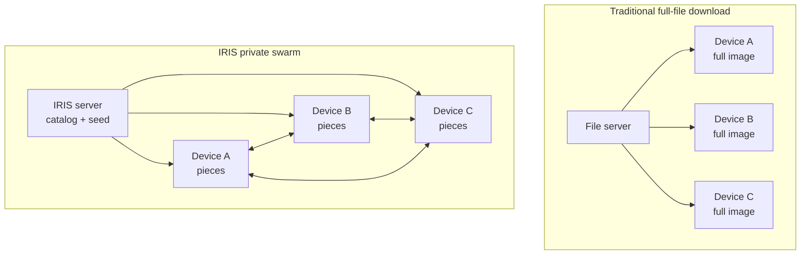
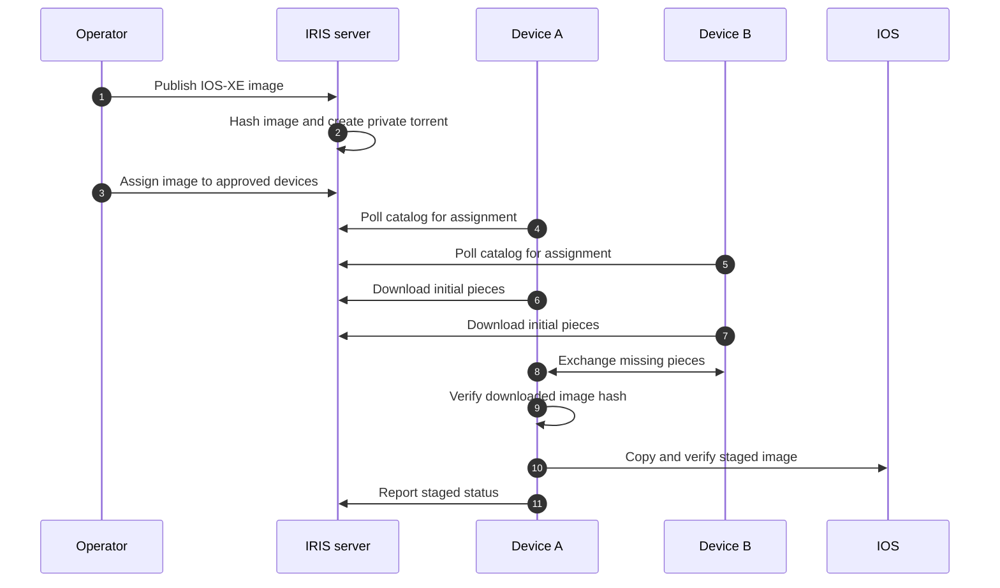

<!--
Copyright 2026 Cisco Systems, Inc. and its affiliates

SPDX-License-Identifier: Apache-2.0
-->

# Architecture

IRIS uses a private BitTorrent swarm to distribute large Cisco IOS-XE images to routers and switches. The goal is simple: get the image staged on every approved device faster and with better transfer resilience, while leaving install and reload decisions to the operator.

## The Simple Model

With a traditional file-server rollout, every device downloads the entire image from one server. That works for a few devices, but large images and large networks can overload the server or its uplink.

With IRIS, the server seeds the image and devices exchange image pieces with each other. As more devices receive pieces, they can help other devices complete the same image.

## What This Delivers

| Merit | What it means |
| --- | --- |
| Faster network distribution | The server does not need to send every byte of a multi-gigabyte image to every device. Devices that already have pieces can help the rest of the network. |
| Higher transfer tolerance | Downloads are piece-based and resumable. If a transfer is interrupted or one path is slow, a device can continue by fetching missing pieces from available peers and the seeder. |
| Controlled rollout intent | The catalog tells each device which image is approved for staging. Devices that are not assigned do not stage that image. |
| Device-side safety | Each device verifies the downloaded file and the final staged copy. IRIS stops after staging; install, activation, boot changes, and reloads remain outside IRIS. |

!!! note "Central services still matter"
    IRIS improves image distribution, not every possible failure mode. The catalog and tracker still coordinate policy and swarm participation. The fault-tolerance benefit is in the transfer path: devices can resume piece downloads and use more than one source once the swarm has content.

## Image Lifecycle

## Under the Hood

The public story is peer-assisted staging. The server implements that with a few focused services:

| Component | Responsibility |
| --- | --- |
| Catalog | Serves image metadata, assignments, token refresh, and device reports. |
| Tracker | Authenticates private BitTorrent announces. |
| Seeder | Provides the initial image pieces through `aria2c`; its JSON-RPC port stays local-only. |
| Artifact server | Serves bootstrap scripts, catalog trust material, and agent bundles over HTTPS. |
| Console | Browser UI for image, device, onboarding, monitoring, settings, and audit workflows. |
| Telemetry service | Receives device reports and exposes health, swarm, and metrics surfaces. |
| Device agent | Downloads pieces, verifies the image, stages it to platform storage, and reports status. |

## Storage and State

The server keeps durable state under `/var/lib/iris`. Catalog records are small JSON documents written atomically with advisory locks so concurrent GUI and CLI operations do not corrupt state. Secret material is encrypted at rest under `/etc/iris` with age recipients and decrypted to `/run/iris` tmpfs only while the container is running.

Generated artifacts live under `artifacts/` on the host and are served by the artifact server. IOS-XE image files stay outside the repository, commonly under `/opt/images`, and are mounted read-only into the container.

On an IOx device, `/data/iris` is persistent application scratch rather than an
IOS-visible image destination. After swarm verification, the app pushes the file
to the selected IOS filesystem and IOS performs the final `copy /verify`. This
keeps signature enforcement and the final filesystem write inside IOS.
