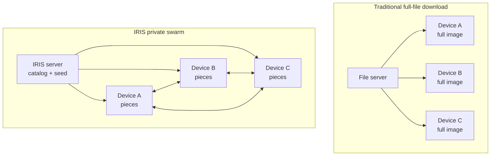
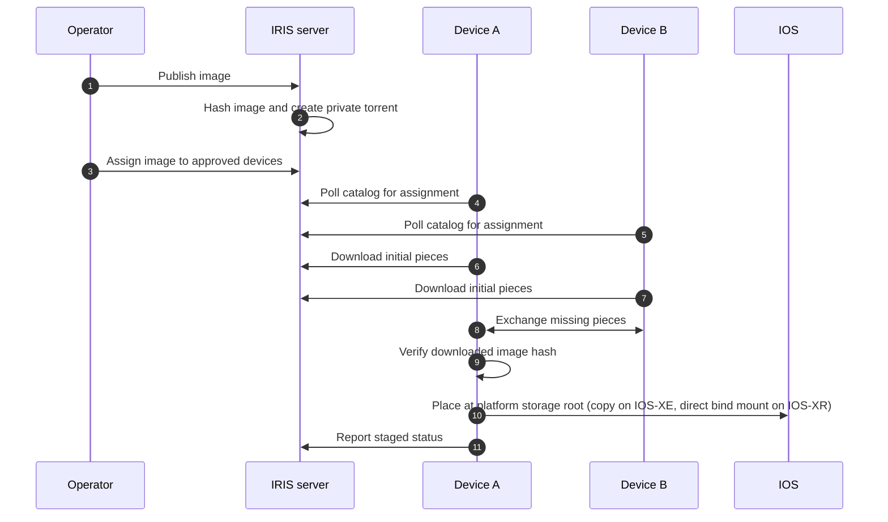
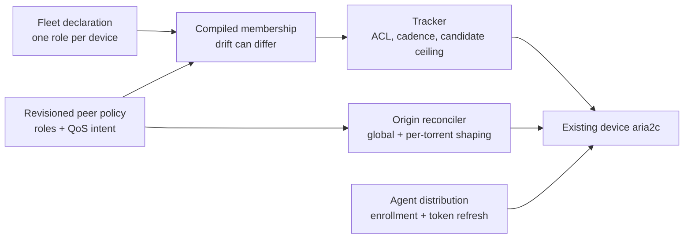

<!--
Copyright 2026 Cisco Systems, Inc. and its affiliates

SPDX-License-Identifier: Apache-2.0
-->

# Architecture

IRIS uses a private BitTorrent swarm to distribute large Cisco images and patches to routers and switches. The goal is simple: get the image staged on every approved device faster and with better transfer resilience, while leaving install and reload decisions to the operator.

## The simple model

With a traditional file-server rollout, every device downloads the entire image from one server. That works for a few devices, but large images and large networks can overload the server or its uplink.

With IRIS, the server seeds the image and devices exchange image pieces with each other. As more devices receive pieces, they can help other devices complete the same image.

## What this delivers

| Merit | What it means |
| --- | --- |
| Faster network distribution | The server does not need to send every byte of a multi-gigabyte image to every device. Devices that already have pieces can help the rest of the network. |
| Higher transfer tolerance | Downloads are piece-based and resumable. If a transfer is interrupted or one path is slow, a device can continue by fetching missing pieces from available peers and the seeder. |
| Controlled rollout intent | The catalog tells each device which image is approved for staging. Devices that are not assigned do not stage that image. |
| Device-side safety | Each device verifies the downloaded file's hash. IOS-XE then copies it to the target filesystem and checks its size; XR downloads directly to `harddisk:`. Install, activation, boot changes, and reloads remain outside IRIS. |

!!! note "Central services still matter"
    IRIS improves image distribution, not every possible failure mode. The catalog and tracker still coordinate policy and swarm participation. The fault-tolerance benefit is in the transfer path: devices can resume piece downloads and use more than one source once the swarm has content.

## Image lifecycle

## Under the hood

The server and Console divide the work as follows:

| Component | Responsibility |
| --- | --- |
| Catalog | Serves image metadata, assignments, token refresh, and device reports. |
| Tracker | Authenticates private BitTorrent announces over pinned HTTPS. |
| Seeder | Provides the initial image pieces through `aria2c`; its JSON-RPC port stays local-only. |
| Artifact server | Serves bootstrap scripts, catalog trust material, and agent bundles over HTTPS. |
| Console | Serves the browser UI and forwards API requests to the server's internal management API. |
| Management API | Runs Console operations against server state, including image publishing and device onboarding. |
| Telemetry service | Reads device reports stored by the catalog and combines them with tracker and seeder data for swarm views, metrics, and exports. |
| Device agent | Downloads pieces, verifies the image, stages it to platform storage, and reports status. |

## Phase 0 roles and traffic controls

Phase 0 adds policy at the two server-owned BitTorrent control points. The
tracker applies virtual role ACLs, server-side cadence, and server-side peer selection
on every announce. It returns only mutually permitted candidates,
caps the request by the role's effective `numwant`, and tells the client when
to announce again. DHT, peer exchange, and local peer discovery remain disabled,
so the tracker is the only source of new peer introductions.

The origin reconciler separately applies the global origin upload limit, the
per-torrent origin upload limit, and the origin's per-torrent peer cap to
`aria2c`. These controls are global or per image. Per-role origin shaping is not expressible
in one shared torrent: aria2 exposes no origin-side rate limit
for a particular remote role. A metered device downlink is protected only
cooperatively. Device administrators remain able to alter their environment;
any later device policy would be tamper-evident rather than tamper-proof.
Phase 0 neither changes a device's live aria2 options nor installs a device-side
traffic policy.

Role ACLs are compiled in memory from the revisioned policy document; they do
not consume the 64 stored-ACL slots and are never serialized as ordinary ACLs.
The Fleet declaration and compiled membership are coordinated but separate
durable values, which is why partial writes can produce visible `role_drift`.
The separate agent-distribution path in the diagram is exempt from role and
QoS policy so a restricted device retains its recovery channel.
The same behavior applies in the one-host Compose stack, separate Docker hosts,
and Kubernetes. All state and enforcement stay on the server tier.
There is no new service and no new listener, environment variable, Secret, Service,
NetworkPolicy rule, or device flow for Phase 0.

The boundary matters during an incident: a policy change stops **new** tracker
pairings, but it does not close an existing BitTorrent connection or erase a
peer address already retained by aria2. See [Role-policy operations and
rollback](operations.md#role-policy-operations-and-rollback) for the immediate
containment procedure.

IOx and IOS-XR appmgr use the same multi-architecture device image and the
same entrypoint. `IRIS_DEVICE_PLATFORM=iox` or `xr-appmgr` selects the storage
and device-integration profile; a missing or unknown value fails before any
staging directory is created. Cisco's IOx tar and appmgr RPM remain different
transport envelopes, but they carry the canonical image for the selected CPU
architecture rather than separately maintained payloads.

Guest Shell uses the same Python agent from a bundle. Its startup and IOS
integration remain specific to Guest Shell.

The server-side services are split across two containers. The stateful server
tier runs the catalog, tracker, artifact server, seeder, telemetry service, and
the authenticated management API. A separate Console container serves
the browser application and forwards its allowlisted `/api/v1` requests to that
management API over authenticated TLS. Device agents call the catalog
and tracker directly; Guest Shell onboarding also fetches from the
artifact listener. Devices never call the management API, and only the server
tier mounts device, catalog, image, or encrypted configuration state.

The two containers can run on the same Docker host, on separate Docker hosts,
or in separate Kubernetes Deployments. Only the authenticated HTTPS management
connection crosses from Console to server; storage stays with the server. See
[Docker on separate hosts](docker-hosts.md) and [Kubernetes](kubernetes.md).

Both containers run as the unprivileged user `iris`, a fixed uid/gid `10001`
baked into their images. Every listener binds an unprivileged port, so the
runtime drops all Linux capabilities and forbids privilege escalation. Nothing
chowns anything at runtime, so the host paths that cross the server-container
boundary — the age identity file, the artifacts directory, and persistent
volumes — have to be owned by
that uid before the stack starts.
Fresh named volumes inherit the image's ownership when they are initialized. See
[Runtime identity](server.md#runtime-identity).

## Storage and state

The server keeps durable state under `/var/lib/iris`. Catalog records are small JSON documents written atomically with advisory locks so concurrent GUI and CLI operations do not corrupt state. Secret material is encrypted at rest under `/etc/iris` with age recipients and decrypted to `/run/iris` tmpfs only while the container is running.

Generated artifacts live under `artifacts/` on the host and are served by the artifact server. Image files stay outside the repository, commonly under `/opt/images`, and are mounted read-only into the container.

Publishing does not move the image. The seeder seeds it from the directory it
already occupies, the generated `.torrent` goes to the state directory, and the
catalog entry records the source directory. That record is what the seeder
resolves each torrent back to when it re-seeds at startup. It also decides
whether deleting a catalog entry may unlink the file: only images sitting on the
writable uploads volume are removed from disk, so an image published in place
from the read-only image root survives. See
[Catalog entry fields](reference.md#catalog-entry-fields).

On an IOx device, the agent uses the platform's persistent application disk as
scratch storage rather than an
IOS-visible image destination. The agent checks the staged file's sha256
against the catalog's known-good value before hand-off — the catalog's
images can separately be checked for authenticity against Cisco's signed
Bulk Hash feed, and a mismatch quarantines the image. The app then hands the
file to IOS — a disk-speed write through the bind-mounted share where
available, an scp push on IE-3400 or as the fallback — and IOS performs the
final placement as a plain copy, which the agent attests by polling for the
file and confirming it matches the catalog's declared byte size exactly.

On IOS-XR, the appmgr container shares the router's own network stack and bind-
mounts `/misc/disk1` as `/hostmount`; that mount is `harddisk:`. The agent
downloads, verifies, and seeds the file at its final location, so there is no
IOS placement copy and no app-network VLAN, SVI, VPG, or NAT configuration.

Torrent completion means all pieces have arrived. The Console marks an image
staged only after the agent reports successful verification and placement.
Status is tracked per device and assigned image; another device starting its
download does not change an already-staged device's status.
