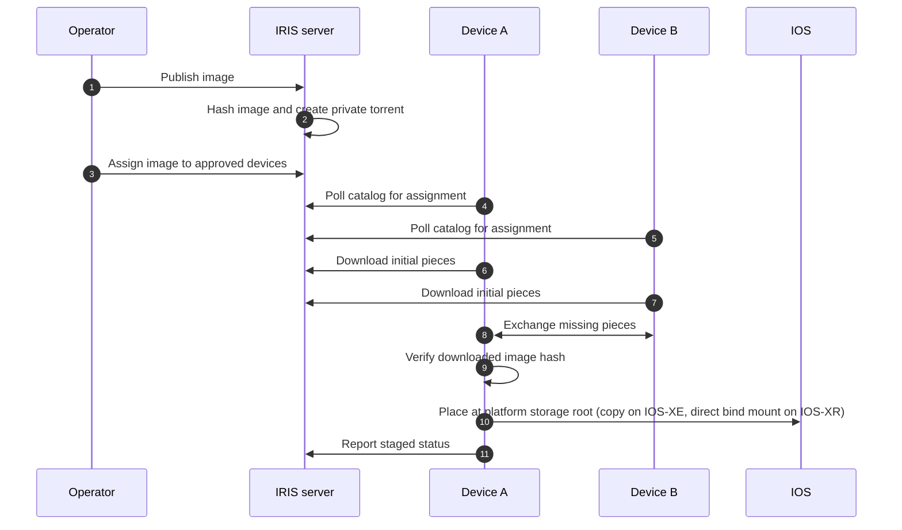

<!--
Copyright 2026 Cisco Systems, Inc. and its affiliates

SPDX-License-Identifier: Apache-2.0
-->

# How an image reaches a device

This page follows one image from the moment you publish it to the moment a
device places it on its own storage. IRIS moves the file over a private swarm:
the server hands out the first pieces, then the devices trade pieces with each
other.

## How the private torrent moves an image

1. **Publish.** You add the image once. The server hashes it and creates a
   private torrent for it.
2. **Assign.** You assign the image to devices. Each device finds the
   assignment the next time it polls the catalog.
3. **Download.** The device takes the first pieces from the server, then
   trades the rest with the other devices that hold the same image.
4. **Verify.** When every piece has arrived, the device checks the whole file
   against the catalog hash.
5. **Stage.** The device places the file on its storage, confirms the exact
   byte size, and reports the result.

## How onboarding delivers the agent

Onboarding hands the device its agent over HTTPS, before any swarm traffic
starts.

| Platform | What the device gets | Devices |
| --- | --- | --- |
| Guest Shell | The agent bundle, its digest file, the bootstrap script and an IOS timer | Catalyst 9000 series switches |
| IOx app | The IOx package that holds the shared container image | Catalyst 9000 series switches with app-hosting storage, Catalyst 8000 series routers, Industrial Ethernet switches with app hosting |
| IOS-XR appmgr | The appmgr package that holds the same container image | Cisco 8000 series and NCS routers |

The device also fetches the public catalog certificate and its own envelope,
the encrypted file that carries the instruction: the signed message the server
sends a device saying which images to stage and how. Each fetch authenticates
with the device id and a short-lived enrollment token, which the controller
sets on the device only for the span of the fetch and removes right after. The
token never appears in a URL or a job log, and the envelope is published for
that one device and that one fetch.

## Where the file lands

- **Guest Shell** on Catalyst 9000 series switches: the agent writes the
  verified file to its shared directory and asks IOS to copy it to `flash:`.
- **IOx app**: where the app can share a disk with IOS, the agent copies the
  file to that share; otherwise it sends the file to the device's own SCP
  server. IOS copies it under a temporary name, the agent confirms the size,
  then IOS renames it.
- **IOS-XR appmgr**: the container bind-mounts `harddisk:`, so the download
  already landed at its final location and the agent only confirms it.

## The check-in loop

A tick is one pass of the agent's check-in loop. Every mechanical tick
reasserts the traffic-control options the agent has verified into the running
aria2 process and sends a heartbeat, whatever else happens on that tick. A
signed value inside the instruction sets how often the agent checks the
catalog.

On every tick the agent:

1. Loads its configuration and refreshes credentials that are near expiry.
2. Reads the instruction, or falls back to the last policy it accepted.
3. Writes the verified traffic-control options into aria2.
4. Sends a heartbeat.

When a catalog check is due, it then:

1. Reads the assigned images and stops torrents for assignments you removed.
2. Downloads what is missing through `aria2c`.
3. Checks each finished file against the catalog SHA-256.
4. Places the image and confirms its exact byte size.
5. Reports the state of each image. A failure on one image leaves the others
   running.

## The checks an image passes before it counts as staged

The server hashes every image when you publish it. The device checks against
those catalog values.

| Check | Where | Purpose |
| --- | --- | --- |
| Torrent pieces | aria2 on every device | Checks pieces during transfer and validates saved pieces when resuming an incomplete download. |
| SHA-256 | Shared agent, on the completed staging file | Confirms the file matches the value recorded at publication. |
| Exact byte size | IOS-XE `dir`, or XR `stat` on the bind mount | Confirms final placement. IOS-XE copies the already-verified file; XR has downloaded directly to its final location. |
| SHA-512 and size for an existing Guest Shell or IOx root file | Bounded IOS-XE native verification | Confirms an existing Guest Shell or IOx root file through the native IOS commands that read it on the agent's behalf. IOx checks after the scratch download. |

The server runs one more check of its own: it compares the catalog SHA-512
with Bulk Hash, the checksum Cisco publishes for that image. See
[Publish and verify images](../user-guide/images.md).

A device that fails a check reports the failure and stops there.

## How the agent replaces an image without deleting it first { #crash-safe-same-name-replacement }

The agent never deletes the file at the target name first, which matters most
when the device's boot setting points at that exact name. If a file of that
name is already there, the agent counts it as staged only when the name, the
native SHA-512 digest and the size all match the catalog. Guest Shell checks
that hash through a one-shot Embedded Event Manager (EEM) policy; IOx checks
it over a local SSH session. A file that does not match is left untouched and
reported as a placement failure, so replacing it stays your decision. When no
file of that name exists, IOS-XE writes the new bytes under a reserved
temporary name and confirms they are there at the expected size. Only then
does it rename the proven copy, so an interrupted run leaves any previous
file untouched. IOS-XR writes only one copy, at its final location.

## What happens when flash is nearly full

A file already at the target name is consuming space, so the agent budgets for
the new copy on top of it. On IOx the agent asks IOS whether that name exists
before a download that would be short of space; staging waits when the answer
cannot be read. If space is still short on a device running in bundle mode,
the agent sweeps unused image artifacts and leftover IRIS temporary files,
keeping every package and provisioning file the boot setting names. On a
device running in install mode the sweep is limited to the agent's own
reserved temporary name. It is reclaimed only after the file passes its size
and digest checks, and only once IOS confirms the name is gone. The agent
tries the reclaim once per acquisition cycle. Republishing that image, a
successful placement, or an image returning from park re-arms it; park means
keeping an unassigned image on the device in case it is assigned again.

## A restarted agent keeps seeding

A restarted agent rejoins the swarm right away. A transfer in progress
resumes from its saved checkpoint. A finished image is re-added only when the
agent's own record shows the file matches the catalog size and passed its
content check. With either fact missing the agent announces nothing, because
IRIS never offers peers bytes it cannot vouch for.

## What differs between Guest Shell and the app-hosting image

One term in the table needs a plain reading first: Tracker-only means the
device uses the peers the tracker gives it, with no list of its own to
enforce. See [`verifier_missing`](../reference/glossary.md#verifier_missing).
For what a device administrator can still change,
read
[Security model and trust boundaries](security-model.md#device-administrator-trust-boundary).

| Property | Unified IOx/XR image | Guest Shell |
| --- | --- | --- |
| Two distinct public roots | Embedded mode-0444 signer/root files; image pin depends on enforced package signature | Same public roots in a replaceable bundle on flash; tamper-evidence |
| Signature verifier | Bundled OpenSSH verifier on both architectures | Static bundled verifier promoted off flash; a failed runtime probe gives `verifier_missing` and tracker-only peers |
| Mechanical tick | Container supervisor; `IRIS_TICK_SECONDS` interval/floor | IOS-owned 60-second EEM timer with bounded startup jitter |
| Agent update evidence | The image and wrapper provenance records; native signing is a separate gate | Digest-only bundle update with an adjacent SHA-256 sidecar, bounded members and rollback to the previous bundle |
| Compatibility | Shared agent sources | Shared agent sources, run by the older Python that Guest Shell provides; the bundled verifier is checked on the actual host |

## Limits

- A device's copy counts as staged only after that device reports a passed
  hash check and a completed placement. See
  [Data formats and states](../reference/state-and-data.md).
- Deleting an image from the catalog removes the file from disk only when you
  uploaded it through the Console. An image published in place from the
  read-only image root stays on disk.
- A seeding torrent holds a concurrency slot on the server and on the device
  for as long as it seeds. A low cap leaves an assigned image waiting. See
  [Server configuration](../reference/server-configuration.md).
- A share hand-off fails placement outright rather than falling back to SCP.
  See [Troubleshoot: symptoms and first steps](../user-guide/troubleshooting.md).
- The agent acts only on a tick, so an assignment you add or withdraw is
  picked up later.

## Related

- [How IRIS works](index.md)
- [Security model and trust boundaries](security-model.md)
- [Network ports and flows](network-ports.md)
- [Device agent configuration](../reference/device-configuration.md)
- [Monitor transfers and device reports](../user-guide/monitoring.md)
