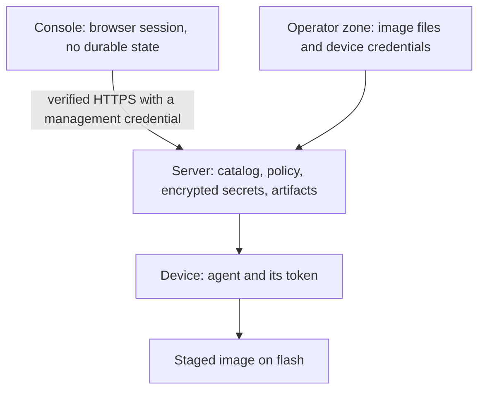

<!--
Copyright 2026 Cisco Systems, Inc. and its affiliates

SPDX-License-Identifier: Apache-2.0
-->

# Security model and trust boundaries

This page says what IRIS refuses to do on a device, where each trust boundary
sits, and who holds which keys.

## Guardrails

| Guardrail | Meaning |
| --- | --- |
| No operating-system install | IRIS does not install or activate the staged IOS image, or commit an operating-system package change. Onboarding and undeploy manage only the IRIS application. |
| No reload | IRIS does not reload or schedule reloads. |
| No boot mutation | IRIS does not change boot variables or running software state. |
| No inband network mutation | For inband devices, IRIS never creates, changes, or removes the existing VLAN, SVI, gateway, routes, or VRF. |
| Device-side content check | Downloaded bytes are checked against catalog SHA-256. IOS-XE placement checks the final copy's exact size; XR verifies the file on its host mount. An existing Guest Shell root image is adopted only after native SHA-512 verification against the catalog. |
| Private swarm | Torrents use private metadata and authenticated announces. |
| Unprivileged runtime | Every server process runs as a fixed non-root uid with all Linux capabilities dropped. |

Teardown follows the deployment record and removes only what IRIS created. See
[Data formats and states](../reference/state-and-data.md).

## Where the boundaries are

## What a device administrator can still change { #device-administrator-trust-boundary }

The server sends each device an instruction, the signed message that says which
images to stage and how. It arrives in an envelope, the encrypted file that
carries an instruction. The envelope encrypts the
**private per-device payload**, not its header and not its signed role intent.

That payload is confidential against users below privilege 15, swarm peers,
network observers, reuse on another device, and envelope-only copies. It is
**not confidential** against the device's own administrator, who holds every key
the agent holds. On Guest Shell, and wherever package verification is not
enforced, the roots and the verifier are replaceable, which gives
tamper-evidence rather than tamper-proofing.

An offline copy of a filesystem holding `iris-agent.conf`, its current or prior
instruction keys, or its `lkg_key` is readable by whoever holds the copy. Mode
`0600` guards the running filesystem; it does not encrypt a copy of it.

A privilege-15 or IOS-XR root-lr administrator can alter the runtime or bypass
the agent. Device-side rates and caps stay cooperative: **violation = 0 does not
mean compliant**. Tracker and origin enforcement of role isolation, announce
cadence, peer discovery and origin rates remains authoritative.

## What IRIS changes on a device

### Guest Shell

On Catalyst 9000 series switches and Catalyst 8000 series routers the agent runs
in Guest Shell; on Catalyst 9000 series switches with app-hosting storage the
IOx app is the alternative. The installer pastes the catalog trust point over
its own authenticated session, then has the device fetch the agent bundle, its
configuration file, its aria2 secret and the catalog certificate into the
guest-share root. It adds one applet that runs the bootstrap script every 60
seconds.

### IOx

The IOx app is the agent on Industrial Ethernet 3000 series switches, on IR 1100
and 1800 series routers, and on Catalyst 9000 series switches and Catalyst 8000
series routers with app-hosting storage. The package carries no certificate. The
device fetches the package and the current catalog certificate over HTTPS, the
controller copies the certificate into the application data directory after
activation, and the app starts only once it validates that copy. The enrollment
token, the device id and the SSH-to-self credential are passed as run options.

### IOS-XR

On Cisco 8000 series and NCS routers, onboarding creates the appmgr application,
registers the package source, and stages the package, the catalog certificate
and one working directory under `harddisk:`. Undeploy removes the recorded
application, the package and those files.

## Credentials held on the device

Each device holds what its agent needs: the catalog token, the aria2 secret,
and, on IOx, the password for the app's SSH session back to IOS. Each file is
readable only by the agent.

> **Residual risk — device login held in cleartext.** The generated
> `iris-agent.conf` holds the SSH-to-self password in cleartext on the app's
> persistent storage (SD on IE-3x00), mode `0600` and readable only inside the
> app. There is no secrets broker; the credential is static until an operator
> rotates it. Mitigate it at the device: scope the account with AAA
> (`parser view` / command authorization limited to `copy`, `dir`, and `event
> manager`), restrict the VTY ACL to the IRIS app subnet, and prefer SSH **key**
> auth where the platform supports it. Rotating the credential means re-running
> the installer with the new value.

Guest Shell writes its RPC secret into mode-0600 `$EXEC_DIR/aria2.conf`. aria2
receives the config path and the readiness probe reads the protected file, so
the secret value never reaches process arguments. See [Device agent
configuration](../reference/device-configuration.md).

## How instructions are signed and trusted

The server signs the role intent and seals one envelope for each device, served
over the connection the device already uses for the catalog. The envelope uses
AES-256-SIV (RFC 5297) through OpenSSL, with a per-device SP800-108
key-derivation step built on HMAC-SHA-256 that binds the audience context: the
device and the instruction key that device holds. A response over 256 KiB is
rejected before any cryptographic work begins, and the helper emits plaintext
only after successful authentication.

The agent verifies the signature and authenticates the envelope before parsing
private plaintext or applying either part. It also checks the signer revocation
list, the device and platform audience, the role binding, and a replay floor on
`(epoch, instr_serial)` that only moves forward. An authenticated server clock
anchors the expiry.

### The two root keys

Exactly two distinct offline-root public keys form the trust set. Two people
hold the two private halves, in two places, and neither half reaches the server.
Lose one half and the surviving root issues the next online certificate.
The unified IOx and IOS-XR appmgr image embeds both public root files read-only,
so with a natively signed package and platform verification enforced those roots
are pinned in the image. Guest Shell holds the same two files in a bundle on
replaceable flash, which is tamper-evidence rather than a pin.

The online signing private key is stored encrypted on the server and exists as
plaintext only in the server's runtime directory while the server runs. Each
device also holds a key for its own last known good copy, the LKG key, which the
device creates itself. No current/prior instruction key, LKG key, online signing
private key or offline-root private key enters IOx `run-opts`, XR
`docker-run-opts`, installer arguments, or device platform configuration. Only
an authenticated refresh returns the current and bounded prior instruction keys
into the agent's private configuration file.

Bootstrap is the exception: the enrollment bearer stays in IOx `run-opts` and XR
`docker-run-opts`, and IOx also keeps its SSH-to-self password. Someone with
full rights on the device can read those bootstrap credentials. An enrollment
token lasts 3,600 seconds, one hour, by default. Complete the first
authenticated refresh promptly: it replaces the agent's active credential, with
a normal token overlap of 120 seconds.

The server keeps a fixed list of credential widths: 128-bit bearer credentials
and 256-bit cryptographic instruction keys. Missing, unsupported or mismatched
widths fail before minting, without printing values. To rotate an instruction
key, revoke a device, or replace both roots, see [Replace or recover signing
keys](../admin-guide/instruction-keys.md).

### What IOx verifies and what Guest Shell cannot

IOx verification is a device-global setting. A signed wrapper is preferred and
causes no verification-state change. The installer preserves that setting around
an unsigned install and restores it afterward, and a signature marker on its own
is not cryptographic proof. Turning verification off affects every hosted app on
that device. The state table is in [Signature verification is a device-wide
setting](../install/iox.md#device-global-package-verification).

Guest Shell has no equivalent control: its roots and its verifier live in a
bundle on flash that someone with full rights on the device can replace, along
with the evidence beside it.

## Roles and peer sharing

A role is a named group of devices that share with each other. The server
compiles the roles into the peer policy, the rules that say which devices may
share pieces with which, and the tracker applies those rules every time a device
asks for peers. Every tracker and catalog credential resolves to a typed
principal, who a request is from: `device:<id>` is an onboarded device,
`service:seeder` is the server's own seeder, and `legacy` is a credential that
authenticated but belongs to neither. **Duplicate credential ownership** fails
closed: if two records share a credential value, every request in that lane is
refused, and no error message carries the value.

A restricted role becomes one virtual role ACL in memory: it permits its own
role, the peer roles you named, and `service:seeder` when origin access is on,
then denies everything else.

| Order | Rule set that governs a principal |
| --- | --- |
| 1 | Fail-closed or revoked state. |
| 2 | An explicit stored assignment. It shadows the role; the two are not added together. Quarantine, a device told to stop sharing with every peer, is the reserved deny-all assignment. |
| 3 | A restricted role's virtual role ACL. |
| 4 | Implicit permit. |

A rule change gates new introductions. It does not sever existing connections,
and aria2 may reconnect to a peer it already knows. To contain a device,
unassign every image from it. Devices behind one router share one translated
outside address; when a policy would permit one and deny another, IRIS records a
`shared_permit_deny` conflict and leaves that address unblocked. Give a device
its own outside address when you need that isolation.

The **agent-distribution exemption** is an invariant: role rules, rate values,
announce cadence, candidate ceilings and instruction policy cannot gate
bootstrap artifacts, enrollment, token refresh or agent packages. A restricted
or quarantined device keeps that recovery path.

### What happens when a policy file is missing or corrupt

Peer rules and per-device assignments live in `peer-policy.json` under the
server state directory, with a last-known-good copy at `peer-policy.lkg.json`
and the five most recent committed documents in a ring beside it. A durable
watermark records that roles have existed at all.

| State on disk | Result |
| --- | --- |
| Neither file present, no roles-ever watermark | Open discovery. The validated base document is materialized to both paths; not degraded, not fail-closed. |
| Neither file present, roles-ever watermark retained | The base document is materialized and discovery is open, but the result is `degraded` because prior role state was lost. Subsequent reads remain degraded. |
| Valid authoritative | Used as-is, except that an authoritative document with no `roles` is `degraded` when `roles_present` or the roles-ever watermark proves role state previously existed. |
| Corrupt authoritative, valid LKG | The LKG is used and the policy reports `degraded`. |
| At least one file present, neither valid | `fail_closed`: no announce is offered any candidate peer, and the seeder blocklist switches to the emergency deny list. |

!!! warning
    Removing both files re-materializes the base policy and drops every rule
    assignment, role, member and rate override you wrote. Only `quarantine` is
    re-created.

Under `fail_closed` the tracker derives an emergency deny list: every address it
knows that is not attributed to a `service` principal is denied. The address
configured as `IRIS_HOST_IP` is the one exclusion, so protecting the seeder
depends on `IRIS_HOST_IP` being the address the seeder announces from. When the
tracker knows no address, the derived set is empty, and that one empty set is
the set it **deliberately does not send**. The state stays `fail_closed` and is
never reported as enforced.

### What the status shows and what it hides

The status route is the operator boundary and is count-only. It returns counts:
role definitions, restrictions and members, queue occupancy, the applied
revision, the addresses the tracker wants denied, conflicts by type, and origin
rate counts. It never returns the raw blocklist, peer addresses, aria2 option
dictionaries, session ids, or the device ids behind the mutual-origin preflight.

Two devices that both hold a full copy of the same image are a mutual origin.
Mutual-origin blocking is **preflight only**: the reconciler counts how many
devices a future rule would newly deny and keeps applying the rules in force.
The count is `null` when the protected seeder address is unknown; zero means the
evaluation found no newly denied device.

A conflict record names the single address that two principals disagree about,
so the status file is **not address-free**. See [Control which devices share
with each other](../user-guide/roles.md).

## Tracker transport

The tracker on TCP 6969 is **HTTPS-only** and presents the same server
certificate that devices already pin for the catalog. The origin seeder and
every device aria2 process load that public certificate as their CA and keep
certificate verification enabled. The origin seeder, IOx and IOS-XR send their
announce credential in an `Authorization: Bearer` header, Guest Shell sends a
query credential in the same connection, and TLS encrypts the complete request.

## Peer transfer encryption

Encrypting the payload between peers is one setting for the whole swarm, off by
default, and separate from the HTTPS that protects the tracker and the catalog.
It applies to a whole aria2 process: undeploy the agents, change the setting,
onboard them again.

When it is required, peers use TLS 1.3 with a hybrid key exchange, an
authenticated cipher, a dedicated application protocol name, and mutual
certificate checks, and a required peer never falls back to plain text. Each
device generates its own private key, sends a certificate request over the
catalog connection it already trusts, and receives a certificate valid for 24
hours, renewed six hours before it expires. A missing, expired or mismatched
identity stops the peer from starting.

!!! warning
    Revoking a device's catalog token prevents renewal, but a certificate already
    issued stays usable until it expires. Replacing the issuing authority means
    enrolling every peer again. See
    [Find your way around the Console](../user-guide/console.md).

## Image authenticity: the Bulk Hash check

Bulk Hash is the checksum Cisco publishes for an image. Before any row of the
feed is parsed, its detached signature is verified with the public key from a
Cisco certificate pinned in the repository, never one found inside the feed. Any
fetch, signature or parse failure leaves every stored verdict untouched. A
checksum mismatch quarantines the image: seeding stops across restarts, the
image can no longer be assigned, and it is unassigned from every device that had
it. See [Publish and verify images](../user-guide/images.md).

## Secrets at rest

Catalog credentials, device credentials, agent RPC secrets and private server
TLS material are encrypted at rest with age recipients, and their decrypted
runtime copies live only in `/run/iris`. The one-host stack mounts the age
private key as a Docker secret from a host path you control, never from the
encrypted volume. Two things stay unencrypted: the management credential files
the Console reads, and the audit trail. Treat both as credentials. The paths are
in [Server configuration](../reference/server-configuration.md).

## Audit trail

The server records every sign-in, settings change, onboarding action, undeploy
and image action in an append-only trail of JSON lines. It holds console user
names and device ids in plain text, so treat a copy as sensitive. Every export
is encrypted to an age recipient, and the destination's host key is pinned on
first use. See [Routine maintenance tasks](../admin-guide/maintenance.md).

## Report a vulnerability

Report a suspected vulnerability through the project's security policy:
<https://github.com/cisco-open/intelligent-release-image-staging/blob/main/SECURITY.md>.

## Related

- [How an image reaches a device](data-path.md)
- [Network ports and flows](network-ports.md)
- [Limits](limitations.md)
- [Choose a management type](../install/management-types.md)
