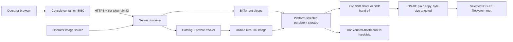

<!--
Copyright 2026 Cisco Systems, Inc. and its affiliates

SPDX-License-Identifier: Apache-2.0
-->

# Container deployments

IRIS builds three images: the server, the Console, and one device image for IOx
and IOS-XR. The device image contains the shared agent in `device/agent/` and
selects its platform adapter at runtime. Guest Shell receives that same agent
as a bundle. Agents stage images on device storage; they never install or
activate the staged operating-system image.

| Role | Image architecture | Durable storage | Deployment target |
| --- | --- | --- | --- |
| Server tier | `linux/amd64` | State, encrypted config, images, served artifacts | Docker Compose or its own Kubernetes Deployment |
| Console tier | `linux/amd64` | None | Docker Compose or its own Kubernetes Deployment |
| Unified device agent | `linux/arm64` or `linux/amd64` | Platform-selected CAF disk or `harddisk:` mount | Cisco IOx or IOS-XR appmgr |

## End-to-end data path



On IOx, final placement crosses back into IOS-XE. The CAF persistent disk is
available to the application (for example, as `/iox_data` on Catalyst 9300), but it is
not an IOS filesystem root. The agent uses that disk for resumable swarm data,
then hands the completed file to IOS for the final plain copy, attested by
the agent afterward against the catalog's exact byte size — the file was
already checked against the catalog SHA-256 before the placement copy. The
server separately checks image authenticity against Cisco's signed Bulk Hash
feed when verification is run; a mismatch quarantines the image. On Catalyst 9300
the app-hosting SSD share
(`usbflash1:iox_host_data_share`) is bind-mounted into the container, so the
hand-off is a disk-speed write followed by an IOS-internal copy onto
bootflash. On IE-3400 (where IOx cannot bind-mount the SD card) — or on a
Catalyst 9300 whose share mount is unavailable — the agent SCP-pushes the
file to `guest-share` through SSH-to-self instead. See
[IOx App](iox.md#runtime-behavior).

The Console does not mount catalog state, device credentials, image roots, or
served artifacts. Browser `/api/v1` requests remain same-origin at the Console;
it forwards allowlisted operations to the server's internal `/internal/v1`
management API over authenticated, CA-pinned HTTPS. Devices do not use that
management API: they continue to call the device catalog and tracker directly.

The server and Console can share a Docker host or run on separate hosts.
On one host, Compose assigns private container addresses and the Console
resolves `iris` through Docker DNS. Across hosts, the Console uses the server's
private management address on HTTPS port 9443. Each host publishes its own
service ports; the containers do not need separate LAN addresses. See
[Docker on separate hosts](docker-hosts.md) for deployment and credential setup.
IOx and Guest Shell still need
an app address, supplied through routed, inband, or router networking. XR uses
the router's host network and does not take a separate app address. See
[Network ports and flows](network-ports.md).

<span id="seed-server-image"></span>

## Server and Console images

`aria2c` is handed in, not downloaded or built — run `tools/get-aria2c.sh amd64`
first, or the Dockerfile's `COPY bin/aria2c` step fails. Then build from the
repository root because the runtime image includes the device installers and
SSH helper used by console onboarding:

```bash
tools/get-aria2c.sh amd64
docker build --pull --platform linux/amd64 \
  -f server/Dockerfile \
  -t iris:latest .
docker build --pull --platform linux/amd64 \
  -f server/Dockerfile.console \
  -t iris-console:latest .
```

`--pull` re-resolves the `python:3.12-slim-trixie` base tag instead of reusing
whatever the build host cached, which can be weeks of Debian security updates
behind the tag. Set `IRIS_NO_PULL=1` on the helper scripts to keep a cached base
for an A/B build of an unrelated change.

The image exposes the device-facing services, includes a Docker health check
that probes `/readyz` (so a container whose catalog, artifact, or internal
management listener died does not report `healthy`), and keeps aria2 RPC on
loopback only. The separate Console image exposes only 8080 and has its own
local health/readiness checks. Once running, Console readiness checks its own
files and listener, not server availability. Compose starts it after the server
is healthy because its initial browser certificate comes from the management
API. Docker on separate hosts and Kubernetes provide an independent default
Console certificate, allowing the Console to start while the server is
unavailable. API requests return a redacted 503 with `Retry-After` until the
authenticated server connection is available.

Docker Compose mounts operator images read-only from `IRIS_IMAGE_ROOT` (default
`/opt/images`) and served artifacts from `IRIS_ARTIFACTS_HOST_DIR`, which
defaults to the repository's `artifacts/` directory (`../artifacts`, relative to
`server/docker-compose.yml`). Run `iris-bootstrap` once before the normal service
startup.

The read-only mount is one of the seed server's two image roots. The other is
the `iris-images` uploads volume (`IRIS_IMAGES_DIR`, default
`/var/lib/iris-images`), which holds images uploaded through the Console's
authenticated HTTPS API.
Publishing seeds an image from its own directory rather than copying it, so an
image staged on the host is published in place and the read-only root stays
read-only. See [Server](server.md#publishing-images).

### Non-root runtime

Every seed-server service runs as the fixed uid and gid `10001`, and Compose
drops all capabilities. The age identity file, the served artifacts directory,
and the host tree behind `IRIS_IMAGE_ROOT` must be accessible to that uid; the
identity file must remain mode 600 or 400. Named volumes must be writable by
uid 10001. See [Runtime identity](server.md#runtime-identity) and
[Volume permissions](server.md#volume-permissions).

Deployment records persist under `IRIS_STATE` on the `iris-state` volume, so
undeploy-from-record and restart recovery behave identically to the Kubernetes
PVC layout. See [Management Type and VLAN Ownership](management-type.md).

## Instruction trust and server custody

The server still supervises five processes. Custody and stamper loops are two
daemon threads in the management process, not another service/container. Both
instruction GETs use existing authenticated catalog HTTPS 8443; 9443 remains
Console-to-server management-only. The optional encrypted signing key stays at
`$IRIS_CONFIG/instr/signing-key.age`, runtime plaintext at
`$IRIS_RUN/instr/signing-key`, and durable instruction state under `$IRIS_STATE`.
The Console receives none of those files or the age identity, even on split
hosts. See the [exact path inventory](server.md#instruction-state-and-processes).

Exactly two distinct offline-root public keys are embedded as mode-0444 signer
and root files in the unified IOx/XR image. Their private keys remain offline
with separate custodians. Guest Shell gets identical public trust through a
replaceable flash bundle, so its guarantee is tamper-evidence rather than an
image pin. Runtime `ssh-keygen -Y verify` probing can leave Guest Shell
tracker-only. The image-pinning premise requires native package signing and
platform verification; current unsigned proof artifacts do not establish it.

IOx verification is device-global. Signed wrappers cause no state change;
unsigned/enabled records an obligation, disables only for installation, then
restores with read-back before activation/start. Unsigned/disabled stays
disabled; unknown refuses. Durable interruption/resume and uninstall recovery
never blindly enables operator-changed or unowned state. Cisco documents the
control/media limits in its [IE-3x00 guide](https://www.cisco.com/c/en/us/td/docs/switches/lan/cisco_ie3X00/software/17_14/b_cisco-iox-ie3x00-switches/m-ie3400-deploying-iox-applications.html)
and [Catalyst 9000 guide](https://www.cisco.com/c/en/us/support/docs/switches/catalyst-9500-series-switches/222780-understand-app-hosting-on-catalyst-9000.html).
See the [IOx transaction](iox.md#device-global-package-verification) before onboarding.

The enrollment bearer remains in IOx `run-opts` and XR `docker-run-opts`, with
IOx's SSH-to-self password also present. Privileged device administrators can
read these bootstrap credentials. Enrollment defaults to one hour (3,600
seconds); prompt authenticated refresh uses normal 120-second token overlap.
Instruction current/prior keys arrive only through refresh into mode-0600
agent config; its LKG key is device-local. Neither those keys nor online/offline
private signing keys enter platform configuration or installer arguments.

`IRIS_MAX_PEERS` and `IRIS_MAX_CONCURRENT` are legacy provisional launcher
inputs, absent from image defaults and superseded by verified/default options
at the first successful tick before restored downloads can run. Every future
`addTorrent` uses verified/default values. Parsed legacy `max_peers` has no
policy authority. `IRIS_TICK_SECONDS` remains the mechanical interval/floor;
signed `catalog_tick_s` controls logical catalog/staging cadence while QoS
reassertion and heartbeat run every mechanical tick.

For a disconnected device, F3 redelivery transports a ciphertext bootstrap
envelope through the platform installer; it is not a secret key or a verifier
bypass. Authenticated refresh self-heals key availability. See
[offline delivery](operations.md#f3-offline-bootstrap-envelope-redelivery).

## Unified app-hosting image

`device/container/Dockerfile` and `device/container/entrypoint.sh` are the one
image definition and runtime entrypoint for IOx and IOS-XR. The required
`IRIS_DEVICE_PLATFORM` value selects the profile:

| Value | Scratch/control path | Final IOS filesystem | Runtime path |
| --- | --- | --- | --- |
| `iox` | CAF persistent storage, normally `/data/iris` | Platform-aware writable media selected and attested by the existing flash-target logic | IOS-XE SSH-to-self and optional shared-disk hand-off |
| `xr-appmgr` | `/hostmount/iris-work` | `harddisk:` through the verified `/hostmount` bind mount | IOS-XR appmgr helpers; no SSH config or credentials |

The selector is validated before any directory is created. Missing and unknown
values fail closed rather than guessing where a multi-gigabyte image belongs.
The image contains OpenSSH and `sshpass` because the IOx profile requires them;
the XR profile rejects IOx SSH/share variables and never creates an SSH
dependency. BusyBox supplies `ps`, `top`, `free`, and `kill` on both
architectures for diagnostics.

Guest Shell uses the same Python agent sources, packaged with its own
bootstrap/EEM launcher and installer rather than this container image. Every
platform pins the current public server certificate at runtime, but the unified
container does not carry it: IOx onboarding uses application data and XR
onboarding places it on the router's `harddisk:` mount.

Before any device-package build, point `IRIS_INSTRUCTION_ROOTS_DIR` at a
reviewed directory containing exactly two distinct public-root `.pub` files.
Private root files never belong there. The helpers also accept
`--instruction-roots-dir DIR`; no disposable proof root may be substituted for
production trust. Supply current pinned binaries with `ARIA2C_BIN_AMD64` and
`ARIA2C_BIN_ARM64` when the repository's fallback bundles contain older inputs.
The builder verifies architecture and `tools/aria2c.sha256` before packaging.

Build only the canonical image when iterating locally. `--image-only` is not
architecture-selected: every run builds or verifies one OCI archive containing
both `linux/amd64` and `linux/arm64`, by default
`artifacts/iris-device-$VERSION.oci.tar`, plus the adjacent
`.oci.tar.manifest`:

```bash
device/iox/build.sh --image-only
```

Build the Cisco IOx package directly when `ioxclient` is available:

```bash
device/iox/build.sh device/iox/out

IOX_ARCH=amd64 PACKAGE_NAME=iris-amd64.tar \
  device/iox/build.sh device/iox/out
```

Build the IOS-XR wrapper from the same canonical image:

```bash
tools/build-xr-package.sh --out artifacts/
```

For the normal Compose workflow, run `tools/provision-iox-packages.sh` after
the server becomes healthy. It obtains the pinned Cisco `ioxclient` tool on the
Linux server when needed and places both deployment-neutral,
architecture-specific packages and their provenance manifests in served
artifacts. Use
`tools/stage-iox-package.sh --arch arm64` or `--arch amd64` only when rebuilding
one package. Building the arm64 package on an amd64 host needs Docker's arm64
emulation; if it is not already enabled, `stage-iox-package.sh` requires
`BINFMT_IMAGE_DIGEST` — an audited `tonistiigi/binfmt` sha256 digest — and
fails closed without it.
[ARM64 emulation](getting-started.md#arm64-emulation) covers checking for the
handler, the distribution package that avoids the digest entirely, and
resolving a reviewed tag to one.

### Package footprint

Measure the canonical OCI per platform using compressed layer bytes and
uncompressed rootfs bytes. Use the current archive and adjacent manifest for
its identity, and measure the IOx tars and XR RPM separately because their
native envelopes differ. Guest Shell bundles and staged IOS images are
separate artifacts.

The shared Alpine runtime includes OpenSSH and `sshpass` for IOx, diagnostic
tools, the agent sources, and architecture-matched `aria2c`. The IOx
descriptor's `memory: 768` and `disk: 2048` values are runtime quotas in MB,
not package sizes.

`aria2c` is handed in, never downloaded: the build takes each architecture
from an explicit `ARIA2C_BIN_AMD64` / `ARIA2C_BIN_ARM64` override, a matching
local agent bundle, or the handed-in `deliverables/aria2c-x86_64` or
`deliverables/aria2c-aarch64` binary, verifying it against
`tools/aria2c.sha256` and failing closed on a mismatch. The builder accepts no
catalog-certificate input; onboarding supplies the current public certificate
without changing the canonical image or its wrappers.

The sidecar records `index_digest`, `archive_sha256`, `source_sha256`, and the
two platforms. A matching archive is reused; a pre-existing archive whose
manifest or source digest does not match is refused unless
`IRIS_FORCE_DEVICE_IMAGE_BUILD=1` explicitly permits replacement. Replacement
is built in a private sibling directory and each file is published by rename,
so neither the archive nor manifest is exposed half-written. During replacement
the old sidecar is removed before the new archive is visible; a reader therefore
sees either matching provenance or no provenance, never a stale manifest beside
new bytes. Each IOx tar and XR RPM follows the same fail-closed publication
order with an adjacent `.manifest` that binds its `wrapper_sha256` and selected
platform to those three canonical digests.

Package status calls a wrapper ready only when its readable bytes match that
adjacent provenance manifest. It does not compare against newer source, inspect
package contents, or validate a native package signature. After a shared-agent
change, rebuild the server/Guest Shell bundle, both IOx tars, and XR RPM before
rollout. See [Embedded agent packages](development.md#embedded-agent-packages).

The installer passes all environment-specific values at deployment time. The
image contains no lab address:

| Variable | Purpose |
| --- | --- |
| `IRIS_DEVICE_PLATFORM` | Required exact profile selector: `iox` or `xr-appmgr`; missing/unknown values stop before writes. |
| `IRIS_CATALOG_URL` | Reachable HTTPS catalog URL covered by the runtime-delivered certificate. |
| `IRIS_CATALOG_TOKEN` | Per-device enrollment token. |
| `IRIS_DEVICE_ID` | Catalog identity for the device. |
| `IRIS_DEVICE_SSH_HOST` | IOS SVI used for SSH-to-self and SCP. |
| `IRIS_DEVICE_SSH_USER` / `IRIS_DEVICE_SSH_PASS` | Scoped IOS transport credential. |
| `IRIS_TARGET_FS` | IOx-only optional filesystem preference; it is validated against live writable media. XR rejects it and always derives `harddisk:`. |

An explicit target is accepted only if `show file systems` reports it as a
writable disk and it is not `crashinfo:`. If it is unavailable, the agent logs
the fallback and uses platform-aware auto-detection. `device/iox/install.sh`
defaults to `sdflash:`. Console-onboarded Catalyst 9300 deployments use the SSD-share
transfer with `flash:` (bootflash) as the final target — the same placement as
Guest Shell — and `AppGigabitEthernet1/0/1`.

## Alpha constraints

- The seed-server image is amd64 so the static binary packed into Catalyst
  Guest Shell bundles remains x86_64.
- The canonical image is architecture-specific under one multi-architecture
  identity. IOx still needs an `ioxclient` tar envelope and XR still needs an
  appmgr RPM envelope; those wrapper bytes and metadata cannot be identical.
  Both wrappers consume the same canonical image manifest for their CPU, so
  an amd64 IOx wrapper and the XR wrapper contain the identical rootfs/config
  digest. If Cisco requires native wrapper signatures, each native envelope
  must still be signed in addition to the common image digest.
- IOx packages are architecture-specific. On IE-3400 the image hand-off uses
  SSH-to-self SCP because IOx there does not expose the SD card as a container
  bind mount; on Catalyst 9300 the app-hosting SSD share is bind-mounted and carries the
  hand-off at disk speed.
- Compose requires Docker Engine 23.0 or later, because the `/run/iris` tmpfs is
  mounted with `uid=`, `gid=`, and `mode=` mount options that older engines
  reject.
- Server clustering is not implemented. Kubernetes uses one replica and one
  ReadWriteOnce PVC.
- The server certificate is IP-pinned. Its public address must be stable, and a
  change requires certificate rotation plus re-onboarding each deployed device
  to update runtime trust; package rebuilding is not required.

The container packaging follows Cisco's
[IOx package descriptor](https://developer.cisco.com/docs/iox/package-descriptor/)
and [IOS XE app-hosting](https://www.cisco.com/c/en/us/td/docs/ios-xml/ios/prog/configuration/1718/b-1718-programmability-cg/m_1717_prog_application_hosting.html)
contracts.
