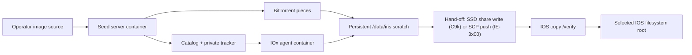

<!--
Copyright 2026 Cisco Systems, Inc. and its affiliates

SPDX-License-Identifier: Apache-2.0
-->

# Container Deployments

IRIS ships two container roles built around the same catalog and private-swarm
protocol. The seed server coordinates and originates content; the app-hosting
agent consumes an assignment, verifies the synchronized image, and writes it to
IOS-managed storage without installing or activating it.

| Role | Image architecture | Durable storage | Deployment target |
| --- | --- | --- | --- |
| Seed server | `linux/amd64` | State, encrypted config, images, served artifacts | Docker Compose or one Kubernetes pod |
| App-hosting agent | `linux/arm64` or `linux/amd64` | CAF persistent disk | Cisco IE or Catalyst 9000 IOx app hosting |

## End-to-end data path



The final copy deliberately crosses back into IOS. The CAF persistent disk is
available to the application (for example, as `/iox_data` on C9300), but it is
not an IOS filesystem root. The agent uses that disk for resumable swarm data,
then hands the completed file to IOS for the signature-enforcing
`copy /verify`: on C9k the app-hosting SSD share
(`usbflash1:iox_host_data_share`) is bind-mounted into the container, so the
hand-off is a disk-speed write followed by an IOS-internal copy onto
bootflash; on IE-3x00 (where IOx cannot bind-mount the SD card) the agent
SCP-pushes the file to `guest-share` through SSH-to-self instead. See
[IOx App](iox.md#runtime-behavior).

## Seed-server image

Build from the repository root because the runtime image includes the device
installers and SSH helper used by console onboarding:

```bash
docker build --platform linux/amd64 \
  -f server/Dockerfile \
  -t iris:latest .
```

The root `.dockerignore` prevents local credentials, firmware, generated
artifacts, and network files from entering the build context. The image exposes
all device-facing services, includes a `/healthz` Docker health check, and keeps
aria2 RPC on loopback only.

Docker Compose mounts operator images read-only from `IRIS_IMAGE_ROOT` (default
`/opt/images`) and served artifacts from `IRIS_ARTIFACTS_HOST_DIR`, which
defaults to the repository's `artifacts/` directory (`../artifacts`, relative to
`server/docker-compose.yml`). Run `iris-bootstrap` once before the normal service
startup.

The read-only mount is one of the seed server's two image roots. The other is
the `iris-images` uploads volume (`IRIS_IMAGES_DIR`, default
`/var/lib/iris-images`), which holds images the console received over HTTP.
Publishing seeds an image from its own directory rather than copying it, so an
image staged on the host is published in place and the read-only root stays
read-only. See [Server](server.md#publishing-images).

### Non-root runtime

Every seed-server service runs as the fixed uid and gid `10001`, and Compose
drops all capabilities. Two host paths — the age identity file and the served
artifacts directory — plus the host tree behind `IRIS_IMAGE_ROOT` must be
accessible to that uid, and a deployment upgraded from a root-runtime release
needs a one-time migration of its named volumes. Both procedures live in
[Runtime identity](server.md#runtime-identity), with the migration command in
[Upgrading from a root-runtime deployment](server.md#upgrading-from-a-root-runtime-deployment).

Deployment receipts persist under `IRIS_STATE` on the `iris-state` volume, so
undeploy-from-receipt and restart recovery behave identically to the Kubernetes
PVC layout. See [Management Type and VLAN Ownership](network-attachment.md).

## App-hosting image

Build only the Docker image when iterating locally:

```bash
CATALOG_PEM=/path/to/iris-catalog.pem \
  device/iox/build.sh --image-only
```

Build the Cisco IOx package directly when `ioxclient` is available:

```bash
CATALOG_PEM=/path/to/iris-catalog.pem \
device/iox/build.sh device/iox/out

IOX_ARCH=amd64 PACKAGE_NAME=iris-amd64.tar \
  CATALOG_PEM=/path/to/iris-catalog.pem \
  device/iox/build.sh device/iox/out
```

For the normal Compose workflow, run `tools/provision-iox-packages.sh` after
the server becomes healthy. It obtains the pinned Cisco `ioxclient` tool on the
Linux server when needed, uses the running server certificate, and places both
architecture-specific packages in served artifacts. Use
`tools/stage-iox-package.sh --arch arm64` or `--arch amd64` only when rebuilding
one package.

If no matching local agent bundle is present, the build downloads a pinned
architecture-matched static `aria2c` and verifies its SHA-256 digest. The catalog certificate
must either be supplied locally or fetched with an explicitly supplied SHA-256
certificate fingerprint.

The installer passes all environment-specific values at deployment time. No
lab address is baked in:

| Variable | Purpose |
| --- | --- |
| `IRIS_CATALOG_URL` | Reachable HTTPS catalog URL covered by the pinned certificate. |
| `IRIS_CATALOG_TOKEN` | Per-device enrollment token. |
| `IRIS_DEVICE_ID` | Catalog identity for the device. |
| `IRIS_DEVICE_SSH_HOST` | IOS SVI used for SSH-to-self and SCP. |
| `IRIS_DEVICE_SSH_USER` / `IRIS_DEVICE_SSH_PASS` | Scoped IOS transport credential. |
| `IRIS_TARGET_FS` | Optional IOS filesystem prefix such as `sdflash:`, `usbflash1:`, or `bootflash:`. |

An explicit target is accepted only if `show file systems` reports it as a
writable disk and it is not `crashinfo:`. If it is unavailable, the agent logs
the fallback and uses platform-aware auto-detection. `device/iox/install.sh`
defaults to `sdflash:`. Console-onboarded C9300 deployments use the SSD-share
transfer with `flash:` (bootflash) as the final target — the same placement as
Guest Shell — and `AppGigabitEthernet1/0/1`.

## Alpha constraints

- The seed-server image is amd64 so the static binary packed into Catalyst
  Guest Shell bundles remains x86_64.
- IOx packages are architecture-specific. On IE-3x00 the image hand-off uses
  SSH-to-self SCP because IOx there does not expose the SD card as a container
  bind mount; on C9k the app-hosting SSD share is bind-mounted and carries the
  hand-off at disk speed.
- Compose requires Docker Engine 23.0 or later, because the `/run/iris` tmpfs is
  mounted with `uid=`, `gid=`, and `mode=` mount options that older engines
  reject.
- Server clustering is not implemented. Kubernetes uses one replica and one
  ReadWriteOnce PVC.
- The server certificate is IP-pinned. Its public address must be stable, and a
  change requires certificate rotation plus a device trust update.

The container packaging follows Cisco's
[IOx package descriptor](https://developer.cisco.com/docs/iox/package-descriptor/)
and [IOS XE app-hosting](https://www.cisco.com/c/en/us/td/docs/ios-xml/ios/prog/configuration/1718/b-1718-programmability-cg/m_1717_prog_application_hosting.html)
contracts.
