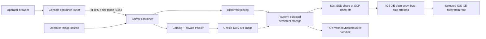

<!--
Copyright 2026 Cisco Systems, Inc. and its affiliates

SPDX-License-Identifier: Apache-2.0
-->

# Container deployments

IRIS ships separate server and Console tiers plus one multi-architecture device
container built around the same catalog and private-swarm protocol. The server
coordinates and originates content; the Console is a state-free browser-facing
gateway; each agent consumes an assignment, verifies the synchronized image,
and writes it to platform storage without installing or activating it.

| Role | Image architecture | Durable storage | Deployment target |
| --- | --- | --- | --- |
| Server tier | `linux/amd64` | State, encrypted config, images, served artifacts | Docker Compose or its own Kubernetes Deployment |
| Console tier | `linux/amd64` | None | Docker Compose or its own Kubernetes Deployment |
| Unified device agent | `linux/arm64` or `linux/amd64` | Platform-selected CAF disk or `harddisk:` mount | Cisco IOx or IOS-XR appmgr |

## End-to-end data path



The final copy deliberately crosses back into IOS. The CAF persistent disk is
available to the application (for example, as `/iox_data` on Catalyst 9300), but it is
not an IOS filesystem root. The agent uses that disk for resumable swarm data,
then hands the completed file to IOS for the final plain copy, attested by
the agent afterward against the catalog's exact byte size — the file was
already verified by sha256 against the catalog before the placement copy; the
catalog can separately verify authenticity against Cisco's signed Bulk Hash
feed, and a mismatch quarantines the image. On Catalyst 9300
the app-hosting SSD share
(`usbflash1:iox_host_data_share`) is bind-mounted into the container, so the
hand-off is a disk-speed write followed by an IOS-internal copy onto
bootflash. On IE-3400 (where IOx cannot bind-mount the SD card) — or on a
Catalyst 9300 whose share mount is unavailable — the agent SCP-pushes the
file to `guest-share` through SSH-to-self instead. See
[IOx App](iox.md#runtime-behavior).

The Console does not mount catalog state, device credentials, image roots, or
served artifacts. Browser `/api/v1` requests remain same-origin at the Console;
it forwards allowlisted operations to the server's internal `/internal/v1`
management API over authenticated, CA-pinned HTTPS. Devices do not use that
management API: they continue to call the device catalog and tracker directly.

## Seed-server image

`aria2c` is handed in, not downloaded or built — run `tools/get-aria2c.sh amd64`
first, or the Dockerfile's `COPY bin/aria2c` step fails. Then build from the
repository root because the runtime image includes the device installers and
SSH helper used by console onboarding:

```bash
tools/get-aria2c.sh amd64
docker build --pull --platform linux/amd64 \
  -f server/Dockerfile \
  -t iris:latest .
```

`--pull` re-resolves the `python:3.12-slim-trixie` base tag instead of reusing
whatever the build host cached, which can be weeks of Debian security updates
behind the tag. Set `IRIS_NO_PULL=1` on the helper scripts to keep a cached base
for an A/B build of an unrelated change.

The image exposes the device-facing services, includes a Docker health check
that probes `/readyz` (so a container whose catalog, artifact, or internal
management listener died does not report `healthy`), and keeps aria2 RPC on
loopback only. The separate Console image exposes only 8080 and has its own
local health/readiness checks; Console readiness deliberately does not depend
on the server being ready, avoiding a cold-start dependency cycle.

Docker Compose mounts operator images read-only from `IRIS_IMAGE_ROOT` (default
`/opt/images`) and served artifacts from `IRIS_ARTIFACTS_HOST_DIR`, which
defaults to the repository's `artifacts/` directory (`../artifacts`, relative to
`server/docker-compose.yml`). Run `iris-bootstrap` once before the normal service
startup.

The read-only mount is one of the seed server's two image roots. The other is
the `iris-images` uploads volume (`IRIS_IMAGES_DIR`, default
`/var/lib/iris-images`), which holds images uploaded through the Console's
authenticated HTTPS API.
Publishing seeds an image from its own directory rather than copying it, so an
image staged on the host is published in place and the read-only root stays
read-only. See [Server](server.md#publishing-images).

### Non-root runtime

Every seed-server service runs as the fixed uid and gid `10001`, and Compose
drops all capabilities. The age identity and Console setup-token files, the
served artifacts directory, and the host tree behind `IRIS_IMAGE_ROOT` must be
accessible to that uid; both credential files must remain mode 600 or 400. A
deployment upgraded from a root-runtime release
needs a one-time migration of its named volumes. Both procedures live in
[Runtime identity](server.md#runtime-identity), with the migration command in
[Upgrading from a root-runtime deployment](server.md#upgrading-from-a-root-runtime-deployment).

Deployment records persist under `IRIS_STATE` on the `iris-state` volume, so
undeploy-from-record and restart recovery behave identically to the Kubernetes
PVC layout. See [Management Type and VLAN Ownership](management-type.md).

## Unified app-hosting image

`device/container/Dockerfile` and `device/container/entrypoint.sh` are the one
image definition and runtime entrypoint for IOx and IOS-XR. The required
`IRIS_DEVICE_PLATFORM` value selects the profile:

| Value | Scratch/control path | Final IOS filesystem | Runtime path |
| --- | --- | --- | --- |
| `iox` | CAF persistent storage, normally `/data/iris` | Platform-aware writable media selected and attested by the existing flash-target logic | IOS-XE SSH-to-self and optional shared-disk hand-off |
| `xr-appmgr` | `/hostmount/iris-work` | `harddisk:` through the verified `/hostmount` bind mount | IOS-XR appmgr helpers; no SSH config or credentials |

The selector is validated before any directory is created. Missing and unknown
values fail closed rather than guessing where a multi-gigabyte image belongs.
The image contains OpenSSH and `sshpass` because the IOx profile requires them;
the XR profile rejects IOx SSH/share variables and never creates an SSH
dependency. BusyBox supplies `ps`, `top`, `free`, and `kill` on both
architectures, preserving the field-diagnostics decision.

Guest Shell is not packaged from this image. Its existing agent bundle,
bootstrap/EEM launcher, and installer remain a separate, unchanged delivery
path.

Build only the canonical image when iterating locally. `--image-only` is not
architecture-selected: every run builds or verifies one OCI archive containing
both `linux/amd64` and `linux/arm64`, by default
`artifacts/iris-device-$VERSION.oci.tar`, plus the adjacent
`.oci.tar.manifest`:

```bash
CATALOG_PEM=/path/to/iris-catalog.pem \
  device/iox/build.sh --image-only
```

Build the Cisco IOx package directly when `ioxclient` is available:

```bash
CATALOG_PEM=/path/to/iris-catalog.pem \
device/iox/build.sh device/iox/out

IOX_ARCH=amd64 PACKAGE_NAME=iris-amd64.tar \
  CATALOG_PEM=/path/to/iris-catalog.pem \
  device/iox/build.sh device/iox/out
```

For the normal Compose workflow, run `tools/provision-iox-packages.sh` after
the server becomes healthy. It obtains the pinned Cisco `ioxclient` tool on the
Linux server when needed, uses the running server certificate, and places both
architecture-specific packages in served artifacts. Use
`tools/stage-iox-package.sh --arch arm64` or `--arch amd64` only when rebuilding
one package. Building the arm64 package on an amd64 host needs Docker's arm64
emulation; if it is not already enabled, `stage-iox-package.sh` requires
`BINFMT_IMAGE_DIGEST` — an audited `tonistiigi/binfmt` sha256 digest — and
fails closed without it.

### Package footprint

The canonical OCI is measured per platform as compressed layer bytes and
uncompressed rootfs bytes; those are the only comparable values until native
IOx/RPM wrappers are actually built. A 2026-09-04 source-exact build from this
tree, using the current lab's public catalog TLS leaf, measured:

| Platform/object | Compressed layer bytes | Uncompressed layer bytes | Previous separate-image unpacked bytes | Unpacked delta |
| --- | ---: | ---: | ---: | ---: |
| `linux/amd64` unified (IOx comparison) | 27,907,984 | 74,469,376 | 159,014,912 | -84,545,536 (-53.2%) |
| `linux/amd64` unified (XR comparison) | 27,907,984 | 74,469,376 | 70,798,336 | +3,671,040 (+5.2%) |
| `linux/arm64` unified (IOx comparison) | 28,957,268 | 78,494,720 | 185,548,800 | -107,054,080 (-57.7%) |

The whole two-platform OCI archive is 56,904,192 bytes. Its measured identity
is index `sha256:4331b1e68eb3be4266fcccf2ff80e0cf9eaba11a9bd1db5cbe8e5063265dc5a5`,
archive SHA-256
`56f538b73ca9d471d8b7e13269db0451faeb2c267aa72d2d049dd39ea3d7a27f`,
and source SHA-256
`44b4ea29cfbe2557423a90fade833a669972f668be2e5f16deb2bcd61cea7cc4`.
The architecture manifests are
`sha256:6b2fbf2b1ca7f2101ce631fce72dabfc54f009a3c7941561d4a4c7a541174efc`
(amd64) and
`sha256:bb07a2c94c1ba45311847fbae9d981bb7f8e223e85a1e922f9068b2010c7d635`
(arm64). This is measurement evidence, not a release artifact: a release build
that embeds another deployment's pinned catalog CA necessarily has different
digests. Native wrapper size is deliberately not inferred from the earlier
Debian packages because no native wrapper was built in this measurement.

The large IOx reduction comes from converging on the already-qualified Alpine
runtime instead of carrying the former Debian userland. The modest increase
against the former XR image is the shared OpenSSH/`sshpass` closure required by
IOx. Both manifests retain BusyBox `ps`, `top`, `free`, and `kill`, the static
architecture-matched `aria2c`, pinned certificate, full agent source set, and
reconcile/supervision paths. Splitting the tiny platform-only Python modules
would save at most tens of kilobytes and would defeat the one-content audit
boundary, so it remains rejected.

These comparison values are the last verified separate images, after the
field-diagnostics decision restored `procps` to IOx and after the last agent
source refresh. The earlier slimming experiment recorded 157,999,616
(amd64 IOx), 183,948,288 (arm64 IOx), and 70,754,304 (XR) bytes before those
two follow-up changes; mixing those intermediate numbers into this table would
understate the IOx baseline by 1,015,296/1,600,512 bytes and the XR baseline by
44,032 bytes.

Guest Shell remains a separate, unchanged bundle/runtime and is not included
in the canonical image measurements. The IOx descriptor's `memory: 768` and
`disk: 2048` values are runtime quotas, not package size; staged IOS images are
also excluded.

`aria2c` is handed in, never downloaded: the build takes each architecture
from an explicit `ARIA2C_BIN_AMD64` / `ARIA2C_BIN_ARM64` override, a matching local agent bundle, or the handed-in
`deliverables/aria2c-<arch>` binary, verifying it against
`tools/aria2c.sha256` and failing closed on a mismatch. The catalog certificate must either be supplied
locally or fetched with an explicitly supplied SHA-256 certificate
fingerprint.

The sidecar records `index_digest`, `archive_sha256`, `source_sha256`, and the
two platforms. A matching archive is reused; a pre-existing archive whose
manifest or source digest does not match is refused unless
`IRIS_FORCE_DEVICE_IMAGE_BUILD=1` explicitly permits replacement. Replacement
is built in a private sibling directory and each file is published by rename,
so neither the archive nor manifest is exposed half-written. During replacement
the old sidecar is removed before the new archive is visible; a reader therefore
sees either matching provenance or no provenance, never a stale manifest beside
new bytes. Each IOx tar and XR RPM follows the same fail-closed publication
order with an adjacent `.manifest` that binds its `wrapper_sha256` and selected
platform to those three canonical digests.

The installer passes all environment-specific values at deployment time. No
lab address is baked in:

| Variable | Purpose |
| --- | --- |
| `IRIS_DEVICE_PLATFORM` | Required exact profile selector: `iox` or `xr-appmgr`; missing/unknown values stop before writes. |
| `IRIS_CATALOG_URL` | Reachable HTTPS catalog URL covered by the pinned certificate. |
| `IRIS_CATALOG_TOKEN` | Per-device enrollment token. |
| `IRIS_DEVICE_ID` | Catalog identity for the device. |
| `IRIS_DEVICE_SSH_HOST` | IOS SVI used for SSH-to-self and SCP. |
| `IRIS_DEVICE_SSH_USER` / `IRIS_DEVICE_SSH_PASS` | Scoped IOS transport credential. |
| `IRIS_TARGET_FS` | IOx-only optional filesystem preference; it is validated against live writable media. XR rejects it and always derives `harddisk:`. |

An explicit target is accepted only if `show file systems` reports it as a
writable disk and it is not `crashinfo:`. If it is unavailable, the agent logs
the fallback and uses platform-aware auto-detection. `device/iox/install.sh`
defaults to `sdflash:`. Console-onboarded Catalyst 9300 deployments use the SSD-share
transfer with `flash:` (bootflash) as the final target — the same placement as
Guest Shell — and `AppGigabitEthernet1/0/1`.

## Alpha constraints

- The seed-server image is amd64 so the static binary packed into Catalyst
  Guest Shell bundles remains x86_64.
- The canonical image is architecture-specific under one multi-architecture
  identity. IOx still needs an `ioxclient` tar envelope and XR still needs an
  appmgr RPM envelope; those wrapper bytes and metadata cannot be identical.
  Both wrappers consume the same canonical image manifest for their CPU, so
  an amd64 IOx wrapper and the XR wrapper contain the identical rootfs/config
  digest. If Cisco requires native wrapper signatures, each native envelope
  must still be signed in addition to the common image digest.
- IOx packages are architecture-specific. On IE-3400 the image hand-off uses
  SSH-to-self SCP because IOx there does not expose the SD card as a container
  bind mount; on Catalyst 9300 the app-hosting SSD share is bind-mounted and carries the
  hand-off at disk speed.
- Compose requires Docker Engine 23.0 or later, because the `/run/iris` tmpfs is
  mounted with `uid=`, `gid=`, and `mode=` mount options that older engines
  reject.
- Server clustering is not implemented. Kubernetes uses one replica and one
  ReadWriteOnce PVC.
- The server certificate is IP-pinned. Its public address must be stable, and a
  change requires certificate rotation plus a device trust update.

The container packaging follows Cisco's
[IOx package descriptor](https://developer.cisco.com/docs/iox/package-descriptor/)
and [IOS XE app-hosting](https://www.cisco.com/c/en/us/td/docs/ios-xml/ios/prog/configuration/1718/b-1718-programmability-cg/m_1717_prog_application_hosting.html)
contracts.
