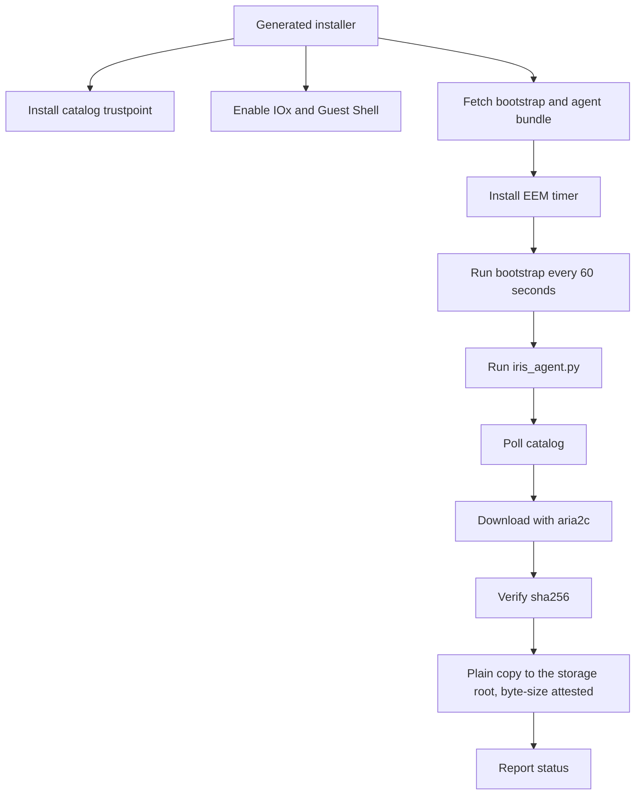

<!--
Copyright 2026 Cisco Systems, Inc. and its affiliates

SPDX-License-Identifier: Apache-2.0
-->

# Device Agents

Device agents are the only part of IRIS that runs on the device. Their job is intentionally narrow: discover the approved image, download it, verify it, place it on the platform storage root, and report status. Most run on IOS-XE; the IOS-XR agent runs in an appmgr container, described under [IOS-XR: what the installer pushes](#ios-xr-what-the-installer-pushes).

A device attaches through one of four management types: a dedicated IRIS-managed
VLAN/SVI (**routed**), an existing operator-owned management VLAN (**inband**),
or an IRIS-managed VirtualPortGroup (**router-routed** or **router-nat**).
The management-type choice governs what the installer and uninstaller may configure
and remove; see
[Management Type and VLAN Ownership](network-attachment.md).

After a successful Guest Shell or IOx onboarding or cleanup lifecycle, IRIS runs
`copy running-config startup-config`. This persists the IRIS app-hosting,
networking, trustpoint, and cleanup state across a reload. Failed or partial
onboarding is not saved. IOS-XR has no running/startup split to bridge — a
`commit` is already the persisted state — so the XR recipes never issue one.

## Guest Shell path

Catalyst 9300 devices and Catalyst 8000 routers use Guest Shell (routers through an IRIS-managed VirtualPortGroup, staging to `bootflash:`). The generated installer configures the device-side plumbing and then the EEM timer keeps the agent alive.



## Agent installation

### Guest Shell and router: what the installer pushes

`device/device-install.sh` (Catalyst 9300 Guest Shell) and
`device/router-install.sh` (Catalyst 8000 router) push the same file set to
the guest-share root, over a `copy https://` that the PKI trustpoint step
(pasted over SSH first) lets IOS verify:

| File served from the artifact server | Device-side name | Purpose |
| --- | --- | --- |
| staged as `iris-agent-<DEVICE_ID>-<CAP>.conf` | `iris-agent.conf` | catalog URL, device id, and an empty `rpc_secret` — the agent fetches the real secret on its first token refresh |
| staged as `rpc-secret-<CAP>` | `rpc-secret` | seeds aria2c's RPC secret; bootstrap.sh reconciles it against the conf on every tick |
| `iris-agent.tgz` | `bundle.tgz` | the agent Python, `bootstrap.sh`, `guestshell-start.sh`, `rotate-logs.sh`, `agent/peer-receipt-hook.sh` (aria2's `--on-bt-download-complete` program), and an architecture-matched `aria2c`, packed by `tools/make-agent-bundle.sh` |
| the bare server cert | `iris-catalog.pem` | pinned TLS trust anchor for the agent's catalog calls |
| — | `bootstrap.sh` | the EEM entry point itself |

`CAP` is a fresh 128-bit random capability minted per install run (not one
fixed filename reused by every device — that was the old shared
`rpc-secret`). The staged copies live under the artifact server's `staging/`
prefix and are only reachable for the ~600 seconds it retains them, ample
headroom for the installer's own 3-attempt retry loop.

The installer then installs one EEM applet:

```text
event manager applet IRIS-AGENT authorization bypass
 event timer watchdog time 60 maxrun 900
 action 100 cli command "enable"
 action 200 cli command "guestshell run bash <fs>guest-share/bootstrap.sh"
```

Every 60 seconds it runs `bootstrap.sh` inside Guest Shell, which moves any
freshly dropped files into its own guest-owned working directory, unpacks a
new `bundle.tgz` if one arrived (copying its `bootstrap.sh` back over the
running copy), makes sure `aria2c` is up and serving, and finally runs
`iris_agent.py --once`.

**Dropping a new `bundle.tgz` on the device is the agent upgrade** for Guest
Shell and router — the next tick unpacks it and runs the new code. There is no
separate upgrade command. Re-running the installer script directly has the same
effect (it mints a new capability and re-copies the bundle). A console
re-onboard is not that path: its preflight refuses a device that still carries
the live agent, so undeploy first and then onboard again. `router-install.sh`
additionally destroys any pre-existing Guest Shell before re-applying config,
so a re-onboard never leaves the guest running on stale networking from a
previous install — see
[Router routed and router NAT](network-attachment.md#router-routed-and-router-nat-iris-managed-virtualportgroup).

### IOx: what the installer pushes

`device/iox/install.sh` never touches Guest Shell. It copies the built
package (`iris-arm64.tar` or `iris-amd64.tar`) to the target IOS filesystem
over the same verified `copy https://`, then drives the app-hosting lifecycle
directly: `app-hosting install` → `activate` → `start`. Deployment-specific
values — the enrollment token, device id, SSH-to-self credentials, target
filesystem — are passed as numbered `run-opts -e` Docker options at deploy
time and never baked into the image; `device/iox/entrypoint.sh` (PID 1 inside
the container) writes them into `iris-agent.conf` on first boot only if no
config already exists on the persistent mount. There is no EEM timer on IOx:
`entrypoint.sh` is its own supervisor loop, running the agent once every
`IRIS_TICK_SECONDS` (default 60s).

Re-provision a device when replacing its bootstrap configuration or enrollment material: the cutover replaces only the staging agent's credentials and never touches the device's software.

**Upgrade on IOx is uninstall, then reinstall** — there is no in-place package
update. `device/iox/install.sh` is idempotent by design: its first step always
stops, deactivates, and uninstalls any existing `iris` app before copying the
new package and reinstalling, so re-running `device/iox/install.sh` directly
with a freshly built package is the supported upgrade path. The same upgrade
from the console needs an undeploy first: onboarding preflight refuses a device
that still has the `iris` app-hosting stanza or any other IRIS-named config.
`device/iox/uninstall.sh`
performs the same teardown standalone, for a clean removal with no reinstall.

### IOS-XR: what the installer pushes

`device/xr-install.sh` deploys the agent to a Cisco 8000-series router
running IOS-XR as an **appmgr Docker application**. It pushes the pre-built
`iris-xr.rpm` to `harddisk:` over scp, registers it (`appmgr package install
rpm`), and activates it in config mode with host networking and one bind
mount: `-v /misc/disk1:/hostmount`. `/misc/disk1` **is** `harddisk:`, so the
container writes straight to the router's own filesystem. Secrets and the
device id are passed as `--env` options on the activation line and are never
baked into the image; `device/xr/entrypoint.sh` writes them into
`iris-agent.conf` on first boot, and is its own supervisor loop the same way
the IOx entrypoint is. `device/xr-uninstall.sh` is the receipt-driven
inverse: deactivate, uninstall the source, and remove the RPM and the agent's
`iris-work/` directory.

Nothing is installed or activated on the device's *software*: as on every
other platform, IRIS distributes, verifies, and stages an image, and stops
there.

### Confirming it worked

Assignment only gates staging, not presence: an unassigned device still
heartbeats so it registers in `devices.json`, the Swarm Map, and telemetry
posture. The agent's first successful heartbeat is therefore the signal that
installation succeeded — that is what makes a device appear in the Console
device table and Swarm Map (see [Web Console](console.md)). Nothing before
that point is visible outside device-side logs.

### Failure mode: aria2c alive but not serving

Fixed 2026-08-20 after a field incident. `device/bootstrap.sh`,
`device/guestshell-start.sh` (Guest Shell and router), and
`device/iox/entrypoint.sh` (IOx) used to gate a relaunch on aria2c *process*
liveness (`pgrep`). An aria2c that was running but not answering its RPC port
blocked its own relaunch — it still owned the port, and `cp -f` over a running
binary fails `ETXTBSY` — so the agent hit `ECONNREFUSED` on
`127.0.0.1:6800` every 60-second tick and crashed before ever sending its
first heartbeat. The device stayed invisible in the Console indefinitely, with
no self-healing path.

All three now key supervision on RPC *health* instead of process liveness.
`guestshell-start.sh` probes `aria2c.getVersion` over the RPC port before
deciding whether to relaunch, and kills a non-serving aria2c before copying a
fresh binary over it; `bootstrap.sh` delegates to it unconditionally on every
tick (it is idempotent — it exits 0 immediately once the RPC answers);
`entrypoint.sh` gained the same `rpc_healthy()` check in its own supervisor
loop. Copy and chmod failures during relaunch are no longer swallowed, so a
failed relaunch now surfaces in the logs instead of silently leaving a dead
binary in place.

## Agent loop

The agent loop is deliberately boring:

1. Load device config and token material.
2. Refresh the token when needed.
3. Ask the catalog for the approved image.
4. Skip work when the approved image is already staged and verified.
5. Download missing content through `aria2c`.
6. Verify the downloaded file hash.
7. Place the image at the storage root and attest it by exact byte size. On
   IOS-XE that is a copy; on IOS-XR the download already landed there through
   the bind mount, so the agent only attests it.
8. Report health, progress, and errors.

## Verification gates

IRIS uses two checks because the server and device have different capabilities:

| Check | Where | Why |
| --- | --- | --- |
| `sha256` | Agent Python code | Confirms the downloaded file matches the catalog's known-good value — the same value established at publish time on the server — before the IOS copy runs. |
| Byte size at the storage root | Agent Python code, polling IOS `dir` (IOS-XE) or a `stat` on the mount (IOS-XR) | Placement carries no in-band signature check on any platform; the agent attests the file landed correctly by confirming its size matches the catalog exactly. On IOS-XR there is nothing to copy — the image was downloaded to its final location — so the same check runs against the file already there. |

If verification fails, the agent reports the failure and leaves installation decisions untouched. It does not change boot variables and does not reload the device.

## Replaced image cleanup

When a device is reassigned to a different image, the agent removes the storage-root
copy it placed for the previous image — never an image IRIS did not place. The
delete is queued in agent state and executed through a one-shot
`event manager applet ... authorization bypass` EEM applet, the same mechanism the
copy-to-root and bundle-mode reclaim paths use. A raw exec `delete` is not used: on a
device running AAA command authorization IOS discards it silently, which leaves the
replaced image on flash and the delete queued on every 60-second tick.

After firing the applet the agent re-checks whether the file is gone. Cleanup is
reported only on proven absence; a name still present stays queued and is retried on
the next tick, which also covers the case where the applet is still running when the
agent looks. Queued names are re-validated against the agent's filename whitelist
before they reach the applet, so a hand-edited state file cannot inject a command.

## Device SSH host-key pinning

Guest Shell runs inside IOS and configures the device locally. The IOx app instead
reaches IOS over SSH to run the placement copy and the cleanup applets, so it has a host
key to consider.

Host-key pinning is optional and off by default. Set `device_ssh_known_hosts` in the
agent config to a `known_hosts` path and, when that file exists, SSH and SCP run with
`StrictHostKeyChecking=yes` against it. With the key unset — or set to a path that
does not exist — the agent runs `StrictHostKeyChecking=no` with
`UserKnownHostsFile=/dev/null`. This is the same verify-if-present shape the agent
uses for the catalog TLS trust anchor. Nothing in IRIS writes the `known_hosts` file;
it exists for operators who want the connection pinned.

## Platform targets

| Platform path | Storage target | Control path |
| --- | --- | --- |
| Catalyst 9300 Guest Shell | `flash:` | EEM timer and Guest Shell process. |
| Catalyst 9300 IOx | `flash:` when console-onboarded (via the SSD share); the CLI installer defaults to `sdflash:` | IOx Docker app and SSH-to-self IOS commands. |
| IE-3400 IOx | `sdflash:` | IOx Docker app and SSH-to-self IOS commands. |
| Catalyst 8000 Guest Shell | `bootflash:` | Guest Shell through a VirtualPortGroup. |
| Cisco 8000 series (IOS-XR) | `harddisk:` | appmgr Docker app; no CLI — the container bind-mounts `harddisk:` and stages directly onto it. |

The router path targets the Catalyst 8000 family and is lab-tested on Catalyst 8000V; see
[Router routed and router NAT](network-attachment.md#router-routed-and-router-nat-iris-managed-virtualportgroup).

For the lab-validation status behind this table — including which of these
platforms have been exercised end to end on real hardware and which have not
— see [Validation: Validated platforms](validation.md#validated-platforms).
