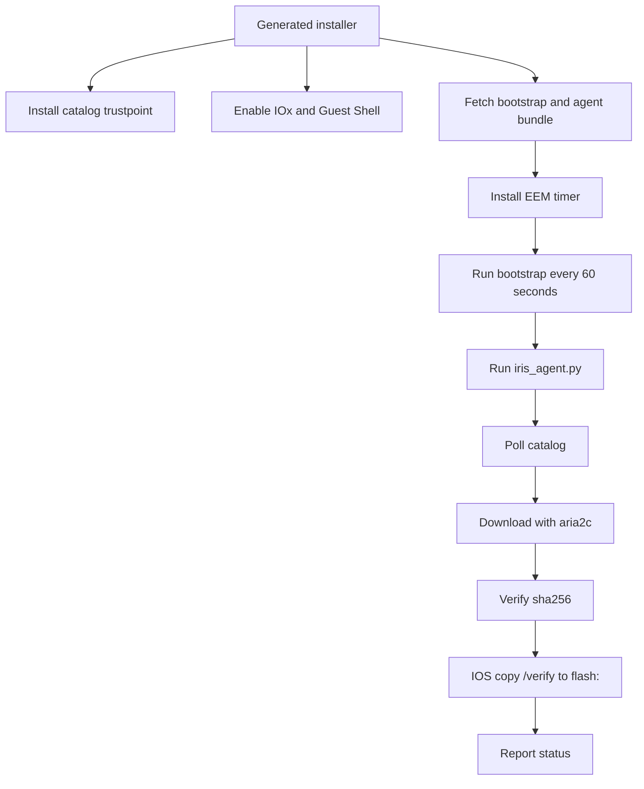

<!--
Copyright 2026 Cisco Systems, Inc. and its affiliates

SPDX-License-Identifier: Apache-2.0
-->

# Device Agents

Device agents are the only part of IRIS that runs on IOS-XE devices. Their job is intentionally narrow: discover the approved image, download it, verify it, copy it to the platform storage root, and report status.

A device attaches to the network in one of two ways — a dedicated IRIS-managed
VLAN/SVI (**routed**) or an existing operator-owned management VLAN (**inband**,
Guest Shell static IPv4). The attachment choice governs what the installer and
uninstaller may configure and remove; see
[Network Attachment and VLAN Ownership](network-attachment.md).

After a successful Guest Shell or IOx onboarding or cleanup lifecycle, IRIS runs
`copy running-config startup-config`. This persists the IRIS app-hosting,
networking, trustpoint, and cleanup state across a reload. Failed or partial
onboarding is not saved.

## Guest Shell path

Catalyst 9300 devices use Guest Shell. The generated installer configures the device-side plumbing and then the EEM timer keeps the agent alive.

## Agent loop

The agent loop is deliberately boring:

1. Load device config and token material.
2. Refresh the token when needed.
3. Ask the catalog for the approved image.
4. Skip work when the approved image is already staged and verified.
5. Download missing content through `aria2c`.
6. Verify the downloaded file hash.
7. Copy to the IOS storage root with IOS verification.
8. Report health, progress, and errors.

## Verification gates

IRIS uses two checks because the server and device have different capabilities:

| Check | Where | Why |
| --- | --- | --- |
| `sha256` | Agent Python code | Confirms the downloaded file matches catalog metadata before IOS copy. |
| `sha512` | IOS `verify` path | Confirms the root storage copy matches catalog metadata using IOS-native verification. |

If verification fails, the agent reports the failure and leaves installation decisions untouched. It does not change boot variables and does not reload the device.

## Platform targets

| Platform path | Storage target | Control path |
| --- | --- | --- |
| Catalyst 9300 Guest Shell | `flash:` | EEM timer and Guest Shell process. |
| IE-3x00/IE-3400 IOx | `sdflash:` | IOx Docker app and SSH-to-self IOS commands. |
