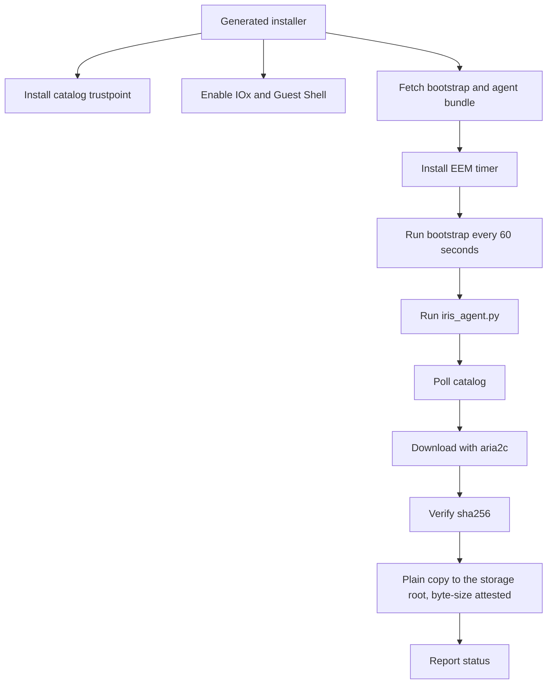

<!--
Copyright 2026 Cisco Systems, Inc. and its affiliates

SPDX-License-Identifier: Apache-2.0
-->

# Device Agents

Device agents are the only part of IRIS that runs on the device. Their job is
intentionally narrow: discover the approved image, download it, verify it,
place it on the platform storage root, and report status. IOx and IOS-XR use
the same multi-architecture container definition and entrypoint; the mandatory
`IRIS_DEVICE_PLATFORM` selector activates the `iox` or `xr-appmgr` profile.
Guest Shell remains outside that container unification and keeps its existing
bundle, bootstrap, EEM, and HTTPS enrollment path unchanged.

A device attaches through one of five management types: a dedicated IRIS-managed
VLAN/SVI (**routed**), an existing operator-owned management VLAN (**inband**),
an IRIS-managed VirtualPortGroup (**router-routed** or **router-nat**), or the
router's own network stack with no app-network fields (**xr-host**).
The management-type choice governs what the installer and uninstaller may configure
and remove; see
[Management Type and VLAN Ownership](management-type.md).

After a successful Guest Shell or IOx onboarding or cleanup lifecycle, IRIS runs
`copy running-config startup-config`. This persists the IRIS app-hosting,
networking, trustpoint, and cleanup state across a reload. Failed or partial
onboarding is not saved. IOS-XR has no running/startup split to bridge — a
`commit` is already the persisted state — so the XR recipes never issue one.

## Guest Shell path

Catalyst 9300 devices and Catalyst 8000 routers use Guest Shell (routers through an IRIS-managed VirtualPortGroup, staging to `bootflash:`). The generated installer configures the device-side plumbing and then the EEM timer keeps the agent alive.



## Agent installation

### Guest Shell and router: what the installer pushes

`device/device-install.sh` (Catalyst 9300 Guest Shell) and
`device/router-install.sh` (Catalyst 8000 router) push the same file set to
the guest-share root, over a `copy https://` that the PKI trustpoint step
(pasted over SSH first) lets IOS verify:

| File served from the artifact server | Device-side name | Purpose |
| --- | --- | --- |
| staged as `iris-agent-<DEVICE_ID>-<CAP>.conf` | `iris-agent.conf` | catalog URL, device id, and an empty `rpc_secret` — the agent fetches the real secret on its first token refresh |
| staged as `rpc-secret-<CAP>` | `rpc-secret` | seeds aria2c's RPC secret; bootstrap.sh reconciles it against the conf on every tick |
| `iris-agent.tgz` | `bundle.tgz` | the agent Python, `bootstrap.sh`, `guestshell-start.sh`, `rotate-logs.sh`, `agent/peer-transfer-hook.sh` (aria2's `--on-bt-download-complete` program), and an architecture-matched `aria2c`, packed by `tools/make-agent-bundle.sh` |
| the bare server cert | `iris-catalog.pem` | pinned TLS trust anchor for the agent's catalog calls |
| — | `bootstrap.sh` | the EEM entry point itself |

`CAP` is a fresh 128-bit random capability minted per install run (not one
fixed filename reused by every device — that was the old shared
`rpc-secret`). The staged copies live under the artifact server's `staging/`
prefix and are only reachable for the 3600 seconds it retains them, ample
headroom for queued fleet work and the installer's own retry loop. This
capability-bearing HTTPS surface is retained specifically for the unchanged
Guest Shell installer; the authenticated `/v1/devices/.../artifacts/...` API
used by explicit clients is a separate surface.

The installer then installs one EEM applet:

```text
event manager applet IRIS-AGENT authorization bypass
 event timer watchdog time 60 maxrun 900
 action 100 cli command "enable"
 action 200 cli command "guestshell run bash <fs>guest-share/bootstrap.sh"
```

Every 60 seconds it runs `bootstrap.sh` inside Guest Shell, which moves any
freshly dropped files into its own guest-owned working directory, unpacks a
new `bundle.tgz` if one arrived (copying its `bootstrap.sh` back over the
running copy), makes sure `aria2c` is up and serving, and finally runs
`iris_agent.py --once`.

**Dropping a new `bundle.tgz` on the device is the agent upgrade** for Guest
Shell and router — the next tick unpacks it and runs the new code. There is no
separate upgrade command. Re-running the installer script directly has the same
effect (it mints a new capability and re-copies the bundle). A console
re-onboard is not that path: its preflight refuses a device that still carries
the live agent, so undeploy first and then onboard again. `router-install.sh`
additionally destroys any pre-existing Guest Shell before re-applying config,
so a re-onboard never leaves the guest running on stale networking from a
previous install — see
[Router routed and router NAT](management-type.md#router-routed-and-router-nat-iris-managed-virtualportgroup).

### IOx: what the installer pushes

`device/iox/install.sh` never touches Guest Shell. It pushes the built package
(`iris-arm64.tar` or `iris-amd64.tar`) and current public catalog certificate
from the server host to the target IOS filesystem over the same authenticated,
host-key-checked SCP transport. After package installation reaches `DEPLOYED`,
the installer copies the certificate into app-hosting application data before
it activates and starts the app. The deployment-neutral package contains no
server certificate; the common container entrypoint reads the runtime copy
from CAF's app-data directory. Deployment-specific values — the enrollment
token, device id, and SSH-to-self credentials — are passed as numbered
`run-opts -e` Docker options at deploy time and never baked into the image.
`IRIS_DEVICE_PLATFORM=iox` selects and persists the IOx profile;
`device/container/entrypoint.sh` (PID 1) writes the values into
`iris-agent.conf` on first boot only if no config already exists on the
persistent mount. There is no EEM timer on IOx: the common entrypoint is its own
supervisor loop, running the agent once every `IRIS_TICK_SECONDS` (default 60s).

Re-provision a device when replacing its bootstrap configuration or enrollment material: the cutover replaces only the staging agent's credentials and never touches the device's software.

**Upgrade on IOx is uninstall, then reinstall** — there is no in-place package
update. `device/iox/install.sh` is idempotent by design: its first step always
stops, deactivates, and uninstalls any existing `iris` app before copying the
new package and reinstalling, so re-running `device/iox/install.sh` directly
with a freshly built package is the supported upgrade path. The same upgrade
from the console needs an undeploy first: onboarding preflight refuses a device
that still has the `iris` app-hosting stanza or any other IRIS-named config.
`device/iox/uninstall.sh`
performs the same teardown standalone, for a clean removal with no reinstall.

### IOS-XR: what the installer pushes

`device/xr-install.sh` deploys the agent to a Cisco 8000-series router running
IOS-XR as an **appmgr Docker application**. It pushes the pre-built
`iris-xr.rpm` and current public catalog certificate to `harddisk:` over scp,
registers the RPM (`appmgr package install rpm`), and activates it in config
mode with host networking and the `/misc/disk1:/hostmount` bind mount.
`/misc/disk1` **is** `harddisk:`, so the container
writes straight to the router's own filesystem and reads the runtime trust
anchor at `/hostmount/iris-catalog.pem`. The deployment-neutral RPM contains no
server certificate. Secrets and the device id are passed as `--env` options on
the activation line and are never baked into the image.
`IRIS_DEVICE_PLATFORM=xr-appmgr` selects and persists the XR profile;
`device/container/entrypoint.sh` writes the configuration on first boot and
uses the same supervisor as IOx. The XR profile verifies the `harddisk:` mount
before its first write, rejects all IOx SSH/share variables, and never
instantiates the SSH transport even though the common image contains the client
binaries IOx needs. `device/xr-uninstall.sh` is the record-driven
inverse: deactivate, uninstall the source, remove the RPM and the agent's
`iris-work/` directory, and sweep any `*.torrent`/`*.aria2`/`*.peers.json`
sidecar the agent left at `harddisk:` root — this platform has no placement
step, so those land next to any staged image, not inside `iris-work/`.

All three onboarding paths deliver the current public certificate at runtime.
A server-certificate rotation therefore requires re-onboarding devices so that
file is replaced, but it does not require rebuilding the Guest Shell bundle,
IOx tars, or XR RPM. A shared-agent source change is the opposite: rebuild all
package families, then redeploy affected devices so they receive the new code.

Nothing is installed or activated on the device's *software*: as on every
other platform, IRIS distributes, verifies, and stages an image, and stops
there.

### Confirming it worked

Assignment only gates staging, not presence: an unassigned device still
heartbeats so it registers in the fleet's heartbeat store, the Swarm Map,
and telemetry posture. The agent's first successful heartbeat is therefore
the signal that installation succeeded — that is what makes a device appear
in the Console device table and Swarm Map (see [Web Console](console.md)).
Nothing before that point is visible outside device-side logs.

Immediately after first boot, aria2c may still be running with the empty RPC
secret deliberately shipped by the installer while the agent has just fetched
the real one. aria2-next reports that brief mismatch as HTTP 400. IRIS treats it
as a normal `staging` state, emits `ARIA2-AUTH`, and lets the next bootstrap tick
copy the refreshed secret and restart aria2c; it does not show a false staging
failure. A connection-refused or otherwise unreachable RPC endpoint remains a
real error.

### Failure mode: aria2c alive but not serving

Fixed 2026-08-20 after a field incident. `device/bootstrap.sh`,
`device/guestshell-start.sh` (Guest Shell and router), and
the former IOx container entrypoint used to gate a relaunch on aria2c *process*
liveness (`pgrep`). An aria2c that was running but not answering its RPC port
blocked its own relaunch — it still owned the port, and `cp -f` over a running
binary fails `ETXTBSY` — so the agent hit `ECONNREFUSED` on
`127.0.0.1:6800` every 60-second tick and crashed before ever sending its
first heartbeat. The device stayed invisible in the Console indefinitely, with
no self-healing path.

All three now key supervision on RPC *health* instead of process liveness.
`guestshell-start.sh` probes `aria2c.getVersion` over the RPC port before
deciding whether to relaunch, and kills a non-serving aria2c before copying a
fresh binary over it; `bootstrap.sh` delegates to it unconditionally on every
tick (it is idempotent — it exits 0 immediately once the RPC answers);
`entrypoint.sh` gained the same `rpc_healthy()` check in its own supervisor
loop. Copy and chmod failures during relaunch are no longer swallowed, so a
failed relaunch now surfaces in the logs instead of silently leaving a dead
binary in place.

The common container entrypoint (`device/container/entrypoint.sh`) goes one
step further for both its IOx and IOS-XR profiles: it runs
aria2c as a tracked child of the PID-1 shell and supervises it by that exact
PID, never by process-name matching. A daemon that is alive but wedged or
stopped is sent TERM, then KILL after five seconds, reaped, and relaunched
within a tick — the earlier `pkill`-based loop could not replace a daemon
that ignored TERM, and its relaunch failed to bind the RPC port every tick
while the log claimed success. The same path runs on container stop, so an
interrupted download keeps its `.aria2` checkpoint for resume, and the
launchers pass `--check-integrity` so that a resume re-hashes the bytes that
checkpoint claims are already on flash: a piece corrupted in place — bit-rot,
a torn write during a power loss — is dropped and re-fetched instead of being
carried into a "complete" image with the wrong SHA-256. It costs nothing on
the other paths. A fresh download has nothing on disk to read, and a completed
file being re-added to seed is skipped by `--bt-seed-unverified`, so a device
seeding its staged images does not re-hash them at launch.

Every aria2 launcher also loads the device's pinned `iris-catalog.pem` as its
CA and keeps certificate checking enabled for tracker announces on TCP 6969.
IOx and IOS-XR attach their bearer credential as a per-torrent header; Guest
Shell keeps its legacy query credential, now inside the same verified TLS
transport. A transport-generation marker makes an upgraded agent refetch and
re-add only the small torrent metadata once. The image payload and any `.aria2`
resume bitfield remain in place.

Guest Shell additionally copies the validated CA to a content-addressed path
on its executable filesystem and launches aria2 against that immutable
generation. Aria2 loads CA bytes only when it starts, so merely replacing
`iris-catalog.pem` at the same path during re-onboard would otherwise leave a
healthy daemon trusting the previous certificate. A changed digest (or an
older launch line with no CA pin) now forces one restart; a malformed or
unverifiable snapshot fails before launch.

### Failure mode: a busy aria2c read as a dead one

The health probe above has to answer two different questions, and for a while
it conflated them into one three-second request. An aria2c built without
c-ares resolves tracker hostnames with a blocking `getaddrinfo()` on its
event-loop thread, so a single announce against a slow or unresponsive
resolver freezes the whole daemon — RPC replies included — for as long as the
resolver takes (measured at five seconds against a blackholed forwarder).
Every such stall that overlapped a supervisor tick read as "dead", and a
perfectly healthy daemon was killed and relaunched, losing its in-flight
download.

The probe now separates the two questions. *Is anything bound to the RPC
port?* is decided by the connection: on loopback a daemon that is gone refuses
it instantly, and that is still a verdict — the relaunch stays immediate, as
the 2026-08-20 incident requires. *Did it answer?* is bounded well above the
worst resolver stall, and a late answer is treated as a suspicion rather than
a verdict: a second probe has to fail too before anything is killed. A stalled
daemon passes that second probe once the resolver gives up; a wedged one does
not. The documented deployment (`IRIS_HOST_IP` as an IP literal) never
resolves a tracker hostname at all, so this only bites a deployment whose
announce URL carries a name.

## Agent loop

The agent loop is deliberately boring:

1. Load device config and token material.
2. Refresh the token when needed.
3. Ask the catalog for the approved image.
4. Skip work when the approved image is already staged and verified.
5. Download missing content through `aria2c`.
6. Verify the downloaded file hash.
7. Place the image at the storage root and attest it by exact byte size. On
   IOS-XE that is a copy — [crash-safely, never deleting a
   pre-existing same-named file first](#crash-safe-same-name-replacement); on
   IOS-XR the download already landed there through the bind mount, so the
   agent only attests it.
8. Report health, progress, and errors.

## Crash-safe same-name replacement

Placing an image under a name IRIS finds already on the storage root — the
operator's ordinary republish flow, or a name the `BOOT` variable currently
points at — never deletes the old file first. On Guest Shell, the agent first
uses the existing local `flash:` / `bootflash:` mount to compare that root
file's exact size and SHA-256 with the catalog. An exact match is adopted in
place, including on IOS releases where `rename` will not overwrite an existing
destination. An unreadable or mismatched root file is left untouched and
reported as `copy_failed`; replacing it is an explicit operator decision, not
a destructive guess by IRIS.

When no destination exists, IOS-XE stages the new bytes under a reserved temp
name (`<image>.iris-tmp`), verifies presence and exact byte size there, and
then renames the proven copy to the real name. A failure or power loss before
that rename leaves any previous file exactly as it was; a failure at the
rename step is not assumed to mean it failed — the agent re-checks the real
name afterwards and reports whichever state it actually finds. IOS-XR is
unaffected: `attest_in_place` never writes a second copy at all.

A leftover temp-name file — from an attempt that crashed before its own
retry could clean up after it — is covered by the same low-space
bundle-reclaim sweep as any other unused image artifact on a **bundle-mode**
device, so it does not sit invisible on an otherwise-full box there. On an
**install-mode** device this sweep does not apply: low-space reclaim there
runs `install remove inactive`, which manages installed packages and does
not touch a stray `.bin.iris-tmp` at the storage root, so a temp-name
leftover on an install-mode device is not automatically reclaimed by
either path. The narrow exception is Guest Shell adoption of an already
size-and-SHA-verified root file: if the failed attempt's reserved
`<image>.iris-tmp` also exists, IRIS reclaims exactly that temp name and
re-stats it before reporting the root ready. If cleanup cannot be proved, the
agent fails closed instead of claiming adoption. Either way, IRIS only ever
attempts the low-space reclaim once per acquisition cycle for a given image —
a content republish under the same id, an image returning from park, or that
image's own placement succeeding all start a fresh cycle and re-arm the
attempt.

The old file and the new temp copy do coexist on the storage root until the
rename, but this costs no *extra* headroom on top of the existing staging
scratch: the old file was already occupying space before the replacement
began, so the free-space check the agent reads never counted it as
available in the first place — only the new temp copy is new consumption.
[Sizing the storage root](management-type.md#sizing-the-storage-root) covers
the same figure whether or not the destination name is already occupied.

## Cadence jitter and overload backoff

Guest Shell's EEM watchdog and the IOx/XR container supervisors all drive the
agent on a nominal 60-second tick. Left exactly synchronized, a fleet that is
bulk-installed or reloaded together keeps every device's tick in the same
phase indefinitely — turning an ordinary tick into a fleet-wide burst of
policy GETs, heartbeats, and tracker re-announces. Three independent,
bounded guards spread that out, sized to smooth *arrival*, not to compensate
for a slow catalog — the per-device cost of a policy/heartbeat round trip is
now a fixed, small constant regardless of fleet size (see [Reference → Keyed
per-device state](reference.md#keyed-per-device-state)):

- **Steady-state dither (IOx/XR only).** The IOx and XR profiles in
  `device/container/entrypoint.sh` vary every ordinary tick by ±10% of
  `IRIS_TICK_SECONDS` (54–66s at the 60s default, via `IRIS_TICK_JITTER_PCT`)
  — enough that devices which started in the same second drift apart over a
  handful of ticks, small enough that the *average* cadence, and so token
  refresh and assignment convergence latency, barely moves. Guest Shell
  cannot move the EEM timer's own period (IOS owns that clock), so
  `device/bootstrap.sh` instead sleeps a small bounded jitter
  (`IRIS_TICK_JITTER_MAX`, default 0–7s) immediately before contacting the
  catalog each tick — the EEM timer still fires every 60s, but the actual
  request lands at a different offset within it per device.
- **Startup jitter (IOx/XR only).** The first tick after a container starts
  is spread across the whole tick window (`IRIS_STARTUP_JITTER`, on by
  default) — the case the steady-state dither only corrects gradually: many
  containers restarting in the same second (a platform-wide app-hosting
  restart, say) get their first catalog contact spread out instead of firing
  together. Set it to `0` for a single-device debug session watching for the
  first tick.
- **Failure backoff.** After a tick fails outright — the catalog unreachable,
  timed out, or answering a non-2xx status, the same shape a saturated
  server produces — the next contact backs off exponentially, capped at
  `IRIS_TICK_BACKOFF_MAX` (600s by default), instead of retrying on the
  ordinary cadence. IOx/XR skip the whole tick (`next_tick_sleep` in
  `entrypoint.sh`); Guest Shell/router cannot skip an EEM-fired tick, so
  `bootstrap.sh` instead skips only step 5 (catalog contact) while local
  bundle/aria2c/log upkeep (steps 0–4) keeps running every tick, recording
  the backoff deadline and failure streak in
  `$STAGE/.iris-tick-backoff`. A success immediately clears the streak and
  resumes ordinary cadence. The cap is comfortably inside the catalog
  token's multi-day refresh slack, so a run of backed-off ticks never
  strands a device.

All of these are tuning knobs, not protocol values — see [Reference →
Device container environment variables](reference.md#device-container-environment-variables)
for defaults and ranges.

## Device-side logging (flash write endurance)

Every platform stages images to `flash:` / `bootflash:` / `sdflash:` /
`harddisk:`, and flash has finite write endurance. `aria2c`'s own log is
chatty and continuous for the whole life of a transfer — and with
`--seed-ratio=0.0` (the private-swarm flag every launcher sets, since a
staged device seeds forever) a log left on never stops growing. `IRIS_LOG`
(default `off`, all three platforms) makes **that one file** — `aria2c.log`
— opt-in rather than always-on. It is deliberately narrow: it never touches
the separate `%IRIS-6-<MNEMONIC>` operator lines `emit()` writes on every
tick, on every platform, regardless of `IRIS_LOG` — see "What `IRIS_LOG`
does not stop" below, which is platform-specific and, on IOS-XR, not "no
recurring write" at all.

- **Off (the default) stops aria2c's own `aria2c.log` from being written,
  full stop** — not a smaller or rotated file, on any platform. With no
  `--log=` on the launch line, aria2c's own daemon mode already redirects
  its stdio to `/dev/null` (Guest Shell, via `--daemon=true`); the container
  supervisors (the two profiles in `device/container/entrypoint.sh`)
  already redirect their tracked child's stdio to `/dev/null`
  unconditionally, so there is nothing extra to suppress there either.
- **On** adds `--log=<stage dir>/aria2c.log` to the launch line. Guest Shell
  relies on the existing per-tick `rotate-logs.sh` (driven by
  `bootstrap.sh`, see [Agent installation](#agent-installation)) to keep it
  bounded; IOx and XR have never shipped `rotate-logs.sh` into the image (no
  bash dependency added just for this), so their launch line instead adds
  aria2's own `--log-max-size=50M --log-max-files=1` to bound growth.
- **What `IRIS_LOG` does not stop — uniform in principle, not in where it
  lands.** `emit()`'s `%IRIS-6-<MNEMONIC>` operator lines (every startup
  failure, every stage transition) and the heartbeat's `stage_error` field
  are unaffected by `IRIS_LOG` on every platform. Where those lines actually
  go is platform-specific, though, and matters for "does `off` mean zero
  recurring write":
- **Guest Shell and IOx** have a real IOS CLI to hand: `emit()` issues
  `send log facility IRIS severity 6 ...` into genuine device syslog (IOx
  SSHes to the host IOS box's own management SVI for this — see
  `IRIS_DEVICE_SSH_HOST`/`IRIS_DEVICE_SSH_USER` in [Container deployments →
  Package footprint](containers.md#package-footprint)). That syslog write is
  IOS's own concern, not IRIS's, and was never on `flash:` to begin with —
  so on these two platforms `IRIS_LOG=off` really is zero recurring write
  from IRIS.
- **IOS-XR has no CLI to ask** (the reason it runs as a container rather
  than Guest Shell at all — see `device/agent/xr_deps.py`'s module
  docstring). `emit()` there writes only to the container's own stdout,
  which appmgr captures into a container log — **so on XR, `IRIS_LOG=off`
  does not mean zero recurring write**: roughly one `%IRIS` line lands in
  that container log every ~60s tick either way. Find them with `show
  appmgr application name iris logs` on the router (not `show logging` —
  nothing reaches XR's own syslog, by design; see the deviation note in
  `xr_deps.py`). That write is now bounded rather than unbounded:
  `device/xr-install.sh` always adds `--log-driver json-file --log-opt
  max-size=1m --log-opt max-file=3` to the appmgr activation's
  `docker-run-opts`, independent of `IRIS_LOG` and not itself
  operator-configurable. 3 MiB total, rotated across 3 files, retains
  roughly 11 days of that stdout history at the ~1-line/60s emit rate —
  comfortably past a long weekend — for about 0.08% of the ~3.9 GB
  `/misc/app_host` partition XR's container logs live on. Deliberately
  never `--log-driver=none`: `none` would discard every `%IRIS` line,
  including every pre-heartbeat startup failure, with no second channel to
  fall back on, which is exactly the failure mode the owner's conditional
  approval of `none` ("as long as syslog messages for iris are not
  affected") rules out on this platform.
- Staging, verification, and telemetry reporting are unaffected by
  `IRIS_LOG` on every platform either way — only the continuous local
  `aria2c.log` file is what the toggle actually controls.
- **Turning it on is an explicit operator act, and now reaches every
  platform.** `device/xr-install.sh` and `device/iox/install.sh` both
  forward an operator's `IRIS_LOG` into the container as `--env
  IRIS_LOG=…`/`run-opts N "-e IRIS_LOG=…"` at deploy time, validated with
  the same quoting guard every other interpolated value on that activation
  line already gets (a literal `"` or newline would otherwise break out of
  the quoted `docker-run-opts`/`run-opts` string). Before this, neither
  installer passed `IRIS_LOG` at all, so the two container entrypoints'
  built-in default silently won regardless of what an operator set — the
  documented opt-in was unreachable on exactly the platforms whose
  entrypoints implement it. On Guest Shell, set it in the device's
  persisted `iris-agent.conf` (see [Reference → Device agent config
  keys](reference.md#device-agent-config-keys)) — `guestshell-start.sh`
  itself only reads its own live process environment on every 60s EEM tick,
  so nothing set any other way (e.g. hand-edited into the guest user's shell
  profile) survives the next tick, let alone a reload. `bootstrap.sh` reads
  `iris_log` out of `iris-agent.conf` (the same file the RPC secret already
  round-trips through — issue #122) and exports it before invoking
  `guestshell-start.sh`, so an operator can turn logging on for an
  already-deployed device with a text edit and no reinstall: add
  `iris_log = on` to `iris-agent.conf`, and the next EEM tick picks it up.
  `guestshell-start.sh`'s other launch knobs, `RPC_PORT` and `MAX_PEERS`,
  work the same way via `rpc_port`/`max_peers` in the same file — they had
  the identical persistence gap before `IRIS_LOG` made it operator-relevant.
  A malformed value (non-alphanumeric for `iris_log`, non-numeric or
  out-of-range for `rpc_port`/`max_peers`) is dropped by `bootstrap.sh`
  rather than exported, so `guestshell-start.sh`'s own built-in default
  applies — the same fail-closed posture as the `IRIS_LOG` parsing itself.

See [Reference → Device container environment
variables](reference.md#device-container-environment-variables) for the
exact parsing rule and the XR container-log bound.

## Verification gates

IRIS uses two checks because the server and device have different capabilities:

| Check | Where | Why |
| --- | --- | --- |
| `sha256` | Agent Python code | Confirms the downloaded file matches the catalog's known-good value — the same value established at publish time on the server — before the IOS copy runs. |
| Byte size at the storage root | Agent Python code, polling IOS `dir` (IOS-XE) or a `stat` on the mount (IOS-XR) | Placement carries no in-band signature check on any platform; the agent attests the file landed correctly by confirming its size matches the catalog exactly. On IOS-XR there is nothing to copy — the image was downloaded to its final location — so the same check runs against the file already there. |

If verification fails, the agent reports the failure and leaves installation decisions untouched. It does not change boot variables and does not reload the device.

## Unassigned image park

Unchecking an image — or reassigning a device from image A to image B, which is
the same thing for image A — **parks** it. The agent stops that image's torrent,
deletes its staging copy, and marks the record parked. **The copy already placed
on the storage root is deliberately kept.** A set is something an operator edits,
and an image that comes back is a presence-and-size check instead of another
multi-gigabyte placement.

The kept copy is not pinned there forever. It is kept the way any replaced image
is kept: **available to the reclaim gate the moment a newly checked image needs
the room.** On a bundle-mode device the space check runs `dir`, decides it is
short, and reclaims unused image artifacts — a parked root copy among them.
Reclaiming that space is what frees it; nothing about the park itself does.

Two files are never deleted on any path — bundle-mode reclaim, the agent's own
failed-placement reclaim, and the legacy replaced-root queue alike:

* the **running image** (`show version`), and
* the file the **`BOOT` variable** names (`show boot`), because that is what the
  device boots next and an operator may have pointed it at a staged image for a
  later maintenance window.

When either read fails the agent skips the delete rather than guess, logs
`RECLAIM-DEFERRED` or `CLEANUP-PENDING`, and retries on the next tick.

!!! warning "Plan storage for this"
    A reassignment does **not** reclaim the previous image's space at the moment
    you reassign. Size the storage root for the images you want resident at once
    plus headroom — see
    [Sizing the storage root](management-type.md#sizing-the-storage-root). To
    reclaim root space deliberately, undeploy the agent, or let the next
    assignment's reclaim gate do it.

### The legacy delete queue

State files written by an older agent can still carry a `pending_root_deletes`
queue from the era when reassignment did queue the previous root copy for
deletion. Those deletes were promised to an operator, so the drain still runs.
Nothing queues into it any more.

The drain executes through a one-shot
`event manager applet ... authorization bypass` EEM applet, the same mechanism
the copy-to-root and bundle-mode reclaim paths use. A raw exec `delete` is not
used: on a device running AAA command authorization IOS discards it silently,
which would leave the image on flash and the delete queued on every 60-second
tick. After firing the applet the agent re-checks whether the file is gone;
cleanup is reported only on proven absence, and a name still present stays
queued for the next tick. Queued names are re-validated against the agent's
filename whitelist before they reach the applet, so a hand-edited state file
cannot inject a command. A queued name the agent did not place (an
operator-adopted file on IOS-XR) or that `BOOT` now points at is logged
`ROOTCOPY-KEPT` and resolved out of the queue rather than retried forever.

## Device SSH host-key pinning

Guest Shell runs inside IOS and configures the device locally. The IOx app instead
reaches IOS over SSH to run the placement copy and the cleanup applets, so it has a host
key to consider.

Host-key pinning is optional and off by default. Set `device_ssh_known_hosts` in the
agent config to a `known_hosts` path and, when that file exists, SSH and SCP run with
`StrictHostKeyChecking=yes` against it. With the key unset — or set to a path that
does not exist — the agent runs `StrictHostKeyChecking=no` with
`UserKnownHostsFile=/dev/null`. This is the same verify-if-present shape the agent
uses for the catalog TLS trust anchor. Nothing in IRIS writes the `known_hosts` file;
it exists for operators who want the connection pinned.

## Platform targets

The container selector is required before any write. A new deployment with no
`IRIS_DEVICE_PLATFORM`, an unknown value, or conflicting persisted value stops
with a clear error. After first boot the `device_platform` key in
`iris-agent.conf` carries the choice across a restart or already-deployed
upgrade. Unified IOx/XR container storage is derived and live-attested and
never blindly guesses `flash:`. The explicitly out-of-scope Guest Shell path
keeps its established platform-specific fallback shown below.

| Platform path | Selector | Storage target | Control path |
| --- | --- | --- | --- |
| Catalyst 9300 Guest Shell | n/a | `flash:` | EEM timer and Guest Shell process. |
| Catalyst 9300 IOx | `iox` | Live writable-media policy, normally `flash:` via the SSD share | Common device container and SSH-to-self IOS commands. |
| IE-3400 IOx | `iox` | Live writable-media policy, normally `sdflash:` | Common device container and SSH-to-self IOS commands. |
| Catalyst 8000 Guest Shell | n/a | `bootflash:` | Guest Shell through a VirtualPortGroup. |
| Cisco 8000 series (IOS-XR) | `xr-appmgr` | Fixed `harddisk:` | Common device container with a verified direct bind mount and no SSH path. |

The router path targets the Catalyst 8000 family and is lab-tested on Catalyst 8000V; see
[Router routed and router NAT](management-type.md#router-routed-and-router-nat-iris-managed-virtualportgroup).

For the lab-validation status behind this table — including which of these
platforms have been exercised end to end on real hardware and which have not
— see [Validation: Validated platforms](validation.md#validated-platforms).
