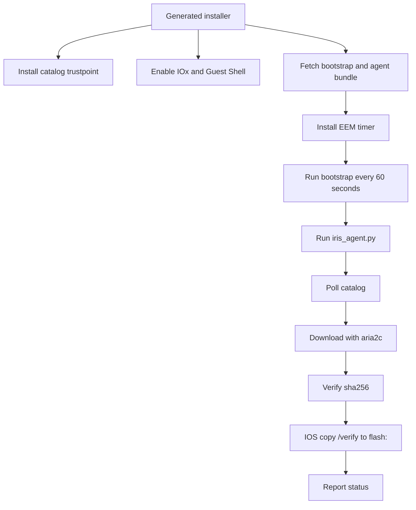

<!--
Copyright 2026 Cisco Systems, Inc. and its affiliates

SPDX-License-Identifier: Apache-2.0
-->

# Device Agents

Device agents are the only part of IRIS that runs on IOS-XE devices. Their job is intentionally narrow: discover the approved image, download it, verify it, copy it to the platform storage root, and report status.

A device attaches through one of four management types: a dedicated IRIS-managed
VLAN/SVI (**routed**), an existing operator-owned management VLAN (**inband**),
or an IRIS-managed VirtualPortGroup (**router-routed** or **router-nat**).
The attachment choice governs what the installer and uninstaller may configure
and remove; see
[Management Type and VLAN Ownership](network-attachment.md).

After a successful Guest Shell or IOx onboarding or cleanup lifecycle, IRIS runs
`copy running-config startup-config`. This persists the IRIS app-hosting,
networking, trustpoint, and cleanup state across a reload. Failed or partial
onboarding is not saved.

## Guest Shell path

Catalyst 9300 devices use Guest Shell. The generated installer configures the device-side plumbing and then the EEM timer keeps the agent alive.

## Agent loop

The agent loop is deliberately boring:

1. Load device config and token material.
2. Refresh the token when needed.
3. Ask the catalog for the approved image.
4. Skip work when the approved image is already staged and verified.
5. Download missing content through `aria2c`.
6. Verify the downloaded file hash.
7. Copy to the IOS storage root with IOS verification.
8. Report health, progress, and errors.

## Verification gates

IRIS uses two checks because the server and device have different capabilities:

| Check | Where | Why |
| --- | --- | --- |
| `sha256` | Agent Python code | Confirms the downloaded file matches catalog metadata before IOS copy. |
| `sha512` | IOS `verify` path | Confirms the root storage copy matches catalog metadata using IOS-native verification. |

If verification fails, the agent reports the failure and leaves installation decisions untouched. It does not change boot variables and does not reload the device.

## Replaced image cleanup

When a device is reassigned to a different image, the agent removes the storage-root
copy it placed for the previous image — never an image IRIS did not place. The
delete is queued in agent state and executed through a one-shot
`event manager applet ... authorization bypass` EEM applet, the same mechanism the
copy-to-root and bundle-mode reclaim paths use. A raw exec `delete` is not used: on a
device running AAA command authorization IOS discards it silently, which leaves the
replaced image on flash and the delete queued on every 60-second tick.

After firing the applet the agent re-checks whether the file is gone. Cleanup is
reported only on proven absence; a name still present stays queued and is retried on
the next tick, which also covers the case where the applet is still running when the
agent looks. Queued names are re-validated against the agent's filename whitelist
before they reach the applet, so a hand-edited state file cannot inject a command.

## Device SSH host-key pinning

Guest Shell runs inside IOS and configures the device locally. The IOx app instead
reaches IOS over SSH to run `copy /verify` and the cleanup applets, so it has a host
key to consider.

Host-key pinning is optional and off by default. Set `device_ssh_known_hosts` in the
agent config to a `known_hosts` path and, when that file exists, SSH and SCP run with
`StrictHostKeyChecking=yes` against it. With the key unset — or set to a path that
does not exist — the agent runs `StrictHostKeyChecking=no` with
`UserKnownHostsFile=/dev/null`. This is the same verify-if-present shape the agent
uses for the catalog TLS trust anchor. Nothing in IRIS writes the `known_hosts` file;
it exists for operators who want the connection pinned.

## Platform targets

| Platform path | Storage target | Control path |
| --- | --- | --- |
| Catalyst 9300 Guest Shell | `flash:` | EEM timer and Guest Shell process. |
| Catalyst 9300 IOx | `flash:` (via the SSD share) | IOx Docker app and SSH-to-self IOS commands. |
| IE-3x00/IE-3400 IOx | `sdflash:` | IOx Docker app and SSH-to-self IOS commands. |
| Catalyst 8000 Guest Shell | `bootflash:` | Guest Shell through a VirtualPortGroup. |

The router path targets the Catalyst 8000 family and is lab-tested on C8000v; see
[Router routed and router NAT](network-attachment.md#router-routed-and-router-nat-iris-managed-virtualportgroup).
