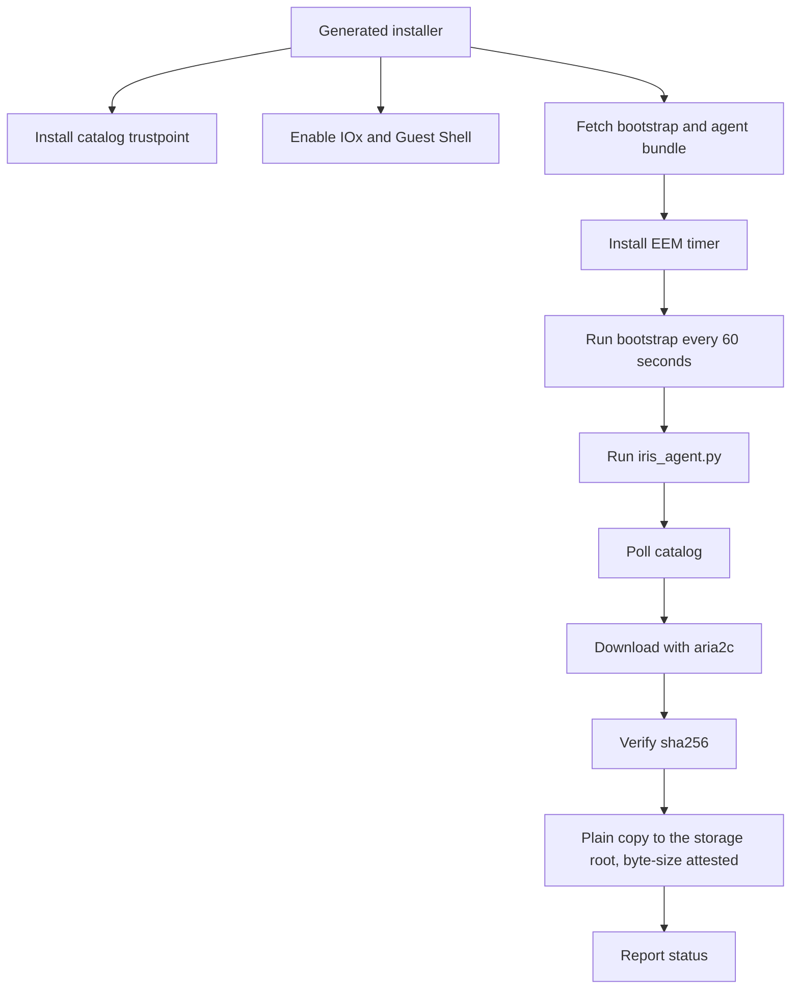

<!--
Copyright 2026 Cisco Systems, Inc. and its affiliates

SPDX-License-Identifier: Apache-2.0
-->

# Device Agents

All device paths use the Python agent in `device/agent/` to read assignments,
download and verify images, stage them on device storage, and report status.
IOx and IOS-XR also share one container build and entrypoint, with amd64 and
arm64 images. `IRIS_DEVICE_PLATFORM` selects the `iox` or `xr-appmgr` profile.
Guest Shell packages the same agent in a bundle and runs it through bootstrap
and an EEM timer. The server and Console have their own container images.

IRIS stages software only. It never installs or activates a network OS image,
changes boot variables, or reloads the device.

A device attaches through one of five management types: a dedicated IRIS-managed
VLAN/SVI (**routed**), an existing operator-owned management VLAN (**inband**),
an IRIS-managed VirtualPortGroup (**router-routed** or **router-nat**), or the
router's own network stack with no app-network fields (**xr-host**).
The management-type choice governs what the installer and uninstaller may configure
and remove; see
[Management Type and VLAN Ownership](management-type.md).

After a successful Guest Shell or IOx onboarding or cleanup lifecycle, IRIS runs
`copy running-config startup-config`. This persists the IRIS app-hosting,
networking, trustpoint, and cleanup state across a reload. Failed or partial
onboarding is not saved. IOS-XR has no running/startup split to bridge — a
`commit` is already the persisted state — so the XR recipes never issue one.

## Guest Shell path

Catalyst 9300 devices and Catalyst 8000 routers use Guest Shell (routers through an IRIS-managed VirtualPortGroup, staging to `bootflash:`). The generated installer configures the device-side plumbing and then the EEM timer keeps the agent alive.



## Agent installation

### Guest Shell and router: what the installer pushes

`device/device-install.sh` (Catalyst 9300 Guest Shell) and
`device/router-install.sh` (Catalyst 8000 router) push the same file set to
the guest-share root, over a `copy https://` that the PKI trustpoint step
(pasted over SSH first) lets IOS verify:

| File served from the artifact server | Device-side name | Purpose |
| --- | --- | --- |
| staged as `iris-agent-<DEVICE_ID>-<CAP>.conf` | `iris-agent.conf` | catalog URL, device id, and an empty `rpc_secret` — the agent fetches the real secret on its first token refresh |
| staged as `rpc-secret-<CAP>` | `rpc-secret` | seeds aria2c's RPC secret; bootstrap.sh reconciles it against the conf on every tick |
| `iris-agent.tgz` | `bundle.tgz` | the agent Python, `bootstrap.sh`, `guestshell-start.sh`, `rotate-logs.sh`, `agent/peer-transfer-hook.sh` (aria2's `--on-bt-download-complete` program), and an architecture-matched `aria2c`, packed by `tools/make-agent-bundle.sh` |
| the bare server cert | `iris-catalog.pem` | pinned TLS trust anchor for the agent's catalog calls |
| — | `bootstrap.sh` | the EEM entry point itself |

`CAP` is a fresh 128-bit random capability minted per install run.
The staged copies live under the artifact server's `staging/`
prefix and are only reachable for the 3600 seconds it retains them, ample
headroom for queued fleet work and the installer's own retry loop. This
capability-bearing HTTPS surface serves the
Guest Shell installer; the authenticated `/v1/devices/.../artifacts/...` API
used by explicit clients is a separate surface.

The installer then installs one EEM applet:

```text
event manager applet IRIS-AGENT authorization bypass
 event timer watchdog time 60 maxrun 900
 action 100 cli command "enable"
 action 200 cli command "guestshell run bash <fs>guest-share/bootstrap.sh"
```

Every 60 seconds it runs `bootstrap.sh` inside Guest Shell, which moves any
freshly dropped files into its own guest-owned working directory, unpacks a
new `bundle.tgz` if one arrived (copying its `bootstrap.sh` back over the
running copy), makes sure `aria2c` is up and serving, and finally runs
`iris_agent.py --once`.

**Dropping a new `bundle.tgz` on the device is the agent upgrade** for Guest
Shell and router — the next tick unpacks it and runs the new code. There is no
separate upgrade command. Re-running the installer script directly has the same
effect (it mints a new capability and re-copies the bundle). A console
re-onboard is not that path: its preflight refuses a device that still carries
the live agent, so undeploy first and then onboard again. `router-install.sh`
additionally destroys any pre-existing Guest Shell before re-applying config,
so a re-onboard never leaves the guest running on stale networking from a
previous install — see
[Router routed and router NAT](management-type.md#router-routed-and-router-nat-iris-managed-virtualportgroup).

### IOx: what the installer pushes

`device/iox/install.sh` never touches Guest Shell. It pushes the built package
(`iris-arm64.tar` or `iris-amd64.tar`) and current public catalog certificate
from the server host to the target IOS filesystem over the same authenticated,
host-key-checked SCP transport. After the app reaches `ACTIVATED`, the installer
copies the certificate into app-hosting application data, then starts the app.
The package contains no server certificate; the container reads the copy from
CAF's app-data directory. Deployment-specific values — the enrollment
token, device id, and SSH-to-self credentials — are passed as numbered
`run-opts -e` Docker options at deploy time and never baked into the image.
`IRIS_DEVICE_PLATFORM=iox` selects and persists the IOx profile;
`device/container/entrypoint.sh` (PID 1) writes the values into
`iris-agent.conf` on first boot only if no config already exists on the
persistent mount. There is no EEM timer on IOx: the common entrypoint is its own
supervisor loop, running the agent once every `IRIS_TICK_SECONDS` (default 60s).

Re-provision a device when replacing its bootstrap configuration or enrollment material: the cutover replaces only the staging agent's credentials and never touches the device's software.

**Upgrade on IOx is uninstall, then reinstall** — there is no in-place package
update. `device/iox/install.sh` is idempotent by design: its first step always
stops, deactivates, and uninstalls any existing `iris` app before copying the
new package and reinstalling, so re-running `device/iox/install.sh` directly
with a freshly built package is the supported upgrade path. The same upgrade
from the Console needs an undeploy first when the app is running. An incomplete
IOx onboard left in `DEPLOYED` or `ACTIVATED` can be retried directly; see
[First install of a new package version](iox.md#first-install-of-a-new-package-version).
`device/iox/uninstall.sh`
performs the same teardown standalone, for a clean removal with no reinstall.

### IOS-XR: what the installer pushes

`device/xr-install.sh` deploys the agent to a Cisco 8000-series router running
IOS-XR as an **appmgr Docker application**. It pushes the pre-built
`iris-xr.rpm` and current public catalog certificate to `harddisk:` over scp,
registers the agent RPM (`appmgr package install rpm`), and starts its appmgr
application in config mode with host networking and the `/misc/disk1:/hostmount` bind mount.
`/misc/disk1` **is** `harddisk:`, so the container
writes straight to the router's own filesystem and reads the runtime trust
anchor at `/hostmount/iris-catalog.pem`. The deployment-neutral RPM contains no
server certificate. Secrets and the device id are passed as `--env` options on
the activation line and are never baked into the image.
`IRIS_DEVICE_PLATFORM=xr-appmgr` selects and persists the XR profile;
`device/container/entrypoint.sh` writes the configuration on first boot and
uses the same supervisor as IOx. The XR profile verifies the `harddisk:` mount
before its first write, rejects all IOx SSH/share variables, and never
instantiates the SSH transport even though the common image contains the client
binaries IOx needs. `device/xr-uninstall.sh` is the record-driven
inverse: deactivate the app, uninstall its package source, remove the RPM and
runtime certificate, empty `iris-work/`, and remove torrent sidecars from
`harddisk:` root. The empty work directory can remain after successful
cleanup; image files remain in place.

All three onboarding paths deliver the current public certificate at runtime.
A server-certificate rotation therefore requires re-onboarding devices so that
file is replaced, but it does not require rebuilding the Guest Shell bundle,
IOx tars, or XR RPM. A shared-agent source change is the opposite: rebuild all
package families, then redeploy affected devices so they receive the new code.

These lifecycle commands install and start the IRIS application. They do not
install or activate any network OS image that IRIS distributes.

### Confirming it worked

An inventory row and a deployment job can exist before the agent connects.
The final `onboard complete: <device-ip>` line means the installer completed.
A fresh heartbeat confirms the agent can reach the catalog, even when no
images are assigned. Check each assigned image in Devices for its staging
result; onboard completion alone does not mean an image is staged.

The normal tick is 60 seconds, with jitter and failure backoff described
below. A new assignment stays **Waiting for staging** until the agent reports
work on it. Current per-image errors remain visible even if the same image
was staged previously. Each device reports its own assigned set, so a second
device starting a transfer does not reset the first device's completed state.

Immediately after first boot, aria2c may still be running with the empty RPC
secret deliberately shipped by the installer while the agent has just fetched
the real one. aria2-next reports that brief mismatch as HTTP 400. IRIS treats it
as a normal `staging` state, emits `ARIA2-AUTH`, and lets the next bootstrap tick
copy the refreshed secret and restart aria2c; it does not show a false staging
failure. A connection-refused or otherwise unreachable RPC endpoint remains a
real error.

### Failure mode: aria2c alive but not serving

A running process does not prove aria2 is answering requests. Guest Shell
bootstrap and the common IOx/XR supervisor probe `aria2.getVersion` on the
local RPC port before deciding whether to relaunch it.

Guest Shell stops a non-serving daemon before replacing its binary; otherwise
the copy can fail because the binary is still executing. Copy and launch
failures appear in bootstrap output instead of being ignored.

The common container supervisor tracks aria2 by its child PID. When it must
restart that child, it sends TERM, waits up to five seconds, then uses KILL
if needed and reaps the process. The same shutdown path runs when the
container stops. TERM lets aria2 save its `.aria2` checkpoint for resume.
Launchers enable `--check-integrity`, so a resumed transfer checks saved
pieces and downloads damaged pieces again. A completed file re-added for
seeding uses `--bt-seed-unverified` to avoid another full read at startup;
its earlier content check is retained in agent state.

Every aria2 launcher also loads the device's pinned `iris-catalog.pem` as its
CA and keeps certificate checking enabled for tracker announces on TCP 6969.
IOx and IOS-XR attach their bearer credential as a per-torrent header; Guest
Shell sends its query credential inside the same verified TLS transport.

Guest Shell additionally copies the validated CA to a content-addressed path
on its executable filesystem and launches aria2 against that immutable
generation. Aria2 loads CA bytes only when it starts, so merely replacing
`iris-catalog.pem` at the same path during re-onboard would otherwise leave a
healthy daemon trusting the previous certificate. A changed digest forces
one restart; a malformed or
unverifiable snapshot fails before launch.

### Failure mode: a busy aria2c read as a dead one

A daemon built without asynchronous DNS can pause its event loop while
resolving a tracker hostname. During that pause it may accept a connection
without answering the RPC request promptly.

The supervisor uses separate connection and response timeouts. A refused
loopback connection triggers a restart; a slow reply must fail a second probe
before the daemon is stopped. This allows a temporary DNS stall to clear
without discarding the transfer. Using the configured server IP in the tracker
URL avoids a hostname lookup on that path.

## Agent loop

Each tick:

1. Load device config and token material.
2. Refresh the token when needed.
3. Read the current assigned set and stop torrents for removed assignments.
4. Skip acquisition for images already staged and verified.
5. Download missing content through `aria2c`.
6. Verify each completed file against its catalog SHA-256.
7. Place the image at the storage root and attest it by exact byte size. On
   IOS-XE that is a copy — [crash-safely, never deleting a
   pre-existing same-named file first](#crash-safe-same-name-replacement); on
   IOS-XR the download already landed there through the bind mount, so the
   agent only attests it.
8. Report per-image state and one combined heartbeat. A catalog or transfer
   error for one image does not prevent the remaining assignments from being
   checked.

## Crash-safe same-name replacement

Placing an image under a name IRIS finds already on the storage root — the
operator's ordinary republish flow, or a name the `BOOT` variable currently
points at — never deletes the old file first. On Guest Shell, the agent first
reads the root file's size through IOS and compares its native SHA-512 with
the catalog. Guest Shell mounts only `guest-share`, so its local `/flash`
directory cannot attest the IOS root. A one-shot `IRIS-ROOT-HASH` EEM policy
runs the read-only hash with a 600-second limit and returns the result through
a unique completion record under the IRIS share. The filename and digest must match,
and IOS must report the expected size both before and after hashing.
An exact match is adopted in
place, including on IOS releases where `rename` will not overwrite an existing
destination. An unreadable or mismatched root file is left untouched and
reported as `copy_failed`; replacing it is an explicit operator decision, not
a destructive guess by IRIS.

Native hash jobs are serialized. A failed hash waits five minutes after
completion before another attempt; adoption does not rehash an already placed
image. An interrupted launch whose completion cannot be determined remains
blocked for operator inspection. See [root-hash recovery](reference.md#guestshell-root-hash-recovery).
Ordinary placement continues to verify the downloaded SHA-256 and the copied
file's exact IOS byte size; it does not run native `verify`.

When no destination exists, IOS-XE stages the new bytes under a reserved temp
name (`<image>.iris-tmp`), verifies presence and exact byte size there, and
then renames the proven copy to the real name. A failure or power loss before
that rename leaves any previous file exactly as it was; a failure at the
rename step is not assumed to mean it failed — the agent re-checks the real
name afterwards and reports whichever state it actually finds. IOS-XR is
unaffected: `attest_in_place` never writes a second copy at all.

A leftover temp-name file — from an attempt that crashed before its own
retry could clean up after it — is covered by the same low-space
bundle-reclaim sweep as any other unused image artifact on a **bundle-mode**
device, so it does not sit invisible on an otherwise-full box there. On an
**install-mode** device this sweep does not apply: low-space reclaim there
runs `install remove inactive`, which manages installed packages and does
not touch a stray `.bin.iris-tmp` at the storage root, so a temp-name
leftover on an install-mode device is not automatically reclaimed by
either path. The narrow exception is Guest Shell adoption of an already
size-and-SHA-verified root file: if the failed attempt's reserved
`<image>.iris-tmp` also exists, IRIS reclaims exactly that temp name after
checking the running image and `BOOT` targets, then confirms its absence
through IOS before reporting the root ready. If cleanup cannot be proved, the
agent fails closed instead of claiming adoption. Either way, IRIS only ever
attempts the low-space reclaim once per acquisition cycle for a given image —
a content republish under the same id, an image returning from park, or that
image's own placement succeeding all start a fresh cycle and re-arm the
attempt.

An existing file already consumes space and is excluded from the device's
reported free bytes. The placement check budgets for the new copy. Guest
Shell's same-name adoption path does not overwrite a conflicting root file;
an operator must resolve that conflict. See
[Sizing the storage root](management-type.md#sizing-the-storage-root).

## Cadence jitter and overload backoff

Guest Shell's EEM watchdog and the IOx/XR container supervisors all drive the
agent on a nominal 60-second tick. Left exactly synchronized, a fleet that is
bulk-installed or reloaded together keeps every device's tick in the same
phase indefinitely — turning an ordinary tick into a fleet-wide burst of
policy GETs, heartbeats, and tracker re-announces. Three independent,
bounded guards spread that out, sized to smooth *arrival*, not to compensate
for a slow catalog — the per-device cost of a policy/heartbeat round trip is
a fixed, small constant regardless of fleet size (see [Reference → Keyed
per-device state](reference.md#keyed-per-device-state)):

- **Steady-state dither (IOx/XR only).** The IOx and XR profiles in
  `device/container/entrypoint.sh` vary every ordinary tick by ±10% of
  `IRIS_TICK_SECONDS` (54–66s at the 60s default, via `IRIS_TICK_JITTER_PCT`)
  — enough that devices which started in the same second drift apart over a
  handful of ticks, small enough that the *average* cadence, and so token
  refresh and assignment convergence latency, barely moves. Guest Shell
  cannot move the EEM timer's own period (IOS owns that clock), so
  `device/bootstrap.sh` instead sleeps a small bounded jitter
  (`IRIS_TICK_JITTER_MAX`, default 0–7s) immediately before contacting the
  catalog each tick — the EEM timer still fires every 60s, but the actual
  request lands at a different offset within it per device.
- **Startup jitter (IOx/XR only).** The first tick after a container starts
  is spread across the whole tick window (`IRIS_STARTUP_JITTER`, on by
  default) — the case the steady-state dither only corrects gradually: many
  containers restarting in the same second (a platform-wide app-hosting
  restart, say) get their first catalog contact spread out instead of firing
  together. Set it to `0` for a single-device debug session watching for the
  first tick.
- **Failure backoff.** After a tick fails outright — the catalog unreachable,
  timed out, or answering a non-2xx status, the same shape a saturated
  server produces — the next contact backs off exponentially, capped at
  `IRIS_TICK_BACKOFF_MAX` (600s by default), instead of retrying on the
  ordinary cadence. IOx/XR skip the whole tick (`next_tick_sleep` in
  `entrypoint.sh`); Guest Shell/router cannot skip an EEM-fired tick, so
  `bootstrap.sh` instead skips only step 5 (catalog contact) while local
  bundle/aria2c/log upkeep (steps 0–4) keeps running every tick, recording
  the backoff deadline and failure streak in
  `$STAGE/.iris-tick-backoff`. A success immediately clears the streak and
  resumes ordinary cadence. The cap is comfortably inside the catalog
  token's multi-day refresh slack, so a run of backed-off ticks never
  strands a device.

All of these are tuning knobs, not protocol values — see [Reference →
Device container environment variables](reference.md#device-container-environment-variables)
for defaults and ranges.

## Device-side logging (flash write endurance)

`IRIS_LOG` controls aria2's continuous transfer log. It defaults to `off` on
all platforms to reduce flash writes. Heartbeats, staging errors, and the
agent's `%IRIS-6-<MNEMONIC>` messages remain enabled.

| Runtime | Agent messages | With the aria2 log enabled |
| --- | --- | --- |
| Guest Shell / router | IOS-XE syslog, through the local CLI | `aria2c.log` in the staging directory, bounded by bootstrap's `rotate-logs.sh`. |
| IOx | IOS-XE syslog, through SSH-to-self | `aria2c.log` in the agent working directory, bounded by aria2's `--log-max-size=50M --log-max-files=1`. |
| IOS-XR | Container stdout, read with `show appmgr application name iris logs` | The same bounded aria2 log in `harddisk:iris-work/`. |

On XR, appmgr captures stdout even with `IRIS_LOG=off`. The installer bounds
that container log with `--log-driver json-file --log-opt max-size=1m
--log-opt max-file=3`. It retains startup and staging diagnostics without an
unbounded log on the app-hosting partition. XR agent messages do not appear
in the router's `show logging` output.

For an IOx or XR deployment, set `IRIS_LOG=on` when running its installer.
The installer passes the setting to the common container. Use the normal
undeploy/onboard sequence when changing a deployed app's run options.

For Guest Shell, add `iris_log = on` to the persisted `iris-agent.conf`.
Bootstrap reads it on each EEM tick before checking aria2. Settings made only
in an interactive shell do not survive that tick. `rpc_port` and `max_peers`
are read from the same configuration file. Invalid Guest Shell values fall
back to launcher defaults; the common container rejects invalid environment
values at startup.

See [Device agent config keys](reference.md#device-agent-config-keys) and
[Device container environment variables](reference.md#device-container-environment-variables)
for the supported values. Disabling the aria2 log does not disable writes
needed for downloads, checkpoints, agent state, or telemetry.

## Verification gates

The server hashes every image when it is published. Device checks use those
catalog values:

| Check | Where | Purpose |
| --- | --- | --- |
| Torrent pieces | aria2 on every device | Checks pieces during transfer and validates saved pieces when resuming an incomplete download. |
| SHA-256 | Shared agent, on the completed staging file | Confirms the file matches the value recorded at publication. |
| Exact byte size | IOS-XE `dir`, or XR `stat` on the bind mount | Confirms final placement. IOS-XE copies the already-verified file; XR has downloaded directly to its final location. |
| SHA-512 and size for an existing Guest Shell root file | Bounded IOS-XE native verification | Allows adoption when Guest Shell cannot read the IOS root itself. This is an existing-file check, not an extra native hash after every placement. |

Cisco Bulk Hash verification on the server separately compares the catalog's
SHA-512 with Cisco's signed feed; see [Image verification](operations.md#image-verification).
A torrent download matching the catalog and a vendor feed match are different
checks.

If verification fails, the agent reports the failure and leaves installation decisions untouched. It does not change boot variables and does not reload the device.

## Unassigned image park

Removing an image from a device's assignments **parks** it. The agent stops
its torrent, removes its staging copy, and marks it parked. Clearing all
assignments applies the same rules to every image.

On IOS-XE, the separate copy on the storage root is kept. Reassigning the image
lets the agent check and reuse that copy.

On XR, the staging file is already on the storage root. Unassigning removes
files IRIS downloaded; files adopted from the operator, or whose origin is
unknown, remain in place.

If a later IOS-XE assignment needs more space, the agent can reclaim parked
root copies during its storage check.

IOS-XE cleanup protects two files:

* the **running image** (`show version`), and
* the file named by the **`BOOT` variable** (`show boot`).

When either read fails, the agent skips deletion, logs
`RECLAIM-DEFERRED` or `CLEANUP-PENDING`, and retries on the next tick.

!!! warning "Storage capacity"
    Allow room for all resident images plus working space; see
    [Sizing the storage root](management-type.md#sizing-the-storage-root).
    Undeploying IRIS also keeps staged IOS-XE images on the storage root.
    To free that space, use the next assignment's automatic cleanup or your
    normal device file-management procedure.

## Device SSH host-key pinning

Guest Shell runs inside IOS and configures the device locally. The IOx app instead
reaches IOS over SSH to run the placement copy and the cleanup applets, so it has a host
key to consider.

Host-key pinning is optional and off by default. Set `device_ssh_known_hosts` in the
agent config to a `known_hosts` path and, when that file exists, SSH and SCP run with
`StrictHostKeyChecking=yes` against it. With the key unset — or set to a path that
does not exist — the agent runs `StrictHostKeyChecking=no` with
`UserKnownHostsFile=/dev/null`. Nothing in IRIS writes this agent-side `known_hosts` file; operators provision
it when they require this connection to be pinned. Catalog and tracker TLS
are separate: their public certificate is required, and a missing or invalid
certificate stops the connection. Server-to-device SSH uses the server's
persistent host-key policy; see [Device SSH host keys](security.md#device-ssh-host-keys).

## Platform targets

The container selector is required before any write. A new deployment with no
`IRIS_DEVICE_PLATFORM`, an unknown value, or conflicting persisted value stops
with a clear error. After first boot the `device_platform` key in
`iris-agent.conf` carries the choice across a restart or already-deployed
upgrade. Unified IOx/XR container storage is derived and live-attested and
does not guess `flash:`. Guest Shell retains its platform-specific target
selection shown below.

| Platform path | Selector | Storage target | Control path |
| --- | --- | --- | --- |
| Catalyst 9300 Guest Shell | n/a | `flash:` | EEM timer and Guest Shell process. |
| Catalyst 9300 IOx | `iox` | Live writable-media policy, normally `flash:` via the SSD share | Common device container and SSH-to-self IOS commands. |
| IE-3400 IOx | `iox` | Live writable-media policy, normally `sdflash:` | Common device container and SSH-to-self IOS commands. |
| Catalyst 8000 Guest Shell | n/a | `bootflash:` | Guest Shell through a VirtualPortGroup. |
| Cisco 8000 series (IOS-XR) | `xr-appmgr` | Fixed `harddisk:` | Common device container with a verified direct bind mount and no SSH path. |

The router path targets the Catalyst 8000 family and is lab-tested on Catalyst 8000V; see
[Router routed and router NAT](management-type.md#router-routed-and-router-nat-iris-managed-virtualportgroup).

For the lab-validation status behind this table — including which of these
platforms have been exercised end to end on real hardware and which have not
— see [Validation: Validated platforms](validation.md#validated-platforms).
