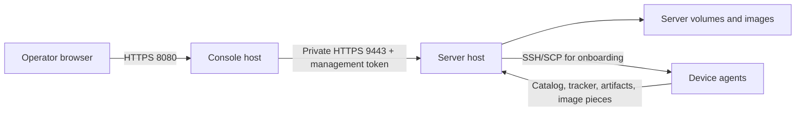

<!--
Copyright 2026 Cisco Systems, Inc. and its affiliates

SPDX-License-Identifier: Apache-2.0
-->

# Docker on separate hosts

Run the server on one Docker host and the Console on another. The server owns
images, credentials, assignments, device jobs, and the swarm. The Console
serves the browser and forwards API requests over authenticated HTTPS. Each
host uses its own local storage; no shared filesystem, Docker network, or
Docker socket is needed.



Both deployments run one container. This separates the Console from the
server; it does not cluster the tracker, catalog, or seeder. Kubernetes uses
the same division of work with Services and Secrets; see
[Kubernetes](kubernetes.md).

## Phase 1 instruction custody

Both `GET /v1/devices/{device_id}/instructions` and
`GET /v1/devices/{device_id}/instruction-keylist` remain authenticated
application traffic on device-to-server HTTPS 8443. There is no new listener,
port, network path or firewall flow; 9443 remains Console-to-server
management-only. Preserve the selected Compose project, env files and volumes.

Only the server host holds `$IRIS_CONFIG/instr/signing-key.age`, the separate
age identity, `$IRIS_RUN/instr/signing-key` runtime plaintext, and durable
instruction state under `$IRIS_STATE`. The Console holds its management
token/CA files and browser identity; never copy server data during relocation.
The two offline-root public keys are public material; their private keys remain
with separate offline custodians. See [layout validation](validation.md#phase-1-layout-validation).

## Addresses and prerequisites

Use two amd64 Linux hosts with Docker Engine 23.0 or newer and Docker Compose
2.24.4 or newer. The server Compose file uses
[`!override`](https://docs.docker.com/reference/compose-file/merge/#replace-value)
to define its mounts.
Check out the same IRIS version on both hosts. Building the server also needs
the pinned `aria2c` binary; building the Console does not.

Choose these addresses before provisioning:

| Address | Used by |
| --- | --- |
| Server device address, `IRIS_HOST_IP` | Device catalog, tracker, artifacts, and origin seeder. |
| Server private management address | The Console's `IRIS_MANAGEMENT_API_URL`, normally `https://iris-mgmt.example.com:9443`. Its hostname must resolve from the Console container. |
| Console browser address | Operators, for example `https://console.example.com:8080`. Set the same full URL as `IRIS_CONSOLE_URL` on the server. |

The server's management address can share its device-facing interface if that
interface is on a trusted management network. Bind port 9443 to that specific
address and allow only the Console host through the firewall. Restrict the
Console browser port to trusted operator sources. Devices do not need access
to the Console or port 9443. See [Network ports](network-ports.md#firewall-rules)
for the remaining server and device flows.

Use assigned addresses from your network's inventory or DHCP reservation
system.

## Certificates and trust

Three identities serve different connections:

| Identity | Private key location | Trusted by |
| --- | --- | --- |
| Catalog/device certificate | Encrypted server configuration, decrypted into server tmpfs | Device agents and installers. |
| Management certificate | Server host's `management-tls` directory | Console's `management-ca/ca.pem`. |
| Default browser certificate | Console host's `console-tls` directory | Operator browsers. |

The management certificate must cover the exact DNS name or IP in
`IRIS_MANAGEMENT_API_URL`. The browser certificate must cover the Console URL.
The Console verifies management TLS and sends a separately scoped token read
from a file. Neither credential is a browser login or device enrollment token.

On a trusted operator machine, create the host bundles:

```bash
umask 077
mkdir -p ~/.config/iris
python3 tools/prepare-docker-hosts.py \
  --out "$HOME/.config/iris/docker-hosts" \
  --management-host iris-mgmt.example.com \
  --console-host console.example.com
```

Use names that resolve in your network. Repeat either host flag to include
another DNS name or IP in that certificate. The helper refuses an existing
output directory. It generates independent self-signed certificates valid for
365 days and one scoped management token, without printing secrets:

```text
docker-hosts/
  server/
    tier-auth/current.json
    management-tls/tls.crt
    management-tls/tls.key
  console/
    tier-auth/current.json
    management-ca/ca.pem
    console-tls/tls.crt
    console-tls/tls.key
```

Deliver only the contents of `server/` to `/etc/iris/docker-hosts/` on the
server, and only `console/` to that path on the Console host. Use SSH/SCP with
the destination host key verified. The matching path names refer to different
local filesystems. The server bundle contains no browser private key; the
Console bundle contains no management private key or age identity.

On each destination host, set ownership and keep the generated permissions:

```bash
sudo chown -R 10001:10001 /etc/iris/docker-hosts
sudo find /etc/iris/docker-hosts -type d -exec chmod 700 {} +
sudo find /etc/iris/docker-hosts -type f -exec chmod 600 {} +
```

Verify the public management certificate fingerprint against the Console's
`ca.pem` through your trusted provisioning channel. Install the browser
certificate in the operator trust store or use a certificate issued by your
organization. Organization-issued certificates can replace the generated
pairs at the same paths; put their management CA chain in `ca.pem`. Keep keys
unencrypted inside these protected files so the containers can start without
a passphrase prompt. Store or remove the provisioning copy according to your
credential policy.

## Start the server host

From the repository root, copy and edit the server environment example:

```bash
cp server/server.env.example server/server.env
```

Set every example address and path. Provision the age identity, recipient
list, writable artifacts directory, and readable image root as described in
[Getting Started](getting-started.md#configure-the-server). The age identity
belongs only on the server host. Keep it mode 600 or 400 and readable by uid
10001; that uid also needs write access to artifacts and server volumes.

The commands below initialize a fresh server. For server data already in use,
keep its actual `COMPOSE_PROJECT_NAME`, container name, age identity, and host
paths; the project name selects the named volumes. Skip the bootstrap command
and preserve those volumes. Stop and remove only the old Console container
when replacing it; server data and device assignments stay with the server.

Use this function in the following commands:

```bash
iris_server() {
  docker compose --env-file server/server.env \
    -f server/docker-compose.server.yml "$@"
}

tools/get-aria2c.sh amd64
iris_server build --pull
iris_server run --rm iris iris-bootstrap
iris_server up -d
iris_server ps
```

Build device packages on the server host as required for your devices:

```bash
set -a
. server/server.env
set +a
tools/provision-iox-packages.sh
tools/build-xr-package.sh --out device/xr/out
sudo install -o 10001 -g 10001 -m 444 device/xr/out/iris-xr.rpm \
  "$IRIS_ARTIFACTS_HOST_DIR/.iris-xr.rpm.next"
sudo install -o 10001 -g 10001 -m 444 device/xr/out/iris-xr.rpm.manifest \
  "$IRIS_ARTIFACTS_HOST_DIR/.iris-xr.rpm.manifest.next"
sudo rm -f "$IRIS_ARTIFACTS_HOST_DIR/iris-xr.rpm.manifest"
sudo mv "$IRIS_ARTIFACTS_HOST_DIR/.iris-xr.rpm.next" \
  "$IRIS_ARTIFACTS_HOST_DIR/iris-xr.rpm"
sudo mv "$IRIS_ARTIFACTS_HOST_DIR/.iris-xr.rpm.manifest.next" \
  "$IRIS_ARTIFACTS_HOST_DIR/iris-xr.rpm.manifest"
```

Exporting the example file's settings gives these host-side helpers the same
container name and artifact directory as Compose. The XR build uses a writable
local output directory, then publishes the package and its manifest to the
server-owned artifacts directory. The native builds need both
architecture binaries and any required ARM64 emulation; see
[package staging](development.md#embedded-agent-packages).

## Start the Console host

The Console needs its three provisioned directories and its environment file:

```bash
cp server/console.env.example server/console.env
```

Set its bind address, browser port, management URL, and directory paths. Then:

```bash
iris_console() {
  docker compose --env-file server/console.env \
    -f server/docker-compose.console.yml "$@"
}

iris_console build --pull
iris_console up -d
iris_console ps
```

The Console can start before the server. It validates and loads its local
browser certificate when the server is unavailable. API requests return a
redacted `503` with `Retry-After` while the management connection is down;
Console readiness checks its own listener and required local files. A TLS
verification failure, rejected credential, or malformed management response
is not permission to bypass authentication.

Open the configured Console URL and complete [administrator setup](console.md#first-run).
The administrator account lives on the server. Connecting another Console to
the same server uses that account; it does not create another inventory.

## Deployment settings

Use the example environment file for each host. Tokens and private keys stay
in the provisioned files; the environment contains only their directory paths.

| Variable | Host | Meaning |
| --- | --- | --- |
| `COMPOSE_PROJECT_NAME` | Both | Local project and volume prefix. Examples use `iris-server` and `iris-console`; preserve the actual name for server data already in use. |
| `IRIS_HOST_IP` | Server | Device-reachable server IP. |
| `IRIS_MANAGEMENT_BIND_IP` | Server | Specific private host address publishing TCP 9443. |
| `IRIS_CONSOLE_URL` | Server | Full browser HTTPS URL reported in Settings, including a nondefault port. |
| `IRIS_AGE_KEY_FILE_HOST`, `IRIS_AGE_RECIPIENTS` | Server | Age identity path and public recipients for encrypted server state. |
| `IRIS_MANAGEMENT_TLS_DIR` | Server | Read-only directory containing `tls.crt` and `tls.key` for the management listener. |
| `IRIS_TIER_AUTH_DIR` | Both | Local directory containing scoped `current.json` and an optional rotation `previous.json`; server read/write, Console read-only. |
| `IRIS_IMAGE_ROOT`, `IRIS_ARTIFACTS_HOST_DIR` | Server | Host import tree and served artifacts directory. |
| `IRIS_MANAGEMENT_API_URL` | Console | HTTPS server management endpoint, normally port 9443; its name must match the certificate. |
| `IRIS_CONSOLE_BIND_IP`, `IRIS_GUI_PUBLISH` | Console | Host browser binding; port defaults to 8080. |
| `IRIS_MANAGEMENT_CA_DIR` | Console | Read-only directory containing trusted management certificates in `ca.pem`. |
| `IRIS_CONSOLE_TLS_DIR` | Console | Read-only directory containing the default browser `tls.crt` and `tls.key`. |

The Console mounts no server state volume. Directory mounts allow files to be
replaced atomically without leaving the container attached to an old inode.
Missing provisioned directories fail deployment instead of being silently
created by Docker.

## Rotate the management credential

Keep the old credential accepted until the Console uses the replacement:

1. On the server host, run `iris_server exec iris iris-management-token rotate`.
   This writes the old value to `previous.json` and atomically replaces
   `current.json` in the server's `IRIS_TIER_AUTH_DIR`. The files must be
   distinct; aliases are rejected before either rotation or retirement.
2. Transfer the new `current.json` to the Console host through verified SSH.
   Place it in that host's tier-auth directory under a temporary filename,
   set ownership `10001:10001` and mode 600, then rename it to `current.json`
   within the same directory. Do not print the token or put it in an argument.
3. Make an authenticated Console request, such as opening Devices. A green
   local readiness probe alone does not prove the new token works.
4. On the server, run `iris_server exec iris iris-management-token retire-previous`.
   Check the Console again and securely remove any temporary transfer copies.

Both services reread credential files per request, so token rotation needs no
container restart. Do not start another rotation until this one is complete.

## Rotate certificates

For an organization-issued management certificate under the same trusted CA,
replace the server's certificate and key together, then restart the server.
For a new management CA or self-signed certificate, first add the replacement
public certificate or CA to the Console's `ca.pem` alongside the current one.
Restart the Console and confirm it still works. Replace the server pair and
restart the server, confirm an authenticated Console request, then remove the
old trust entry and restart the Console again. Keep each pair matched and
retain the same hostname or update the management URL to match. This trust
change does not alter the device/catalog certificate.

For the default browser identity, replace the Console host's `tls.crt` and
`tls.key` together and restart the Console. A certificate installed through
**Settings → TLS & trust** takes precedence; its key is stored encrypted on
the server and delivered over the authenticated management connection.
Settings reports the certificate the Console is actually serving.

## Verify and troubleshoot

Check `iris_server ps` and `iris_console ps` on their respective hosts. Inspect
logs with `iris_server logs --tail=100 iris` and
`iris_console logs --tail=100 console`.

| Symptom | Check |
| --- | --- |
| Console will not start | Directory mounts exist; uid 10001 can read the token, management CA, and browser certificate/key; the browser pair matches. |
| Console loads, API returns 503 | Server health, management DNS from inside the Console container, route/firewall to private TCP 9443, certificate SAN and trust, and matching token files. |
| Browser warns about TLS | The browser trusts the Console issuer and the browser URL matches the certificate; changing management trust does not change browser trust. |
| Server starts with an empty inventory | Check `COMPOSE_PROJECT_NAME` and the mounted state/config volumes before adding devices or changing assignments. |
| Device staging fails while the Console works | Check device-to-server catalog/tracker/seeder flows and server-to-device SSH. The Console host is outside those paths. |

Verify a login, inventory request, Settings addresses and browser certificate,
image import or upload, and job log streaming. Restart the Console while the
server is stopped to check local startup, then restore the server and verify
API recovery. Use a separate test deployment for outage checks when the server
has active device work. These checks exercise the same operator API as the
one-host Compose and Kubernetes deployments.
