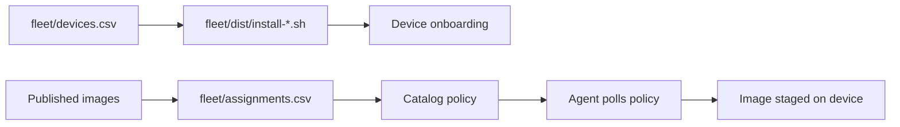

<!--
Copyright 2026 Cisco Systems, Inc. and its affiliates

SPDX-License-Identifier: Apache-2.0
-->

# Network Workflows

IRIS separates network onboarding from image assignment. That keeps connectivity data and release intent in different files, which makes review and rollback easier.

## Inventory

Start from the template:

```bash
cp fleet/devices.csv.example fleet/devices.csv
```

The inventory is an attachment-aware, named-header **CSV v2**. Every device
declares a `management_type`: `routed` (IRIS creates a dedicated VLAN and SVI),
`inband` (the agent attaches to an existing operator-owned management VLAN),
`router-routed` (an IRIS-managed VirtualPortGroup subnet), or `router-nat`
(that VPG subnet behind NAT):

```text
device_id,device_ip,management_type,iris_vlan,svi_ip,svi_mask,app_ip,app_mask,app_gateway,inband_vlan,ios_ssh_host,model,vpg_number,nat_interface,platform
```

- **routed** — fill `iris_vlan`, `svi_ip`, `svi_mask`, `app_ip`, `app_mask`,
  `app_gateway`; leave `inband_vlan` blank.
- **inband** — fill `inband_vlan`, `app_ip`, `app_mask`, `app_gateway`; leave
  `iris_vlan`/`svi_*` blank. Static IPv4 on Guest Shell or IOx (IE-3x00, C9300);
  DHCP is not supported. For inband **IOx**, `ios_ssh_host` (the IOS endpoint
  the app SSHes to) defaults to the device's management IP — only set it for
  an asymmetric topology (Guest Shell leaves it blank).
- `model`/`platform` are optional; blank `platform` auto-selects from the model.
- **router-routed** — fill `app_ip`, `app_mask`, `app_gateway`, and
  `vpg_number`; use `platform=router` (automatic for a known C8xxx model). The
  operator must route the VPG subnet to IRIS and peers.
- **router-nat** — additionally fill `nat_interface`. It creates static PAT
  for TCP 6881; the interface is canonicalized and teardown preserves an
  outside NAT marking that pre-dates IRIS. The router path targets the Catalyst
  8000 family and is lab-tested on C8000v; see
  [Router routed and router NAT](network-attachment.md#router-routed-and-router-nat-iris-managed-virtualportgroup).

See [Management Type and VLAN Ownership](network-attachment.md) for the full
ownership rules. Older positional CSVs (e.g. `device_id,device_ip,vlan,...`)
still import, but are classified `legacy_routed` and must be adopted before they
can be undeployed — they are never inferred as inband.

### Credentials are not in the CSV

The v2 inventory carries network information only. There is no
`credential_profile_id` column, so an imported device has no credential profile
and cannot be onboarded until one is assigned. That assignment is a Console
step: open **Devices**, check the imported rows, pick a profile in the
*credential for selected* dropdown, and press **Apply**. Creating a credential
profile re-renders the device rows immediately, so devices imported before the
profile existed become assignable without waiting for the next poll.

Keep operator passwords out of `fleet/devices.csv` even as a convenience — the
credential profile lives in the server's secret store, and the CSV is a
reviewable, Git-friendly file.

### Batch operations in the Console

The Devices toolbar finishes a CSV import in bulk: onboard, undeploy, adopt,
delete, and credential assignment all act on the checked rows and report
per-device refusals instead of failing the whole batch. See
[Bulk device actions](console.md#bulk-device-actions).

Deleting inventory rows is not an undeploy — an onboarded device keeps its agent
and its staged image with no inventory entry left to manage it — so undeploy the
devices before deleting their rows.

### Onboarding path

Attachment-aware onboarding runs through the **Console / API**, which resolves
an immutable plan, records a durable *receipt* of what it applies, and drives
teardown from that receipt (not from the editable inventory). A router deployment
runs its preflight again at execution time and cannot be adopted afterwards; see
[Router preflight and ownership](network-attachment.md#router-preflight-and-ownership)
and [Web Console](console.md#onboarding-from-the-console).

The legacy CLI generator is **routed-only** and deliberately refuses a v2
(`management_type`) header, because a self-contained installer cannot record
a receipt or run preflight before minting an enrollment token:

```bash
# legacy routed inventory only (old positional columns)
tools/gen-device-installers.sh fleet/devices.csv
```

The generator asks the running server for a short-lived enrollment token per device. The token is enough for first contact, then the agent promotes it through the catalog token-refresh path.

## Assignments

Start from the template:

```bash
cp fleet/assignments.csv.example fleet/assignments.csv
```

Assignments are release intent:

```text
device_id,image_id
```

Apply them:

```bash
tools/apply-assignments.sh fleet/assignments.csv
```

The script validates all rows first, then applies assignments. That avoids partially applying a malformed file.

## Workflow map



## Review guidance

Review `fleet/devices.csv` for network correctness — including the
`management_type` of each device and, for inband rows, that the existing
VLAN/SVI/gateway are operator-owned and correct — and `fleet/assignments.csv`
for release correctness. Do not mix credentials, operator passwords, or image
binaries into either file.
