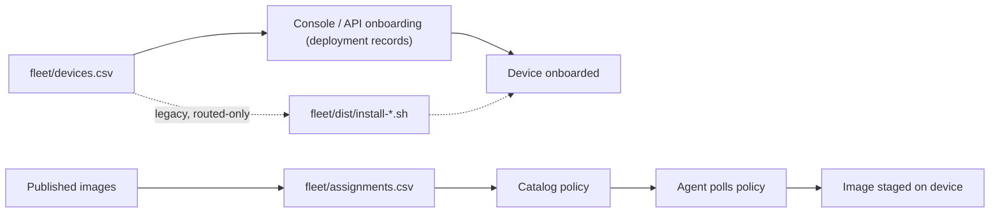

<!--
Copyright 2026 Cisco Systems, Inc. and its affiliates

SPDX-License-Identifier: Apache-2.0
-->

# Network Workflows

IRIS separates network onboarding from image assignment. That keeps connectivity data and release intent in different files, which makes review and rollback easier.

These CSV workflows exist for reviewed, repeatable batches. The same inventory, assignment, and onboarding actions are available in the console — see [Bulk device actions](console.md#bulk-device-actions).

## Inventory

Start from the template:

```bash
cp fleet/devices.csv.example fleet/devices.csv
```

The inventory is a management-type-aware, named-header **CSV v2**. Every device
declares a `management_type`: `routed` (IRIS creates a dedicated VLAN and SVI),
`inband` (the agent attaches to an existing operator-owned management VLAN),
`router-routed` (an IRIS-managed VirtualPortGroup subnet), `router-nat` (that
VPG subnet behind NAT), or `xr-host` (an IOS-XR appmgr container sharing the
router's own network stack):

```text
device_id,device_ip,management_type,iris_vlan,svi_ip,svi_mask,app_ip,app_mask,app_gateway,inband_vlan,ios_ssh_host,model,vpg_number,nat_interface,svi_igp,platform
```

- **routed** — fill `iris_vlan`, `svi_ip`, `svi_mask`, `app_ip`, `app_mask`,
  `app_gateway`; leave `inband_vlan` blank. `svi_igp` is optional and
  routed-only: `isis` adds `ip router isis` to the IRIS SVI for a fabric
  (an SD-Access underlay, say) that must learn it; blank keeps the server's
  `SVI_IGP` env var default (`none`) for that device. This is a per-device
  override, not a fleet-wide setting — one server can onboard devices into
  different fabrics, only some of which run IS-IS. Validated to exactly
  `none`/`isis` before it reaches the device's config; every other
  `management_type` must leave it blank. See
  [Management type → Routed](management-type.md#routed-iris-managed-app-network).
- **inband** — fill `inband_vlan`, `app_ip`, `app_mask`, `app_gateway`; leave
  `iris_vlan`/`svi_*` blank. Static IPv4 on Guest Shell or IOx (IE-3400, Catalyst 9300);
  DHCP is not supported. For inband **IOx**, `ios_ssh_host` (the IOS endpoint
  the app SSHes to) defaults to the device's management IP — only set it for
  an asymmetric topology (Guest Shell leaves it blank).
- `model` and `platform` may be blank in imported inventory. The Add Device form
  requires an explicit `guestshell`, `iox`, `router`, or `xr-appmgr` choice and
  filters those choices by model. A blank imported platform remains an
  inventory transition state: onboarding may resolve a known IOS-XE model, but
  it refuses an unclassified or uncertain device rather than guessing.
- **router-routed** — fill `app_ip`, `app_mask`, `app_gateway`, and
  `vpg_number`; use `platform=router`. The
  operator must route the VPG subnet to IRIS and peers.
- **router-nat** — additionally fill `nat_interface`. It creates static PAT
  for TCP 6881; the interface is canonicalized and teardown preserves an
  outside NAT marking that pre-dates IRIS. The router path targets the Catalyst
  8000 family and is lab-tested on Catalyst 8000V; see
  [Router routed and router NAT](management-type.md#router-routed-and-router-nat-iris-managed-virtualportgroup).
- **xr-host** — use `platform=xr-appmgr` on supported Cisco 8000-series IOS-XR
  routers and leave every addressing, VPG, and NAT field empty. Onboarding
  requires a current `artifacts/iris-xr.rpm`.

See [Management Type and VLAN Ownership](management-type.md) for the full
ownership rules. Older positional CSVs (e.g. `device_id,device_ip,vlan,...`)
still import, but are classified `legacy_routed` and must be adopted before they
can be undeployed — they are never inferred as inband.

### Credentials are not in the CSV

The v2 inventory carries network information only. There is no
`credential_profile_id` column, so a newly imported device has no credential
profile and cannot be onboarded until one is assigned. That assignment is a
Console step: open **Devices**, check the imported rows, pick a profile in the
*credential for selected* dropdown, and press **Apply**. Creating a credential
profile re-renders the device rows immediately, so devices imported before the
profile existed become assignable without waiting for the next poll.

The assignment survives the export → edit → re-import round trip: a re-import
replaces a device's network fields from the CSV but keeps the credential
profile (and the machine-determined `os_family` and registration stamp) already
stored for that device. A CSV that lists the same `device_id` twice is rejected
as a whole, naming both rows, rather than silently keeping the last one.

Keep operator passwords out of `fleet/devices.csv` even as a convenience — the
credential profile lives in the server's secret store, and the CSV is a
reviewable, Git-friendly file.

### Batch operations in the Console

The Devices toolbar finishes a CSV import in bulk: onboard, undeploy, adopt,
delete, credential assignment, and image assignment all act on the checked
rows and report per-device refusals instead of failing the whole batch. Image
assignment applies a *set* — up to ten images — to the whole selection in one
pick, not one image per device: the toolbar opens the same checkbox picker as
each row's own control, pre-checked with the intersection of what the selection
already has assigned, so applying never adds an image outside what you see
checked. It does replace each selected device's whole set, dropping anything
left unchecked, so a selection whose assignments differ is flagged in the
picker and confirmed on apply. See
[Bulk device actions](console.md#bulk-device-actions).

Deleting inventory rows is not an undeploy — undeploy the devices first. See
[Bulk device actions](console.md#bulk-device-actions).

### Onboarding path

Management-type-aware onboarding runs through the **Console / API**, which resolves
an immutable plan, creates a durable *deployment record* of what it applies, and drives
teardown from that deployment record (not from the editable inventory). Every
deployment's preflight runs once, at job execution in the bounded onboarding
worker pool — not inside the onboard request itself — so submitting a large
batch returns a job per device promptly instead of the request waiting on live
SSH to each one. Guest Shell, IOx and router deployments all run the same
IRIS-named collision checks (a device still carrying IRIS configuration is
refused until it is undeployed), each plus its own extras; a router deployment
cannot be adopted afterwards. See
[Router preflight and ownership](management-type.md#router-preflight-and-ownership),
[Onboarding at scale](operations.md#onboarding-at-scale), and
[Web Console](console.md#onboarding-from-the-console).

The legacy CLI generator is **routed-only** and deliberately refuses a v2
(`management_type`) header, because a self-contained installer cannot create
a deployment record or run preflight before minting an enrollment token:

```bash
# legacy routed inventory only (old positional columns)
tools/gen-device-installers.sh path/to/legacy-routed.csv
```

There is deliberately **no template** for that format: it takes the old
positional columns
`device_id,device_ip,vlan,svi_ip,svi_mask,guest_ip`, and it exists for sites
that still hold such a file. `fleet/devices.csv.example` is CSV v2 and the
generator refuses it — a new deployment uses the console.

The generator asks the running server for a short-lived enrollment token per device. The token is enough for first contact, then the agent promotes it through the catalog token-refresh path.

## Assignments

Start from the template:

```bash
cp fleet/assignments.csv.example fleet/assignments.csv
```

Assignments are release intent, one image per device per row — this CSV path
does not carry the console's multi-image set; assign more than one image to a
device from the console instead (see [Bulk device actions](console.md#bulk-device-actions)):

```text
device_id,image_id
```

Apply them:

```bash
tools/apply-assignments.sh fleet/assignments.csv
```

The script validates all rows first, then applies assignments. That avoids partially applying a malformed file.

## Workflow map



## Review guidance

Review `fleet/devices.csv` for network correctness — including the
`management_type` of each device and, for inband rows, that the existing
VLAN/SVI/gateway are operator-owned and correct — and `fleet/assignments.csv`
for release correctness. Do not mix credentials, operator passwords, or image
binaries into either file.
