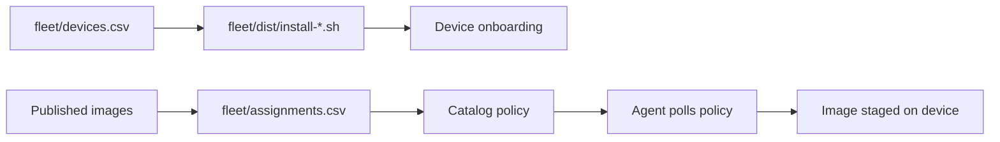

<!--
Copyright 2026 Cisco Systems, Inc. and its affiliates

SPDX-License-Identifier: Apache-2.0
-->

# Fleet Workflows

IRIS separates network onboarding from image assignment. That keeps connectivity data and release intent in different files, which makes review and rollback easier.

## Inventory

Start from the template:

```bash
cp fleet/devices.csv.example fleet/devices.csv
```

The inventory file describes how to reach and configure each device for the agent:

```text
device_id,device_ip,vlan,svi_ip,svi_mask,guest_ip
```

Generate per-device installers:

```bash
tools/gen-device-installers.sh fleet/devices.csv
```

The generator asks the running server for a short-lived enrollment token per device. The token is enough for first contact, then the agent promotes it through the catalog token-refresh path.

## Assignments

Start from the template:

```bash
cp fleet/assignments.csv.example fleet/assignments.csv
```

Assignments are release intent:

```text
device_id,image_id
```

Apply them:

```bash
tools/apply-assignments.sh fleet/assignments.csv
```

The script validates all rows first, then applies assignments. That avoids partially applying a malformed file.

## Workflow map



## Review guidance

Review `fleet/devices.csv` for network correctness and `fleet/assignments.csv` for release correctness. Do not mix credentials, operator passwords, or image binaries into either file.

