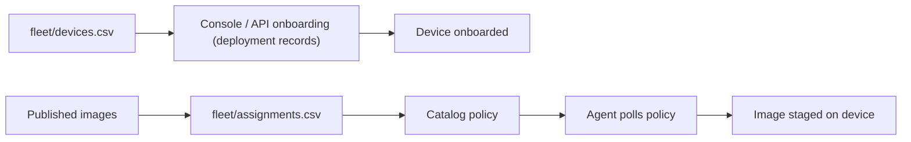

<!--
Copyright 2026 Cisco Systems, Inc. and its affiliates

SPDX-License-Identifier: Apache-2.0
-->

# Network Workflows

IRIS separates network onboarding from image assignment. That keeps connectivity data and release intent in different files, which makes review and rollback easier.

These CSV workflows exist for reviewed, repeatable batches. The same inventory, assignment, and onboarding actions are available in the console — see [Bulk device actions](console.md#bulk-device-actions).

## Inventory

Start from the template:

```bash
cp fleet/devices.csv.example fleet/devices.csv
```

The inventory is a management-type-aware, named-header **CSV**. Every device
declares a `management_type`: `routed` (IRIS creates a dedicated VLAN and SVI),
`inband` (the agent attaches to an existing operator-owned management VLAN),
`router-routed` (an IRIS-managed VirtualPortGroup subnet), `router-nat` (that
VPG subnet behind NAT), or `xr-host` (an IOS-XR appmgr container sharing the
router's own network stack):

```text
device_id,device_ip,management_type,iris_vlan,svi_ip,svi_mask,app_ip,app_mask,app_gateway,inband_vlan,ios_ssh_host,model,vpg_number,nat_interface,svi_igp,role,platform
```

- **routed** — fill `iris_vlan`, `svi_ip`, `svi_mask`, `app_ip`, `app_mask`,
  `app_gateway`; leave `inband_vlan` blank. `svi_igp` is optional and
  routed-only: `isis` adds `ip router isis` to the IRIS SVI for a fabric
  (an SD-Access underlay, say) that must learn it; blank keeps the server's
  `SVI_IGP` env var default (`none`) for that device. This is a per-device
  override, not a fleet-wide setting — one server can onboard devices into
  different fabrics, only some of which run IS-IS. Validated to exactly
  `none`/`isis` before it reaches the device's config; every other
  `management_type` must leave it blank. See
  [Management type → Routed](management-type.md#routed-iris-managed-app-network).
- **inband** — fill `inband_vlan`, `app_ip`, `app_mask`, `app_gateway`; leave
  `iris_vlan`/`svi_*` blank. Static IPv4 on Guest Shell or IOx (IE-3400, Catalyst 9300);
  DHCP is not supported. For inband **IOx**, `ios_ssh_host` (the IOS endpoint
  the app SSHes to) defaults to the device's management IP — only set it for
  an asymmetric topology (Guest Shell leaves it blank).
- `model` and `platform` may be blank in imported inventory. In Add Device,
  **management type controls which network fields appear**. Editing the model
  or agent choice does not change that type. XR host uses `xr-appmgr`; router
  modes use `router`. Routed and inband modes require an explicit compatible
  Guest Shell or IOx choice. Known models limit installer choices; conflicts
  appear in the form. Model is optional free text: you can enter `C3650`, but
  saving it does not confirm hardware support. When an imported platform is
  blank, onboarding can select an installer for a known IOS-XE model; it
  refuses devices it cannot classify.
- **router-routed** — fill `app_ip`, `app_mask`, `app_gateway`, and
  `vpg_number`; use `platform=router`. The
  operator must route the VPG subnet to IRIS and peers.
- **router-nat** — additionally fill `nat_interface`. It creates static PAT
  for TCP 6881; the interface is canonicalized and teardown preserves an
  outside NAT marking that pre-dates IRIS. The router path targets the Catalyst
  8000 family and is lab-tested on Catalyst 8000V; see
  [Router routed and router NAT](management-type.md#router-routed-and-router-nat-iris-managed-virtualportgroup).
- **xr-host** — use `platform=xr-appmgr` on supported Cisco 8000-series IOS-XR
  routers and leave every addressing, VPG, and NAT field empty. Onboarding
  requires a current `artifacts/iris-xr.rpm`.

See [Management Type and VLAN Ownership](management-type.md) for the full
ownership rules.

Console/API inventory writes accept only the named operator fields in this
schema (plus `credential_profile_id`). Unknown names are rejected instead of
being stored for a future component to interpret. `schema_version`,
`registered_at`, and the observed `os_family` are maintained by the server and
cannot be supplied in a JSON request. Older `vlan`/`guest_ip` headers remain a
CSV import compatibility path; they are not public JSON aliases.

An old CSV row can remain in inventory before its management type is
classified. IRIS onboards it only when the complete historical routed tuple is
valid (`device_id`, `device_ip`, VLAN, SVI address/mask, and app address).
Incomplete rows fail before a job, enrollment credential, or device connection
is created; edit them into one of the current management types first.

### Credentials are not in the CSV

The inventory carries network information only. There is no
`credential_profile_id` column, so a newly imported device has no credential
profile and cannot be onboarded until one is assigned. That assignment is a
Console step: open **Devices**, check the imported rows, pick a profile in the
*credential for selected* dropdown, and press **Apply**. Creating a credential
profile re-renders the device rows immediately, so devices imported before the
profile existed become assignable without waiting for the next poll.

The assignment survives the export → edit → re-import round trip: a re-import
replaces a device's network fields from the CSV but keeps the credential
profile (and the machine-determined `os_family` and registration stamp) already
stored for that device. A CSV that lists the same `device_id` twice is rejected
as a whole, naming both rows, rather than silently keeping the last one.

Keep operator passwords out of `fleet/devices.csv` even as a convenience — the
credential profile lives in the server's secret store, and the CSV is a
reviewable, Git-friendly file.

### Role definitions and membership

The optional `role` inventory column declares one lowercase role per device.
Copying or re-importing an older pre-role CSV does not clear membership, and a
blank `role` cell preserves the stored value. Clear it explicitly through the
role API, the Console's **Set role** action, or:

```bash
iris-role set DEVICE_ID - --dry-run
iris-role set DEVICE_ID - --confirm '<preview token>'
```

Role definitions have their own round-trippable file. Lists in `peers` and
`nets` are semicolon-separated; rates are integer bytes per second and `*_s`
values are integer seconds.

`fleet/roles.csv.example` is the tracked template. The real
`fleet/roles.csv` is operator-owned and ignored by Git; keep its review and
backup controls with the rest of your site inventory.

```bash
cp fleet/roles.csv.example fleet/roles.csv
iris-role import fleet/roles.csv --dry-run
iris-role import fleet/roles.csv --confirm '<preview token>'
iris-role export > fleet/roles.exported.csv
```

Import validates the whole role graph before writing, including references,
symmetric restricted-role links, duplicate/canonical-equivalent networks, QoS
ranges, and reserved names. One bulk membership or CSV action creates one
policy revision and one tracker-outbox event. A partial two-store write reports
the exact failed rows and `role_drift`; correct the storage problem and reapply
the same intent. Roles change server-side swarm policy only. They add no device
VLAN, ACL, environment variable, or package setting in any management type.

The change stops new tracker introductions but does not sever connections or
remove peer addresses already retained by aria2. When containment cannot wait,
unassign every image from the device so its current agent removes the torrents
on its next tick. Any future device rate/cap remains cooperative in the presence
of a privileged device administrator; Phase 0 delivers no device rate setting.

### Batch operations in the Console

The Devices toolbar finishes a CSV import in bulk: onboard, undeploy, adopt,
delete, credential assignment, role membership, and image assignment all act on the checked
rows and report per-device refusals instead of failing the whole batch. Image
assignment applies a *set* — up to ten images — to the whole selection in one
pick, not one image per device: the toolbar opens the same checkbox picker as
each row's own control, pre-checked with the intersection of what the selection
already has assigned, so applying never adds an image outside what you see
checked. It does replace each selected device's whole set, dropping anything
left unchecked, so a selection whose assignments differ is flagged in the
picker and confirmed on apply. See
[Bulk device actions](console.md#bulk-device-actions).

Deleting inventory rows is not an undeploy — undeploy the devices first. See
[Bulk device actions](console.md#bulk-device-actions).

### Onboarding path

Management-type-aware onboarding uses the **Console / API**. The Console
forwards the request to the server, which resolves an immutable plan, runs the
installer, and records what it applied in a durable *deployment record*.
Teardown uses that record. Every
deployment's preflight runs once, at job execution in the bounded onboarding
worker pool — not inside the onboard request itself — so submitting a large
batch returns a job per device promptly instead of the request waiting on live
SSH to each one. Guest Shell, IOx and router deployments all run the same
IRIS-named collision checks (a device still carrying IRIS configuration is
refused until it is undeployed), each plus its own extras; a router deployment
cannot be adopted afterwards. See
[Router preflight and ownership](management-type.md#router-preflight-and-ownership),
[Onboarding at scale](operations.md#onboarding-at-scale), and
[Web Console](console.md#onboarding-from-the-console).

The server supplies a short-lived enrollment token for first contact. The
agent obtains its renewable device credential through the catalog's
token-refresh endpoint.

## Assignments

Start from the template:

```bash
cp fleet/assignments.csv.example fleet/assignments.csv
```

Assignments are release intent, one image per device per row. The CSV requires
each device id once; applying that row adds its image without discarding images
already assigned to the device:

```text
device_id,image_id
```

Apply them:

```bash
tools/apply-assignments.sh fleet/assignments.csv
```

The script validates all rows first, then applies assignments. That avoids partially applying a malformed file.
Each target must already exist in fleet inventory. The command-line
To add several images in one operation, use
`iris-assign DEVICE IMAGE [IMAGE ...]`, which also merges by default. Use
`iris-assign --replace DEVICE IMAGE [IMAGE ...]` only when the reviewed intent
is to replace the set and remove images that are no longer listed. The Console
and assignment API keep replacement semantics.
The agent picks up assignments on its next policy poll. Approval alone is not
staging activity: the Console shows **Waiting for staging** until the device
reports work, then uses that device's progress and errors.

## Workflow map



## Review guidance

Review `fleet/devices.csv` for network correctness — including the
`management_type` of each device and, for inband rows, that the existing
VLAN/SVI/gateway are operator-owned and correct — and `fleet/assignments.csv`
for release correctness. Do not mix credentials, operator passwords, or image
binaries into either file.
