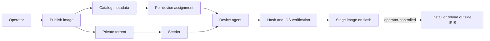

<!--
Copyright 2026 Cisco Systems, Inc. and its affiliates

SPDX-License-Identifier: Apache-2.0
-->

# IRIS Documentation

IRIS, Intelligent Release and Image Staging, stages Cisco IOS-XE images across a network before an operator performs any install or reload activity. It combines a private BitTorrent swarm, a signed catalog, per-device policies, and a small on-device agent so large images can move efficiently without giving up device-side verification.

!!! warning "Stage-only invariant"
    IRIS distributes, verifies, and stages images. It never installs, activates, reloads, changes boot variables, or mutates the running software state of a device.

## What IRIS provides

| Area | Purpose |
| --- | --- |
| Server stack | Tracker, catalog, seeder, artifact server, console, telemetry, and encrypted state. |
| Web console | Browser workflow for images, devices, assignments, onboarding, swarm status, settings, and audit events. |
| Management types | Per-device **routed** (IRIS-managed VLAN/SVI) or **inband** (existing operator-owned management VLAN), with a receipt-backed deployment lifecycle. |
| Guest Shell agent | Catalyst 9300 path that downloads through `aria2c`, verifies hashes, and copies the approved image to `flash:`. |
| IOx app | The same agent model as an IOx Docker app: IE-3x00/IE-3400 (arm64, stages to `sdflash:`) and SSD-equipped Catalyst 9000 (amd64, stages to bootflash through the SSD share). |
| Network tools | CSV-driven inventory, per-device installers, assignments, and release packaging. |
| Observability | Swarm map, health endpoint, Prometheus metrics, optional OTLP export, and structured audit trail. |

## Release model

## Read this first

Start with [Getting Started](getting-started.md) if you are deploying a lab or proof of value. Use [Architecture](architecture.md) and [Security Model](security.md) to understand the trust boundaries before connecting production devices. Use [Operations](operations.md) and [Validation](validation.md) when you need day-two commands or a test checklist.

## Documentation map

| Page | What it covers |
| --- | --- |
| [Getting Started](getting-started.md) | Lab/PoC bring-up from zero to a staged image. |
| [AI-Guided PoC](aiagent.md) | Running the proof of value with an AI assistant driving the steps. |
| [Architecture](architecture.md) | Components, data flow, and trust boundaries. |
| [Container Deployments](containers.md) | The Compose seed server and the device agent containers. |
| [Server](server.md) | Server services, state, bootstrap, and certificates. |
| [Network Ports and Flows](network-ports.md) | Every port, direction, and what rides it. |
| [Management Type and VLAN Ownership](network-attachment.md) | Routed vs inband, receipts, adopt, and the network-preserving guarantees. |
| [Kubernetes](kubernetes.md) | Optional single-replica seed-server manifests. |
| [Device Agents](device-agents.md) | Guest Shell and IOx agent behavior on the device. |
| [Web Console](console.md) | The admin browser workflow end to end. |
| [Network Workflows](fleet-workflows.md) | CSV inventory, assignments, and batch operations. |
| [IOx App](iox.md) | Building, staging, and transfer paths for the IOx agent. |
| [Security Model](security.md) | Tokens, encryption at rest, TLS, and threat model. |
| [Observability](observability.md) | Metrics, swarm map, OTLP export, and dashboards. |
| [Operations](operations.md) | Day-two commands, backups, scaling, and cleanup. |
| [Validation](validation.md) | The test suites and lab validation checklist. |
| [Development](development.md) | Working on IRIS itself. |
| [Reference](reference.md) | Environment variables, file layouts, and APIs. |

