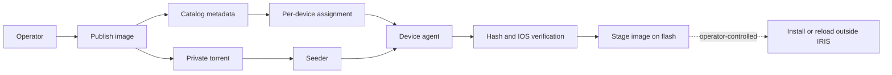

<!--
Copyright 2026 Cisco Systems, Inc. and its affiliates

SPDX-License-Identifier: Apache-2.0
-->

# IRIS Documentation

IRIS, Intelligent Release and Image Staging, stages Cisco IOS-XE images across a fleet before an operator performs any install or reload activity. It combines a private BitTorrent swarm, a signed catalog, per-device policies, and a small on-device agent so large images can move efficiently without giving up device-side verification.

!!! warning "Stage-only invariant"
    IRIS distributes, verifies, and stages images. It never installs, activates, reloads, changes boot variables, or mutates the running software state of a device.

## What IRIS provides

| Area | Purpose |
| --- | --- |
| Server stack | Tracker, catalog, seeder, artifact server, console, telemetry, and encrypted state. |
| Web console | Browser workflow for images, devices, assignments, onboarding, swarm status, settings, and audit events. |
| Guest Shell agent | Catalyst 9300 path that downloads through `aria2c`, verifies hashes, and copies the approved image to `flash:`. |
| IOx app | IE-3x00/IE-3400 path that packages the same agent model into an IOx Docker app and stages to `sdflash:`. |
| Fleet tools | CSV-driven inventory, per-device installers, assignments, and release packaging. |
| Observability | Swarm map, health endpoint, Prometheus metrics, optional OTLP export, and structured audit trail. |

## Release model

## Read this first

Start with [Getting Started](getting-started.md) if you are deploying a lab or proof of value. Use [Architecture](architecture.md) and [Security Model](security.md) to understand the trust boundaries before connecting production devices. Use [Operations](operations.md) and [Validation](validation.md) when you need day-two commands or a test checklist.

