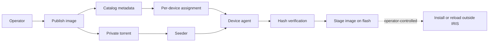

<!--
Copyright 2026 Cisco Systems, Inc. and its affiliates

SPDX-License-Identifier: Apache-2.0
-->

# IRIS Documentation

IRIS, Intelligent Release and Image Staging, stages Cisco IOS-XE images across a network before an operator performs any install or reload activity. It combines a private BitTorrent swarm, a signed catalog, per-device policies, and a small on-device agent so large images can move efficiently without giving up device-side verification.

IRIS also measures that distribution rather than only performing it. Every rollout accounts for how many bytes the devices served to each other and how many came from the origin seeder, and each device reports the peers it actually took its image from — see [Telemetry Export](telemetry-export.md).

!!! warning "Stage-only invariant"
    IRIS distributes, verifies, and stages images. It never installs, activates, reloads, changes boot variables, or mutates the running software state of a device.

!!! note "You do not need the CLI to run IRIS"
    Bringing the server up is a command-line task. After that, publishing images, assigning them, onboarding and undeploying devices, and watching progress are all done in the [web console](console.md). The command-line steps shown throughout these pages are the same operations for people who want them scripted or reviewed in CSV — see [When to use the CLI](console.md#when-to-use-the-cli).

## What IRIS provides

| Area | Purpose |
| --- | --- |
| Server stack | Tracker, catalog, seeder, artifact server, console, telemetry, and encrypted state. |
| Web console | Browser workflow for images, devices, assignments, onboarding, swarm status, settings, and audit events. |
| Management types | Per-device **routed**, **inband**, **router-routed**, or **router-nat**, with a receipt-backed deployment lifecycle. |
| Guest Shell agent | Catalyst 9300 path that downloads through `aria2c` into the bind-mounted guest-share, verifies hashes, and copies the approved image to `flash:`. |
| Catalyst 8000 router | Guest Shell through VirtualPortGroup, staging to `bootflash:`. Designed for the Catalyst 8000 family; routed and NAT modes are lab-tested on Catalyst 8000V through verified staging and receipt-backed undeploy. |
| IOx app | The same agent model as an IOx Docker app: IE-3400 (arm64, stages to `sdflash:`) and SSD-equipped Catalyst 9300 (amd64, stages to bootflash through the SSD share). |
| Network tools | CSV-driven inventory, per-device installers, assignments, and release packaging. |
| Measured distribution | Per-image accounting of origin-served versus peer-served bytes, plus per-device peer receipts naming which peers supplied the image. The portion the origin-side sampler could not trace to a device is published as its own counter -- untraced bytes did leave the origin, only the recipient is unknown -- rather than folded into the totals. |
| Observability | Swarm map, health endpoint, metrics (Prometheus exposition format), optional OTLP export, peer-distribution counters, and structured audit trail. |

## Release model

## Where to start

| If you want to… | Read |
| --- | --- |
| Drive the whole workflow from a browser | [Web Console](console.md) |
| Stand up a lab and stage one image | [Getting Started](getting-started.md) |
| Understand the trust boundaries before touching production | [Architecture](architecture.md), then [Security Model](security.md) |
| Decide how a device attaches to the network | [Management Type and VLAN Ownership](network-attachment.md) |
| Run a rollout across many devices | [Web Console](console.md), then [Network Workflows](fleet-workflows.md) |
| Find out how much of a rollout the peers carried | [Telemetry Export](telemetry-export.md) |
| Find a day-two command or an env var | [Operations](operations.md), [Reference](reference.md) |

## Documentation map

### Get started

| Page | What it covers |
| --- | --- |
| [Getting Started](getting-started.md) | Lab/PoC bring-up from zero to a staged image. |
| [AI-Guided PoC](aiagent.md) | Running the proof of value with an AI assistant driving the steps. |

### How it works

Read these before connecting production devices.

| Page | What it covers |
| --- | --- |
| [Architecture](architecture.md) | Components, data flow, and trust boundaries. |
| [Security Model](security.md) | Tokens, encryption at rest, TLS, non-root runtime, and threat model. |
| [Network Ports and Flows](network-ports.md) | Every port, direction, and what rides it. |

### Deploy the server

| Page | What it covers |
| --- | --- |
| [Server](server.md) | Server services, state, bootstrap, and certificates. |
| [Container Deployments](containers.md) | The Compose seed server and the device agent containers. |
| [Kubernetes](kubernetes.md) | Optional single-replica seed-server manifests. |

### Onboard devices

| Page | What it covers |
| --- | --- |
| [Device Agents](device-agents.md) | Guest Shell and IOx agent behavior on the device. |
| [Management Type and VLAN Ownership](network-attachment.md) | Switch and router management types, VPG/NAT ownership, receipts, and network-preserving guarantees. |
| [IOx App](iox.md) | Building, staging, and transfer paths for the IOx agent. |

### Operate

| Page | What it covers |
| --- | --- |
| [Web Console](console.md) | The admin browser workflow end to end. |
| [Network Workflows](fleet-workflows.md) | CSV inventory, assignments, and batch operations. |
| [Operations](operations.md) | Day-two commands, backups, scaling, and cleanup. |
| [Observability](observability.md) | Metrics, swarm map, OTLP export, and dashboards. |
| [Telemetry Export](telemetry-export.md) | Peer-distribution accounting: the metric families, the device peer receipts, and what each figure does and does not measure. |

### Reference and development

| Page | What it covers |
| --- | --- |
| [Reference](reference.md) | Environment variables, file layouts, and APIs. |
| [Validation](validation.md) | The test suites and lab validation checklist. |
| [Development](development.md) | Working on IRIS itself. |
