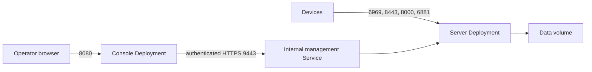

<!--
Copyright 2026 Cisco Systems, Inc. and its affiliates

SPDX-License-Identifier: Apache-2.0
-->

# Install on Kubernetes

Run the IRIS server and Console in a Kubernetes cluster. At the end both
Deployments run, their keys and certificates are in place, and you can sign in
to the Console. The Console Deployment keeps no state and reaches the server on
ClusterIP 9443, as in
[Install on separate Docker hosts](separate-docker-hosts.md).

## Before you start

- A cluster with amd64 capacity, a storage class, LoadBalancer addresses, and a
  container network interface (CNI) that enforces NetworkPolicy. See
  [Check the host before you install](check-the-host.md).
- Clocks that agree on every node a pod can land on. See
  [Verify time before deployment](check-the-host.md#verify-time-before-deployment).
- Both images in a registry every node can pull, digests pinned in
  `kubernetes/kustomization.yaml`. See [Build the server and Console images](build-images.md).
- The two public signing roots as `.pub` files. See
  [Create the two offline signing keys](signing-roots.md).

## Topology

| Resource | Purpose |
| --- | --- |
| `iris-seed-server` Deployment | One amd64 pod running the tracker, the catalog, the seeder, the artifact server, telemetry, and the internal management API. |
| `iris-console` Deployment | One Console pod that serves the browser over HTTPS and its same-origin API gateway. It keeps no state. |
| Persistent volume claim (PVC) | Stores catalog state, encrypted configuration, images, and served artifacts. Only the server mounts it. |
| Two LoadBalancer Services | One publishes the device and server ports, the other publishes the Console. |
| ClusterIP Service | Management HTTPS 9443 inside the cluster; a NetworkPolicy lets only Console pods reach it. |



Run one server pod: the Deployment uses `replicas: 1` with the `Recreate`
strategy, because the tracker, the catalog, the seeder and the instruction
stamper are single-writer with no cross-pod coordination. Do not raise
`replicas` above 1; that configuration is unsupported and not covered by
validation, and it would split coordination state rather than add capacity.

## 1. Reserve the addresses and set the exposure

Reserve one stable address for devices and one for operators. Put the
device-facing address in `kubernetes/iris-seed-server.env` as `IRIS_HOST_IP`,
point the server LoadBalancer at it, and set `IRIS_CONSOLE_URL` to the Console's
browser address. IRIS writes `IRIS_HOST_IP` into the catalog certificate, the
tracker announce URL and the seeder endpoint, so keep it.

The server Service publishes 6969, 8443, 8000, 6881 and 9101 through one
LoadBalancer; the Console publishes 8080 through another. Keep
`externalTrafficPolicy: Local` on the server Service, so the tracker sees each
device's real source address, and restrict the source ranges at your firewall.
See [Open the required ports](open-ports.md).

## Pod security

Both pods run at the restricted pod-security level:

| Setting | Value |
| --- | --- |
| Namespace label | `pod-security.kubernetes.io/enforce: restricted` |
| Pod `securityContext` | `runAsNonRoot: true`, uid, gid and `fsGroup` all `10001` |
| Container and init-container `securityContext` | `allowPrivilegeEscalation: false`, every Linux capability dropped, `seccompProfile: RuntimeDefault` |

Whether `fsGroup` reaches the persistent volume is the CSI driver's decision;
verify it against your storage class, as the next step describes.

## 2. Prepare the persistent volume ownership

Both pods run as uid and gid `10001` under the restricted pod-security level,
with `fsGroup: 10001` and `fsGroupChangePolicy: OnRootMismatch`. Prepare the
volume root first: a directory owned by `10001:10001` with mode `2770`, and its
`state` child, which is `/data/state` in the pod, owned by `10001:10001` with
exact mode `0700` and setgid cleared. A container storage interface (CSI)
driver that handles `VOLUME_MOUNT_GROUP` itself ignores `fsGroupChangePolicy`
and has to preserve the private file modes on its own. Check the driver now;
run the two pod checks after step 4 has started the server:

```bash
kubectl get csidriver \
  -o custom-columns=NAME:.metadata.name,FSGROUPPOLICY:.spec.fsGroupPolicy
kubectl -n iris exec deployment/iris-seed-server -- id
kubectl -n iris exec deployment/iris-seed-server -- \
  ls -ld /data /data/state /data/images /data/artifacts /run/secrets/iris_age_key
```

The listing shows uid `10001` and mode `0700` on `/data/state`. If the driver
does not apply the group, set the ownership out of band or pick a storage class
that does; with GNU `chmod`, `chmod 00700` clears setgid. If a mount already
changed modes on existing files, follow
[Repair a volume whose file permissions were changed](../admin-guide/recovery.md#recover-a-volume-whose-private-modes-were-changed).

!!! warning "Never run either container as root"
    Do not make a container root to work around volume ownership. Fix the
    ownership on the volume instead.

## 3. Create the namespace, keys and certificates

Create the namespace, then the age identity, both token pairs and both TLS
identities, in a protected directory outside the checkout, called
`/secure/path` below. The management certificate needs DNS names for
`iris-server-api`, `iris-server-api.iris` and `iris-server-api.iris.svc`; the
Console certificate must cover the name operators type in the browser. Obtain
the certificates from your authority, or generate private self-signed bundles:

```bash
umask 077
mkdir -p /secure/path
python3 tools/prepare-docker-hosts.py --out /secure/path/identities \
  --management-host iris-server-api --management-host iris-server-api.iris \
  --management-host iris-server-api.iris.svc \
  --console-host console.example.com
```

Replace `console.example.com` with the Console's actual DNS name or IP. The
commands below use this generated bundle; with your own authority, substitute
its certificate, key and CA files.

!!! warning "Keep token values off the command line"
    Write each token to a file, as below, never into a command or an
    environment file.

```bash
umask 077
age-keygen -o /secure/path/iris-age.txt
age-keygen -y /secure/path/iris-age.txt
openssl rand -hex 32 > /secure/path/management-current
openssl rand -hex 32 > /secure/path/observability-current
: > /secure/path/management-previous
: > /secure/path/observability-previous

kubectl apply -f kubernetes/namespace.yaml
kubectl -n iris create secret generic iris-age \
  --from-file=identity=/secure/path/iris-age.txt
kubectl -n iris create secret generic iris-tier-auth \
  --from-file=current=/secure/path/management-current \
  --from-file=previous=/secure/path/management-previous
kubectl -n iris create secret generic iris-observability-auth \
  --from-file=current=/secure/path/observability-current \
  --from-file=previous=/secure/path/observability-previous
kubectl -n iris create secret tls iris-management-tls \
  --cert=/secure/path/identities/server/management-tls/tls.crt \
  --key=/secure/path/identities/server/management-tls/tls.key
kubectl -n iris create configmap iris-management-ca \
  --from-file=ca.crt=/secure/path/identities/console/management-ca/ca.pem
kubectl -n iris create secret tls iris-console-tls \
  --cert=/secure/path/identities/console/console-tls/tls.crt \
  --key=/secure/path/identities/console/console-tls/tls.key
```

Each command prints `created`. Add `--dry-run=client -o yaml | kubectl apply
-f -` to any `create` command when the object already exists. Both `current`
files are required even when monitoring is off, and the `previous` files start
empty. [Server configuration](../reference/server-configuration.md) describes
each file.

Set `IRIS_AGE_RECIPIENTS` in `iris-seed-server.env` to the recipient printed by
`age-keygen -y`, plus a second recipient held by another person in another place,
so the state can still be opened if one key is lost. For an outside telemetry
collector, add the headers Secret in
[Export telemetry](../user-guide/telemetry-export.md).

## 4. Configure and apply the manifests

Review the PVC size, the resource requests, the NetworkPolicies and both
environment files, then render, read and apply them:

```bash
kubectl kustomize kubernetes > /tmp/iris-rendered.yaml
kubectl apply -k kubernetes
kubectl -n iris rollout status deployment/iris-seed-server
kubectl -n iris rollout status deployment/iris-console
```

Both rollouts report `successfully rolled out`. The server's init container runs
`iris-bootstrap` against the PVC, and each environment file is a hashed ConfigMap
input, so editing one and applying again rolls one Deployment.

## 5. Install the two public signing roots

Before you publish any device bundle, put the two public roots your packages
were built with as `.pub` files under `/data/config/instr/roots.d` on the PVC,
readable by uid `10001`. These are the roots [Turn on instruction
signing](activate-signing.md) issues certificates from.

!!! warning "Roots come from outside the cluster"
    Never create replacement roots inside the pod, and never copy a private
    root there.

Instruction state uses the existing `iris-data` PVC: `IRIS_STATE` stays at
`/data/state`, `IRIS_CONFIG` at `/data/config`, and `IRIS_RUN` at `/run/iris`
in memory. Signing adds no new Secret, port, Service or NetworkPolicy rule.

The server also needs an online signing key, a certificate issued by one of
your roots, and an activated producer. Until then every onboarding fails with
`ERROR: instruction bootstrap unavailable`. Follow
[Turn on instruction signing](activate-signing.md#initialise-instruction-custody),
using `kubectl exec` and `kubectl cp` with `/data/config` for `/etc/iris`.

## 6. Publish the device packages

Build the device packages on an approved amd64 Docker host outside the cluster,
then copy them to the server PVC:
[Build and publish the device packages](device-packages.md#build-and-publish-the-arm64-iox-package)
and [Publish to Kubernetes](device-packages.md#publish-to-kubernetes). Then check
package readiness in Console Setup.

## 7. Sign in and create the administrator

Open the Console at its own browser address and create the administrator;
[Sign in for the first time](first-sign-in.md) has the first-run credential.

!!! warning "The first reachable caller can claim a fresh Console"
    Restrict the Console LoadBalancer to trusted operators and finish setup
    immediately after deployment.

## Verify

Export the public catalog certificate through your authenticated cluster
connection before the HTTPS checks. Use the Console bundle's public certificate
for its separate listener:

```bash
kubectl -n iris exec deployment/iris-seed-server -c iris -- \
  openssl x509 -in /run/iris/tls/cert.pem -outform PEM > /secure/path/catalog-ca.crt
kubectl -n iris get pods,svc,pvc,networkpolicy
kubectl -n iris logs deployment/iris-seed-server -c iris
kubectl -n iris logs deployment/iris-console -c console
curl -fsS --cacert /secure/path/catalog-ca.crt \
  https://<server-external-ip>:9101/readyz
curl -fsS --cacert /secure/path/catalog-ca.crt \
  https://<server-external-ip>:9101/healthz
curl -fsS --cacert /secure/path/identities/console/console-tls/tls.crt \
  https://<console-address>:8080/readyz
```

Both pods are `Running`, both Services have an external address, and the three
`curl` calls return `{"ok":true}`. `/readyz` answers with a result only, so
read the server log to find a listener that is not ready. Then make one
authenticated Console API request, which proves the path from the browser to
the server: [Verify the installation](verify.md) has the checks. Back up the
PVC, the age identity and the Secrets; see [Back up and restore](../admin-guide/backups.md).

## Appendix: a single-node cluster with K3s

One amd64 Linux host can run K3s with MetalLB providing the two LoadBalancer
addresses. Reserve two addresses on the node's layer-2 network, outside its
DHCP pool, and pick pod and Service subnets that do not overlap the host or
device networks:

```yaml
# /etc/rancher/k3s/config.yaml
disable:
  - traefik
  - servicelb
kube-proxy-arg:
  - proxy-mode=iptables
  - nodeport-addresses=127.0.0.0/8
secrets-encryption: true
write-kubeconfig-mode: "0600"
```

MetalLB then handles the LoadBalancer Services, the NodePort setting keeps that
access on loopback, and the embedded NetworkPolicy controller stays enabled.
Install a pinned MetalLB release, create an `IPAddressPool` holding the two
reserved addresses and an `L2Advertisement` for it, set `autoAssign: false`, and
give each IRIS Service explicit `metallb.io/address-pool` and
`metallb.io/loadBalancerIPs` annotations in a Kustomize overlay. Restrict the
Console's `loadBalancerSourceRanges` to operator networks.

For local storage, prepare the directory as in step 2, then bind it through a
local PersistentVolume with node affinity, the `Retain` reclaim policy, and a
storage class that uses `WaitForFirstConsumer`. Match the PVC's storage class
and request to that volume; a small deployment can request `10Gi`. Watch free space,
because a directory-backed volume has no disk quota. K3s can share the host
with Docker when the LoadBalancer addresses differ from Docker's published
address; keep the pods on the cluster network with no `hostNetwork` and no
`hostPort`.

## Next steps

- [Turn on instruction signing](activate-signing.md)
- [Build and publish the device packages](device-packages.md)
- [Stage your first image](../user-guide/first-image.md)
- [Rotate credentials and certificates](../admin-guide/rotations.md)
