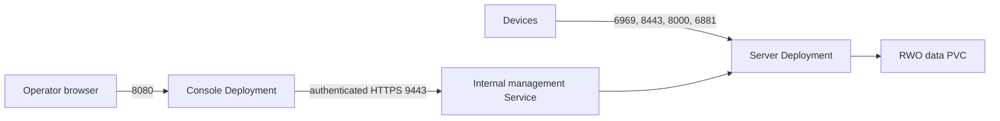

<!--
Copyright 2026 Cisco Systems, Inc. and its affiliates

SPDX-License-Identifier: Apache-2.0
-->

# Kubernetes

Docker can use the same separation on independent hosts; see
[Docker on separate hosts](docker-hosts.md).

The server and Console images run as separate Kubernetes Deployments and
Services. The alpha manifests live under `kubernetes/` and use Kustomize; the
server owns persistent state; the Console reaches it through authenticated
HTTPS on the internal management Service.

## Topology

| Resource | Purpose |
| --- | --- |
| `iris-seed-server` Deployment | One amd64 pod running tracker, catalog, seeder, artifacts, telemetry, and the internal management API. |
| `iris-console` Deployment | One state-free Console pod serving browser HTTPS and its same-origin API gateway. |
| Server init container | Runs idempotent `iris-bootstrap` against the data PVC. |
| PVC | Stores catalog state, encrypted configuration, images, and served artifacts; mounted by server only. |
| Secrets | Supply the age identity, management and observability current/previous tokens, and two distinct TLS identities outside the PVC. |
| Memory `emptyDir` | Holds decrypted server runtime secrets under `/run/iris`. |
| Two LoadBalancer Services | Publish device/server ports separately from the operator Console. |
| ClusterIP Service | Publishes management HTTPS on 9443 inside the cluster; NetworkPolicy restricts its ingress to Console pods. |
| NetworkPolicies | Permit the declared ingress paths and deny incidental cross-tier access. |



The server Deployment uses `replicas: 1` with `Recreate`. There are three single-replica reasons: the tracker peer
registry is in memory; catalog state is file-backed and seeder RPC is local to
the pod; and the instruction stamper, serial history, activation/admission
state and file-backed instruction artifacts have single-writer semantics with
no cross-pod coordination. Multi-replica server operation is unsupported and
not covered by validation. More replicas would split coordination state rather
than add capacity. Console can restart independently without interrupting devices. Pods receive
private cluster addresses and use Service DNS; devices and browsers use the
LoadBalancer addresses. Neither pod needs its own external IP.

Deployment records live under `IRIS_STATE` (`/data/state`) on the PVC, and
server-side onboarding stages artifacts under `/data/artifacts`. Console
reaches both through the management API and never mounts the PVC. A server pod
restart marks in-flight deployment records `unknown` and requires
reconciliation rather than blindly retrying a device operation. See
[Management Type and VLAN Ownership](management-type.md).

IOx onboarding needs `iris-arm64.tar` and/or `iris-amd64.tar` under
`/data/artifacts`; IOS-XR onboarding needs `iris-xr.rpm`. When the aria2c pin
in `tools/aria2c.sha256` changes, refresh both `deliverables/` binaries,
rebuild both images and every device package from them, and copy the packages
again: the agents must be file-identical across packages. Copy each package's
adjacent `.manifest` as well, because readiness binds the served wrapper bytes
to their canonical OCI provenance. Kubernetes does not run host-side package
builders. Build the deployment-neutral packages elsewhere and copy them to the
server pod with `kubectl cp --no-preserve`. Rebuild and re-copy every package
after a shared-agent or common image-definition change, and rebuild/redeploy
the server image to refresh its Guest Shell bundle. A certificate rotation
does not require rebuilding them: server startup refreshes the distributed
`/data/artifacts/iris-catalog.pem`; re-onboard devices so IOx app data or the
IOS-XR harddisk bind mount receives the new runtime trust anchor. Package
readiness checks bytes against manifests, not whether the source has changed;
use the [rebuild procedure](development.md#embedded-agent-packages).

Before publishing fresh bundles, provision exactly two distinct approved public
instruction roots as `.pub` files under `/data/config/instr/roots.d`, readable
by the server's UID 10001. Use the same approved pair when building every
device package; never generate replacement roots in the pod or copy offline
private keys there.
[Obtain the handed-in inputs](getting-started.md#the-two-instruction-roots) has
the commands that create the pair; the
[instruction-root ceremony](operations.md#instruction-root-ceremony-and-recovery)
covers certificates, rotation and revocation.
Missing or invalid roots leave bundle publication unavailable even when the
pod's listeners are ready. Check package readiness in Console Setup after rollout.

## Phase 1 storage and network impact

The existing `iris-data` PVC stays mounted at `/data`, with `IRIS_STATE` at
`/data/state`, `IRIS_CONFIG` at `/data/config`, images and artifacts under that
layout. `IRIS_RUN` remains `/run/iris` on memory `emptyDir`; plaintext signing
material never becomes PVC state. Public roots and encrypted signing material
use the existing configuration storage. Phase 1 requires no new Secret, port,
Service or NetworkPolicy rule.

`GET /v1/devices/{device_id}/instructions` and
`GET /v1/devices/{device_id}/instruction-keylist` add authenticated traffic on
existing device HTTPS 8443, with no new listener, network path or firewall flow.
TCP 9443 remains Console-to-server management-only. Server-only instruction
state, age identity, encrypted signing key and runtime plaintext must never
be mounted into Console pods. Validate this [single-replica layout](validation.md#phase-1-layout-validation)
without claiming multi-replica coverage.

## External address

Reserve stable device/server and operator-Console addresses before bootstrap.
Put the device-reachable address in `kubernetes/iris-seed-server.env` as
`IRIS_HOST_IP`, and configure the server LoadBalancer to use it. IRIS uses it
in the catalog certificate, tracker announce URL, and seeder endpoint.

The server Service sets `externalTrafficPolicy: Local`. The tracker uses the
connection source address when a device does not send an explicit peer IP, so
source NAT could advertise an unreachable node address. See Kubernetes
[source-IP behavior](https://kubernetes.io/docs/tutorials/services/source-ip/).
Port 6969 is an HTTPS listener using the same server certificate devices pin
for the catalog; the Service remains a layer-4 TCP mapping and terminates no
TLS itself.

The management Service is ClusterIP-only and port 9443 is absent from both
LoadBalancers. Its ingress NetworkPolicy selects only Console pods. The API also requires a scoped service credential and pinned TLS. These
NetworkPolicies require a CNI that enforces them. The base policies allow any
source on the published server ports and on Console 8080; restrict operator,
device, and monitoring source ranges at the LoadBalancer or firewall. Egress
is unrestricted because SSH, DNS, and optional feed/telemetry destinations
depend on the deployment.

## Small lab with K3s

A single amd64 Linux host can run K3s with MetalLB providing the two
LoadBalancer addresses. Reserve two addresses on the node's layer-2 network,
outside its DHCP pool: one for devices and one for the Console. Choose distinct
Pod, Service, and Docker subnets that do not overlap the host or device networks.

Configure K3s before starting it:

```yaml
# /etc/rancher/k3s/config.yaml
disable:
  - traefik
  - servicelb
kube-proxy-arg:
  - proxy-mode=iptables
  - nodeport-addresses=127.0.0.0/8
secrets-encryption: true
write-kubeconfig-mode: "0600"
```

IRIS uses direct TCP Services, so it needs no ingress controller. Disabling
ServiceLB lets MetalLB handle LoadBalancer Services without occupying the
node's host ports. Keep K3s's embedded NetworkPolicy controller enabled; do
not set `disable-network-policy`. The NodePort setting limits NodePort access
to loopback while clients use the LoadBalancer addresses. See
[K3s networking services](https://docs.k3s.io/networking/networking-services)
and [server configuration](https://docs.k3s.io/cli/server).

Install a pinned MetalLB release using its
[installation guide](https://metallb.io/installation/). Create an
`IPAddressPool` containing the two reserved addresses and an
`L2Advertisement` for that pool. Set `autoAssign: false` and give each IRIS
Service explicit `metallb.io/address-pool` and `metallb.io/loadBalancerIPs`
annotations in a Kustomize overlay. Retain `externalTrafficPolicy: Local` and
restrict the Console's `loadBalancerSourceRanges` to operator networks. See
[MetalLB configuration](https://metallb.io/configuration/).

For local storage, create a dedicated directory owned by `10001:10001` with
mode `2770` at the volume root, before any server pod mounts it. Also
pre-create its `state` child (`/data/state` in the pod), owned by
`10001:10001` with exact mode `0700` and setgid explicitly cleared. Only the
volume root needs setgid; `state` must not pass it into private authority
directories. Otherwise, a fresh IOx directory inherits mode `2700` and fails
its strict `0700` check. Keep other private files and subdirectories at their
own required modes; the root mode is not a recursive permission setting.
Bind it through a local PersistentVolume with node affinity,
`Retain` reclaim policy, and a storage class using `WaitForFirstConsumer`.
Match the PVC's storage class and request to that volume. The base request is
`50Gi`; a smaller lab overlay can use `10Gi` if its images and artifacts fit.
A directory-backed local volume does not impose a disk quota, so check free
space on the host. Back up its contents and the separately held age identity.
See [Kubernetes local volumes](https://kubernetes.io/docs/concepts/storage/volumes/#local).

K3s can share this host with Docker when its LoadBalancer addresses differ
from Docker's published host address. Keep IRIS pods on the cluster network
without `hostNetwork` or `hostPort`. Preserve Docker firewall rules and verify
both Docker endpoints and Kubernetes source-IP handling after installation.
Keep the management Service internal on 9443. This layout uses one node and
local storage; it does not provide host failover.

## Unprivileged runtime

Both pods run as uid/gid `10001`, drop all capabilities, disallow privilege
escalation, and inherit `RuntimeDefault` seccomp. The namespace enforces the
restricted Pod Security profile. All listeners bind above 1024.

The server uses `fsGroup: 10001` with `fsGroupChangePolicy: OnRootMismatch`.
For kubelet-managed volume permissions, preparing the root as above prevents
recursive permission changes on mount. The default `Always` behavior widens
private `0600` authority files to `0660`, which IRIS correctly rejects.
`OnRootMismatch` still permits a recursive change if the root does not match;
it does not repair files changed by an earlier mount. It does not alter the
group handling of Secret, ConfigMap, or `emptyDir` volumes, so the age-key
projection remains readable. The Console has no PVC.

Verify the storage driver's behavior before first deploy. CSI drivers that
delegate `VOLUME_MOUNT_GROUP` handle permissions themselves and do not use
`fsGroupChangePolicy`; they must preserve IRIS's private file modes. See
[Kubernetes volume permission controls](https://kubernetes.io/docs/tasks/configure-pod-container/security-context/#configure-volume-permission-and-ownership-change-policy-for-pods).

```bash
kubectl get csidriver \
  -o custom-columns=NAME:.metadata.name,FSGROUPPOLICY:.spec.fsGroupPolicy
kubectl -n iris exec deployment/iris-seed-server -- id
kubectl -n iris exec deployment/iris-seed-server -- \
  ls -ld /data /data/state /data/images /data/artifacts /run/secrets/iris_age_key
```

If the driver does not apply the group, pre-create volume ownership out of band
or use a storage class that supports it. Do not make either container root to
work around storage ownership.

### Recover a volume whose private modes were changed

If startup reports an unsafe deployment-authority or transcript mode after a
mount, retain the failure evidence and repair the storage before retrying:

1. Stop new job admission and wait for all onboard, undeploy, and scheduled
   work to finish. Then stop the server pod and any maintenance pods mounting
   the PVC. Do not restart or change permissions while a job is running.
2. Inspect ownership, modes, inode/link metadata, and trusted backup evidence
   without printing file contents. Confirm the problem is a permission change;
   an unexplained content or identity change requires investigation.
3. Restore only the verified, explicitly identified paths to their required
   ownership and modes: UID/GID `10001:10001`, `0600` for
   `/data/state/deployment_records.json`, its `.lock`, and IOx transcript files;
   `0700` with setgid explicitly cleared for `/data/state`, the private
   `/data/state/iox` directory, and its authority subdirectories. Restore the
   public catalog certificate `/data/config/tls/crt.pem` to `0644`; startup
   rejects group-writable modes such as `0660` or `0664` left by a recursive
   mount rewrite. Check
   other affected authority files and public instruction roots against their
   own validation rules. Never use recursive `chmod`/`chown`, delete authority
   evidence, or weaken the validators to make startup pass.
4. Verify the dedicated volume root is `10001:10001` with mode `2770` and
   `/data/state` is `10001:10001` with exact mode `0700`, without setgid.
   Apply the `OnRootMismatch` Deployment policy before starting the server.
   Recheck the private modes after mounting, then verify management API health
   and deployment-record access before admitting jobs.

## Secrets and storage

Before applying the Kustomization, replace the address/recipient sentinels in
`iris-seed-server.env`, set its `IRIS_CONSOLE_URL` to the full external Console
HTTPS URL, configure `iris-console.env`, and set both image names and immutable
digests in `kustomization.yaml`. The server IP and Console URL can be different;
Settings reports both. Build the images from
`server/Dockerfile` and `server/Dockerfile.console` and publish them to a
registry reachable by every node. Configure the LoadBalancers and source
restrictions for the reserved addresses.

Create the namespace, age identity, both token pairs, and both TLS identities.
Use a protected directory outside the repository in place of `/secure/path`
below. The management certificate must have DNS SANs for `iris-server-api`, `iris-server-api.iris`, and
`iris-server-api.iris.svc`; its private key goes only to the server, while
Console receives only the issuing CA. The separate Console certificate must
cover the exact DNS name or IP address operators use in their browser:

```bash
umask 077
age-keygen -o /secure/path/iris-age.txt
age-keygen -y /secure/path/iris-age.txt
openssl rand -hex 32 > /secure/path/management-current
openssl rand -hex 32 > /secure/path/observability-current
: > /secure/path/management-previous
: > /secure/path/observability-previous

kubectl apply -f kubernetes/namespace.yaml
kubectl -n iris create secret generic iris-age \
  --from-file=identity=/secure/path/iris-age.txt
kubectl -n iris create secret generic iris-tier-auth \
  --from-file=current=/secure/path/management-current \
  --from-file=previous=/secure/path/management-previous
kubectl -n iris create secret generic iris-observability-auth \
  --from-file=current=/secure/path/observability-current \
  --from-file=previous=/secure/path/observability-previous
# Optional: outbound OTLP collector authentication.
kubectl -n iris create secret generic iris-otlp-headers \
  --from-file=headers=/secure/path/otlp-headers
kubectl -n iris create secret tls iris-management-tls \
  --cert=/secure/path/server-api.crt --key=/secure/path/server-api.key
kubectl -n iris create configmap iris-management-ca \
  --from-file=ca.crt=/secure/path/server-api-ca.crt
kubectl -n iris create secret tls iris-console-tls \
  --cert=/secure/path/console.crt --key=/secure/path/console.key
```

Set `IRIS_AGE_RECIPIENTS` to the public recipient printed above plus a separately
held break-glass recipient, then apply:

```bash
kubectl apply -k kubernetes
```

After both Deployments are ready, open the Console from the trusted management
network and sign in with the default first-run credential `iris` /
`irisisgreat!`. The login creates no session; it returns a one-use setup grant
that expires after ten minutes and leads to administrator creation. Creating
the administrator permanently ends this special behavior.

!!! warning "The first reachable caller can claim a fresh Console"
    Restrict the Console LoadBalancer to trusted operators and complete setup
    immediately after deployment. Do not make a brand-new Console reachable
    from an untrusted network while no administrator exists.

The base manifests require both `current` files even when external monitoring
is disabled. The initially empty `previous` files satisfy the projections
until the first rotation. A scoped JSON `management` record makes a management-token
mis-mount auditable. Keep observability files as raw token values so Prometheus
can consume `current` directly with `authorization.credentials_file`; the
server assigns those files the `observability` scope when it validates them,
so their values are not accepted by the management API.

Management-token rotation is two phase: put the new token in `current` and the
former token in `previous`, recreate/apply `iris-tier-auth` from both files,
and restart both Deployments. The Console tries `current` first and can use
`previous` after a management-authentication rejection, so either pod can
receive the new Secret projection first. Before retiring the overlap, confirm
that both pods have the replacement in their mounted `current` file and verify
an authenticated Console request. Readiness or a successful request alone can
still reflect the previous token. Then empty `previous`, recreate/apply the
Secret, and restart both again. Do not begin another rotation before completing
these checks. The [rotation commands](https://github.com/cisco-open/intelligent-release-image-staging/blob/main/kubernetes/README.md#management-tier-bearer-token)
include the mounted-file check without printing credentials. Use
`kubectl create secret generic ... --dry-run=client -o yaml | kubectl apply -f -`
for each update so the command works for an existing Secret. Observability
rotation follows the same current/previous overlap, but
only the server Deployment and external scraper need to move. The server
rereads both observability files on each request. Missing, unreadable,
wrongly-scoped, or weak credentials fail closed; rotation never opens an
anonymous fallback.

Only a management-authentication rejection permits the Console's token
fallback. Browser session and CSRF failures are returned unchanged. A mutation
uses the token accepted by its authorization preflight; its body is sent once.

The optional `iris-otlp-headers` Secret is different from the observability
pair: it authenticates outbound OTLP pushes, not inbound Prometheus scrapes.
Its `headers` key contains the comma-separated `Name=Value` header spec and is
mounted only by the server. Do not put it in a ConfigMap, URL, or command
argument. With the Secret absent IRIS sends no collector header; with it
present, the configured OTLP endpoint must use HTTPS. Re-apply that Secret and
restart only `iris-seed-server` to rotate it.

`iris-console-tls` is mounted read-only only by the Console. Its key never
enters the server pod, PVC, ConfigMap, or image. On a normal start the Console
checks the authenticated management API for an operator-installed override.
If the server is unavailable during cold start, or explicitly reports that
the default is active, the Console validates this Secret and copies it into
its memory-backed runtime directory. A malformed or authentication-failed API
response is not treated as a reason to fall back.

Each env file is a hashed `configMapGenerator` input, so an edit and re-apply
rolls the affected Deployment. Keep deployment images pinned to immutable
registry digests. The default server PVC request is `50Gi`; size it for
retained images.

## Health and operation

Server startup/readiness probes call `https://<server-pod>:9101/readyz`, which
checks tracker, catalog, artifact, and management listeners. Server liveness
calls `/healthz`, proving the telemetry process is alive without restarting the
pod for a dependency-readiness failure. Console probes call its local
`/readyz` and `/healthz` on 8080. Console readiness checks local serving files,
a valid credential file, and the presence of its management CA file, not
server availability; the independent
`iris-console-tls` identity lets it start while the server is cold. API
requests arriving while server is down get a redacted 503 with `Retry-After`.

After a rollout, verify an authenticated Console API request before starting
device jobs. Allow Service routing and the server connection to settle; pod
readiness checks the individual tier, while this confirms the complete path.

The server LoadBalancer publishes 6969, 8443, 8000, 6881, and 9101; the Console
LoadBalancer publishes 8080. Metrics export is optional, but the base Service
publishes 9101 for probes regardless. Ports 6800 and 9443 remain internal.
Metrics require monitoring authentication. `/healthz` and `/readyz` disclose
no state; login/setup have their own credential/grant checks. The existing
Guest Shell bootstrap, CA, and agent-bundle HTTPS downloads are separate static
endpoints and are anonymous; per-install staging-artifact
paths still carry their resource capability in the filename.

```bash
kubectl -n iris rollout status deployment/iris-seed-server
kubectl -n iris rollout status deployment/iris-console
kubectl -n iris logs deployment/iris-seed-server -c iris
kubectl -n iris logs deployment/iris-console
POD="$(kubectl -n iris get pod -l app.kubernetes.io/name=iris-seed-server \
  -o jsonpath='{.items[0].metadata.name}')"
kubectl -n iris cp --no-preserve <image>.bin \
  "$POD:/data/images/<image>.bin"
kubectl -n iris exec deployment/iris-seed-server -- \
  iris-publish /data/images/<image>.bin
```

Back up the server PVC and keep the age identity in separate protected storage.
Include the independently supplied Secrets in your recovery plan. Treat a
public IP change as certificate and device-trust rotation, not a transparent Service
update.
