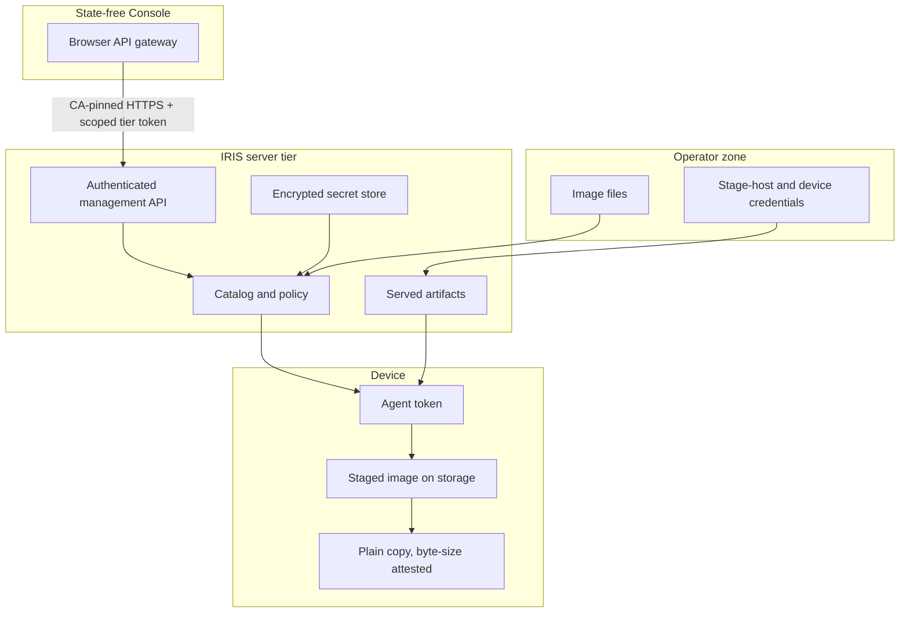

<!--
Copyright 2026 Cisco Systems, Inc. and its affiliates

SPDX-License-Identifier: Apache-2.0
-->

# Security Model

IRIS transfers, verifies, and stages operating-system images. Installing or
activating a staged image remains an operator action outside IRIS.

## Guardrails

| Guardrail | Meaning |
| --- | --- |
| No operating-system install | IRIS does not install or activate the staged IOS image, or commit an operating-system package change. Onboarding and undeploy manage only the IRIS application. |
| No reload | IRIS does not reload or schedule reloads. |
| No boot mutation | IRIS does not change boot variables or running software state. |
| No inband network mutation | For inband devices, IRIS never creates, changes, or removes the existing VLAN, SVI, gateway, routes, or VRF. |
| Device-side content check | Downloaded bytes are checked against catalog SHA-256. IOS-XE placement checks the final copy's exact size; XR verifies the file on its host mount. An existing Guest Shell root image is adopted only after native SHA-512 verification against the catalog. |
| Private swarm | Torrents use private metadata and authenticated announces. |
| Unprivileged runtime | Every server process runs as a fixed non-root uid with all Linux capabilities dropped. |

Deployment lifecycle state is recorded in durable, non-secret **deployment
records** under `IRIS_STATE`, and a normal teardown is driven from a device's
recorded deployment record rather than its editable inventory. The one
exception is a **forced undeploy**, for a device stranded with no readable
deployment record: it is planned from inventory,
removes only what is identifiable by name as IRIS's own, deliberately leaves the
operator's network (VLAN/SVI, VirtualPortGroup, NAT rules) untouched because
nothing proves IRIS created it, and is recorded distinctly in the audit trail as
`undeploy_forced`. Teardown is otherwise never driven from
its editable inventory. Deployment records contain no passwords, tokens, certificate keys,
or raw device configuration. Router deployment records additionally bind the management IP
and processor-board identity and own only collision-free named globals and
`guest-share` resources. See
[Router preflight and ownership](management-type.md#router-preflight-and-ownership).

## Container runtime privileges

The server and Console images create a system user `iris` with a **fixed uid
and gid of 10001** and declare `USER iris`. Tracker (6969), catalog (8443),
artifact server (8000), seeder/aria2c (6881), telemetry (9101), internal
management (9443), and the separate Console (8080) run as that uid. No listener
uses a privileged port, no service needs a raw socket, and nothing chowns
anything at runtime. Compose pins
the same identity and drops the remaining privilege surface; the exact settings
are in [Runtime identity](server.md#runtime-identity).

Decrypted copies of the server's age-encrypted secrets live on `/run/iris` tmpfs,
which is mounted with `uid=`, `gid=`, and `mode=` options so the directory is owned by and
private to the runtime uid. Those options require Docker Engine 23.0 or later.

Because the Dockerfile cannot change ownership of host paths, uid 10001 must be
given access to the age identity file (`IRIS_AGE_KEY_FILE_HOST`, keeping mode
600 or 400) and the artifacts directory (`IRIS_ARTIFACTS_HOST_DIR`) on every
deploy. Named volumes must also be writable by uid 10001. `cap_drop: [ALL]`
applies to `docker compose run`, so permission repairs require a separate
container with permission to change ownership. See
[Volume permissions](server.md#volume-permissions).

The host image tree (`IRIS_IMAGE_ROOT`, mounted read-only at `/opt/images`)
must also be readable and traversable by uid 10001 — see
[Host image tree permissions](server.md#host-image-tree-permissions).

### Kubernetes posture

The Kubernetes manifests match the same identity and enforce it at the
namespace level.

| Control | Value |
| --- | --- |
| Pod `securityContext` | `runAsNonRoot: true`, `runAsUser`/`runAsGroup`/`fsGroup` 10001. |
| Container and init container | `allowPrivilegeEscalation: false`, all capabilities dropped, `seccompProfile: RuntimeDefault`. |
| Namespace pod-security | `pod-security.kubernetes.io/enforce: restricted`. |

`fsGroup` is what keeps the age-key secret readable to a non-root process, and
whether it reaches the persistent volume is the CSI driver's decision — verify
that against your storage class before deploying. See
[Unprivileged runtime](kubernetes.md#unprivileged-runtime).

## Trust boundaries

### Console and server are separate trust zones

The Console mounts no fleet, device credential, catalog, image, artifact, or
audit state. It sends allowlisted `/api/v1` browser requests to the internal
`/internal/v1` management API over CA-pinned HTTPS. A management-scoped bearer
is read from a mounted file, re-read for rotation, and compared against current
and previous values in constant time before route lookup or body buffering.
The credential is valid nowhere else and never appears in an environment value,
URL, process argument, exception, or audit entry. Browser session and CSRF
checks remain independently required.

The Console tries the current token first. Only an explicit management-tier
authentication rejection permits one attempt with the previous token; browser
authentication failures, TLS failures and server errors do not. A mutation
retains the token accepted by preflight and sends its body once.

The default Compose stack exposes port 9443 only on its project network.
Across Docker hosts, bind it to the server's private management address and
allow only the Console host through the firewall. Kubernetes uses a ClusterIP
Service plus a NetworkPolicy that selects Console pods. These reachability
controls supplement the credential and verified TLS.

The Console also needs its own TLS serving identity. The default Compose stack
obtains a Console-only fallback or installed custom identity through the
authenticated management connection. Docker on separate hosts and Kubernetes
mount an independent default certificate and key read-only into the Console;
the server has neither that default private key nor the ability to fetch it.
A custom identity installed through Settings crosses the protected management
connection. The Console keeps its active copy in tmpfs.

The Compose tier credential is an exception to the encrypted server store: its
current/previous files persist in the `iris-tier-auth` volume and are readable
by both tiers, with the Console mount read-only. Separate Docker hosts have
local credential directories provisioned over a trusted channel; neither host
mounts the other's storage. Restrict access to these files and their backups.
Kubernetes supplies the credentials through Secrets. See
[Docker on separate hosts](docker-hosts.md) for provisioning and rotation.

### Swarm data is console-gated

Per-device swarm state (device IDs, IPs, models, progress, live transfer
rates) is reserved for the authenticated management API and browser session.
The telemetry listener authenticates credentials independently of source IP.
Probes at `/healthz` and `/readyz` disclose no fleet state. Metrics require the
monitoring credential, and swarm data crosses the tier-authenticated management
hop plus browser session checks. Login and first-run setup have their own
credential/grant checks. Static Console pages and the documented Guest Shell
bootstrap/bundle/certificate downloads are public; short-lived installer files
require their unguessable capability paths.

## Typed identity and peer policy

Every tracker and catalog credential resolves to a **typed principal** — a
`(type, id)` pair. `device:<id>` is an onboarded device, `service:seeder` is the
server's own seeder, and `legacy` is a credential that authenticated but cannot
be attributed to either. The two namespaces are distinct, so a device registered
under the name `seeder` and the seeder service are different identities rather
than one colliding key. The device id `seeder` is reserved and refused at
enrollment.

A `legacy` participant is visible, answered, and counted, but it carries no
device identity: it is never written to the durable endpoint map, never joined to
a device row, and cannot be quarantined individually. While a rotated seeder
credential remains valid, the tracker treats an unattributed announce from an
address that a durable endpoint
attributes to a quarantined or revoked device as that device: it receives no
peers and is handed to nobody. The real boundary is the credential's own expiry
— a previous seeder token is retired automatically 30 days after the rotation
that replaced it (see [Rotating the seeder announce
credential](#rotating-the-seeder-announce-credential)) — and the address rule is
the hint that holds inside that window.

**Duplicate credential ownership** fails closed. The announce and catalog
authorization indexes are built strictly: if two records share a credential
value, index construction raises and every request in that lane is refused — a
tracker 403 or a catalog authorization failure — rather than silently resolving
to whichever record loaded last. No error message carries the offending value.

Credential lookup uses fixed-size SHA-256 digest keys and checks the selected
record's token with a constant-time comparison. Each request checks that
record's current expiry and revocation state without scanning other devices.

### Roles, virtual ACLs, and server enforcement

A device may declare one role. Role names match
`^[a-z0-9][a-z0-9._-]{0,31}$`; `default`, `quarantine`, `origin`, `seeder`, and
`legacy` are reserved. A restricted role becomes one **virtual role ACL** in
memory: it permits its own role, the explicitly permitted peer roles, and
`service:seeder` when `origin` is true, then denies everything else. Restricted
roles that communicate must name one another symmetrically. An unrestricted
role keeps implicit open discovery.

Exactly one ACL governs a principal. Fail-closed and revoked state come first,
then an explicit stored-ACL assignment, then a restricted role's virtual ACL,
then implicit permit. An explicit assignment therefore **shadows the role**;
it is not conjoined with the role ACL. Quarantine remains the reserved explicit
deny-all assignment and takes precedence. Use the explain route before changing
or migrating a device that already has an explicit assignment.

The tracker enforces new introductions. It **does not sever existing connections**
or purge peers that aria2 already knows, and aria2 may reconnect
to a retained peer without asking the tracker again. An applied verified
device deny list may cooperatively disconnect matching peers. To request
containment, unassign every image from the restricted device; torrent removal
requires the next successful due policy poll and successful aria2 policy apply.
Signed logical cadence and catalog/RPC failures can delay that action; it is
not an immediate or guaranteed next-tick disconnect. No role operation installs,
activates, reloads, changes boot variables, or otherwise changes running device
software.

Issue #153 is **preflight only** in this phase. The reconciler computes how many
devices a future mutual origin ACL would newly deny, but it continues applying
the prior self-evaluation blocklist. `origin: false` controls whether the
tracker introduces the origin; it does not yet add that device's address to the
origin's aria2 blocklist. The management surface exposes the preflight count,
not the device IDs or addresses. When the protected seeder IPv4 address is
unknown, the prospective result is unavailable (`null`), not a completed zero
or a deny-all result. Existing ACL enforcement retains its normal behavior.

Issue #153 remains open through one full release of preflight observation. A
later, separately reviewed activation would apply the
union of current self-evaluation and mutual-origin evaluation to **all** ACLs,
including hand-written ACLs. Phase 1 does not complete that tagged-release dwell
or authorize activation or lab/live validation of the union.

When permitted and denied principals share one translated IPv4 address, a
global origin block would affect both. IRIS records a `shared_permit_deny`
conflict and leaves that address unblocked. This availability rule means NAT can
weaken address-level origin isolation; use distinct addresses when that
isolation is required.

The **agent-distribution exemption** is an invariant: role ACLs, QoS values,
announce cadence, candidate ceilings, and instruction policy cannot gate
bootstrap artifacts, enrollment, token refresh, or agent packages. A restricted
or quarantined device retains this recovery path. Recovery artifacts are
separate from OS-image torrent staging; instruction-body fetch/verification failure stops the
instruction step only; heartbeat/staging continue with verified fallback or
defaults when policy apply succeeds. An aria2 RPC apply failure still sends
heartbeat but skips staging for that tick. Tracker and origin enforcement
remains authoritative for those server controls.

### Device administrator trust boundary

The encrypted instruction file is confidential against users below privilege 15, against swarm peers and network observers, against reuse on another device, and against envelope-only copies that do not include device private keys. It is not, and cannot be, confidential against the device's own administrator, who is root where the agent runs and holds every key the agent holds. Its integrity and authenticity hold against everyone including that administrator once the verification root is pinned inside the signed image; on Guest Shell, and on any platform where the package signature is not enforced, integrity is tamper-evidence rather than tamper-proofing. Role isolation, announce cadence, peer discovery and origin rates are enforced by the tracker and the origin and do not depend on any device honouring anything.

An offline filesystem copy containing `iris-agent.conf`, its current/prior
instruction keys or its `lkg_key` is not confidential from the holder of that
copy. Mode-0600 permissions protect access on the running filesystem; they do
not encrypt a copied filesystem. Diagnostic output such as `show tech` is
within the envelope-only guarantee only when it excludes those private keys.

A privilege-15 or IOS-XR root-lr administrator can alter the runtime or bypass
the agent. A valid signature proves the signed instruction's origin, not that
the administrator applied it. Device-side rates and caps remain cooperative;
**violation = 0 does not mean compliant**. See [instruction evidence](observability.md#instruction-evidence-and-custody)
and the [platform comparison](device-agents.md#instruction-trust-by-platform).

### Encrypted instruction envelope

Phase 1 serves a bounded, per-device envelope on authenticated catalog HTTPS.
A response over 256 KiB is rejected before parsing or cryptographic work.
SP800-108/HMAC-SHA-256 derives separate encryption, MAC and nonce keys with
per-device audience context; a deterministic
16-byte nonce binds device ID, key ID, epoch and instruction serial. An
HMAC-SHA-256 counter keystream encrypts the private device part. A separate
HMAC authenticates the PAE-bound envelope, including header, signed role body,
nonce and ciphertext. MAC-before-decrypt prevents unauthenticated plaintext
from reaching the policy parser. This construction is not AES-GCM.

The agent verifies the OpenSSH role signature and envelope MAC before
decrypting or applying either part. It also checks the signer revocation list,
device/platform audience and role binding, and applies monotonic
`(epoch, instr_serial)` replay floors. Reusing an identity with different bytes
is rejected. An authenticated server clock anchors expiry; a wall-clock change
cannot silently extend validity. Signed role intent is public within the
envelope; confidentiality protects the private per-device part. Failure never
makes unverified instructions authoritative. See the [failure table](device-agents.md#instruction-failures-and-recovery).

### Two-root trust and custody

Exactly two distinct offline-root public keys form the trust set. Keep their
private keys with separate custodians at separate sites, never on the server.
The unified IOx/XR image embeds `iris-signers.allowed_signers` and
`iris-root.allowed_signers` as mode-0444 files. With a natively signed package
and enforced platform verification, these are image-pinned roots. Guest Shell
receives the same two public-root files in its bundle on replaceable flash:
that is tamper-evidence, not an immutable image pin. Losing one root's private
material leaves provisioned trust bytes unchanged; the surviving root can
issue the next online certificate. Follow the [root runbooks](operations.md#instruction-root-ceremony-and-recovery).

The optional online signing private key is encrypted at
`$IRIS_CONFIG/instr/signing-key.age`; plaintext exists only at runtime as
`$IRIS_RUN/instr/signing-key`. Public key, certificate and `roots.d/` remain
under `$IRIS_CONFIG/instr/`. The age identity and instruction state remain on
the server host. The Console has management token/CA files only, never server
instruction state, the age identity, encrypted signing key, or runtime plaintext.
Public roots are public material, not credentials.

No current/prior instruction key, LKG key, online signing private key or
offline-root private key enters IOx `run-opts`, XR `docker-run-opts`, installer
arguments, or device platform configuration. Authenticated refresh alone
returns the current and bounded prior instruction keys into the agent's
mode-0600 configuration; the LKG key is created on the device. A valid LKG is
locally re-encrypted and survives per-device instruction-key rotation.

There is a bootstrap exception: the enrollment bearer remains in IOx
`run-opts` and XR `docker-run-opts`; IOx also retains its SSH-to-self password.
A privileged device administrator can read those bootstrap credentials,
including in platform configuration or diagnostic output. The default
enrollment TTL is 3,600 seconds (one hour); prompt first authenticated refresh
replaces the agent's active credential, with a normal token overlap of 120
seconds. Refresh does not erase the original bootstrap value from platform
activation configuration. These values are not promised confidential from
privilege 15/root-lr or `show tech-support`.
The closed credential-width registry retains 128-bit bearer credentials and
uses 256-bit cryptographic instruction keys. Missing, unsupported or mismatched
widths fail before minting, without printing values.

For a leaked key on an otherwise honest device, rotate its instruction key
with `iris-instr-key rotate --no-overlap <device_id>`. For a retired or
compromised device, use `iris-revoke <device_id>`; never rotate keys to spare a
revoked device. Revocation is durable server authority and blocks its catalog
access even when the last device report still says LKG.

### IOx verification and Guest Shell bundle boundary

IOx verification is a device-global setting. A signed wrapper is preferred
and causes no verification-state change. An unsigned wrapper uses the
[owned transaction](iox.md#device-global-package-verification): initial
`enabled` is recorded durably, disabled only for installation, and restored
with read-back before activation/start; initial `disabled` stays disabled;
`unknown` refuses mutation and installation. Durable obligations survive
interruption/resume and guide uninstall recovery; an operator-changed or
unowned state is never blindly enabled. Signature-marker presence is not
cryptographic validation. The claim that the container never changes in the
field requires a natively signed wrapper and verification remaining enabled.
Current proof artifacts are unsigned and do not establish that premise.

Cisco documents the global control and media restrictions in the
[IE-3x00 IOx deployment guide](https://www.cisco.com/c/en/us/td/docs/switches/lan/cisco_ie3X00/software/17_14/b_cisco-iox-ie3x00-switches/m-ie3400-deploying-iox-applications.html)
and [Catalyst 9000 App Hosting guide](https://www.cisco.com/c/en/us/support/docs/switches/catalyst-9500-series-switches/222780-understand-app-hosting-on-catalyst-9000.html).
Platform signature refusal is preserved; the unsigned transaction is not a
promise that every media/platform combination will accept or run the app.

`server/pack-agent-bundle.sh` emits Guest Shell's adjacent 64-hex SHA-256
sidecar. This is digest validation, not a detached signature. Bootstrap collects sidecar before archive, bounds archive
and member processing, and refuses missing, malformed or mismatched evidence
while preserving the prior runnable bundle. Bundle and installer also bind the
two public-root files. An administrator who can replace bootstrap, bundle and
evidence remains inside the trusted-device-admin boundary.

### Tracker transport security

The tracker on TCP 6969 is **HTTPS-only** and presents the same server
certificate that devices already pin for the catalog. The origin seeder and
every device aria2 process load that public certificate as their CA and keep
certificate verification enabled. A plaintext request fails during the TLS
handshake and never reaches tracker authentication.

The origin seeder, IOx and IOS-XR send their announce credential in an
`Authorization: Bearer` header. Guest Shell uses a BEP-compatible query
credential. TLS encrypts the complete request, and credentials are never
logged. The local aria2 JSON-RPC endpoint uses HTTP on `127.0.0.1` only and
is not exposed to the network.

Seeder credentials must contain only printable ASCII characters without
whitespace. Startup validates both the RPC secret and announce token before
replacing the private aria2 configuration; publishing and rotation validate
the announce token before sending it to aria2. Invalid values stop the operation
with an error that does not include the credential.

For manually generated torrents, `tools/make-torrent.sh` requires an HTTPS
announce URL with a nonempty `announce_token` or `key` query parameter. It
parses the query and rejects missing or ambiguous credentials before creating
the torrent.

### Peer policy failure posture

Peer ACLs and per-device assignments live in `peer-policy.json` under
`IRIS_STATE`, with a last-known-good copy at `peer-policy.lkg.json` and the five
most recent prior committed documents in `peer-policy.lkg.d/`. Every commit
writes the current authoritative document to the LKG and ring before atomically
replacing the authoritative file, so recovery copies are never half-written
candidates. The durable `peer-policy.roles-ever` watermark is created before
the first role-bearing commit and supports startup downgrade/state-loss
warnings. On a fresh start, when neither policy file exists, both are written
with the same base revision.

Read precedence decides the posture:

| State on disk | Result |
| --- | --- |
| Neither file present, no roles-ever watermark | Open discovery. The validated base document is materialized to both paths; not degraded, not fail-closed. |
| Neither file present, roles-ever watermark retained | The base document is materialized and discovery is open, but the result is `degraded` because prior role state was lost. Subsequent reads remain degraded. |
| Valid authoritative | Used as-is, except that an authoritative document with no `roles` is `degraded` when `roles_present` or the roles-ever watermark proves role state previously existed. |
| Corrupt authoritative, valid LKG | The LKG is used and the policy reports `degraded`. |
| At least one file present, neither valid | `fail_closed`: no announce is offered any candidate peer, and the seeder blocklist switches to the emergency deny list below. |

The first and last rows are easy to confuse and lead to opposite repairs. Both
files *missing* is the open case, not the deny-everything case.

Before recovery, preserve the authoritative policy, Fleet state, tracker and
origin status, LKG and ring, and the roles-ever watermark. When the
authoritative file is corrupt and the service is already using the valid LKG,
a controlled repair may replace `peer-policy.json` with the verified LKG bytes;
that repairs the store at the LKG revision and loses the newest policy change.
It is a corrupt-store repair, not the normal rollback mechanism.

An intentional rollback uses the policy restore primitive to copy reviewed
historical content into a **monotonic new revision**. It preserves the live
outbox, appends a `restore` event, and rotates the acknowledgement epoch. There
is no public restore route or CLI, so do not simulate this by copying a ring
file over a usable authoritative policy. The primitive itself requires usable
authoritative state. Follow a reviewed maintenance procedure that invokes the
restore primitive and then reconcile Fleet drift.

Removing both files re-materializes the base policy, which drops
every device's ACL assignment — including every quarantine assignment — every
role and member, every QoS override, and every operator-defined ACL; only the
reserved `quarantine` ACL is re-created. The roles-ever watermark remains, so a
role-capable server reports the loss rather than treating it as a pristine
install.

A **valid but empty** policy is not the same as a broken one. The tracker applies
an empty blocklist — a full replace, so anything previously blocked is released —
and reports `enforced` once that call succeeds against a live seeder RPC session.

### Emergency deny

Under `fail_closed` the tracker stops consulting policy and derives an emergency
deny list instead: every address it knows that is **not** attributed to a
`service` principal is denied. Durable endpoint rows within the TTL and endpoint
writes still queued for retry supply device addresses; the live announce registry
supplies the rest, including legacy participants.

The address configured as `IRIS_HOST_IP` is the exclusion — it is never added to
the deny list in either mode. The emergency list additionally skips addresses it
knows only through a `service` principal, but that skip is **not** a guarantee:
the emergency list is a set of addresses with no shared-address handling, so an
address the tracker also knows under a device principal is denied even if a
service principal announces from it. Protecting the seeder therefore depends on
`IRIS_HOST_IP` being set to the address it actually announces from.

A fail-closed pass is recorded as `fail_closed`, never as `enforced`:
`fail_closed` is decided before any other state, and the status writer rejects an
`enforced` claim with no current seeder RPC session behind it.

### When no address is known

If the tracker is fail-closed and knows no address to deny, the derived set is
empty — and an empty set produced by the fail-closed path is the one desired set
the tracker computes and **deliberately does not send**. Sending it would be a
full replace that released every existing block. The state stays `fail_closed`
and is never reported as `enforced`.

### Enforcement status is count-only

The tracker is the only process that writes the aria2 peer blocklist, and its
status file `peer-enforcement.json` records the denied set as a **count**, not a
list. That file therefore cannot tell you whether one particular peer is blocked.

One exception is deliberate and narrow: a conflict record names the single
address that two principals disagree about, so `peer-enforcement.json` is
**not address-free**. Treat it accordingly when deciding who may read it or
where it is backed up. The console API is the boundary — it rebuilds the payload field by
field and reduces conflicts to a count and the reason names, so no address
crosses into a browser.

### Rotating the seeder announce credential

Rotating the seeder announce credential keeps the previous credential valid for
a bounded overlap: **30 days** from the rotation that retired it
(`IRIS_SEEDER_PREV_TTL`). That window exists to recover a device that did not
receive the new token — both credentials are valid throughout it, and a device
that missed the rotation keeps announcing on the old one meanwhile. It is not a
second permanent key: past the window the tracker refuses the old token like any
other expired credential, and the next rotation drops the record.

The expiry is set at rotation and enforced automatically. At most two valid
previous credentials are allowed; a rotation that would exceed that limit is
refused. Expired credentials do not count toward the limit. There is no
operator command for revoking a previous credential before its expiry.

A device cannot be locked out inside the window, and expiry never strands one:
the way a device receives the current announce token is a freshly personalised
torrent from the catalog, and that request is authorised by the device's own
catalog token, not by the announce credential being retired. Personalise device
torrents during the overlap and nothing announces on a seeder token afterwards.

**If a device is not re-personalised before the window closes**, its next
announce is refused with a token-free 403 and no other symptom by default:
the operator-visible signal is `iris_tracker_announces_refused_expired_total`
(nonzero) alongside `iris_legacy_announce_participants` reading `0` — that
combination can indicate devices attempting to use expired credentials. See
[Observability: reading iris_legacy_announce_participants](observability.md#reading-iris_legacy_announce_participants).

## First-run admin claim

Before an admin account exists, the console's normal login page accepts the
documented default credential `iris` / `irisisgreat!` and, instead of a
session, mints a one-use, 10-minute setup grant that leads into administrator
creation. That pair authorizes nothing else and stops receiving special
treatment the moment a real administrator account exists; afterwards it is
checked only against the stored administrator credentials, with failures
rate-limited and audited like any other login. The operator may name the real
administrator `iris` or even deliberately retain the default pair.

This is a deliberate trade: whoever reaches a brand-new Console first can
claim the administrator account. The one-host Compose stack publishes port
8080 only on `IRIS_HOST_IP`; the standalone Console uses
`IRIS_CONSOLE_BIND_IP`. That
binding is not caller authorization: anyone who can reach that address can
still race the intended operator. Restrict the port to trusted operator sources
(or apply the equivalent policy to the Kubernetes Console LoadBalancer) and
complete setup immediately after deploying.

## Secrets

Catalog and device credentials, RPC secrets, and private server TLS material are
encrypted at rest with age recipients. Their decrypted runtime copies live in
`/run/iris`. Tier credentials use the separate file mounts described above;
short-lived install assets under `staging/` can also contain device credentials.
Device enrollment tokens are generated per device by the running server.

Catalog-token rotation is recoverable without making a rolled token a general
device credential. If the server commits a rotation but the response or the
device's atomic config write is lost, that device's one previous token may ask
only the token-refresh route to reissue the already-current secret bag. It
cannot heartbeat or submit telemetry, its assignment-bound catalog reads end
after the short overlap, and recovery ends at the token's original expiry.
The normal clock-skew allowance still applies. The retry is revalidated under
the server's secrets-store lock, so revocation or a newer successful rotation
takes precedence.

The age private key is deliberately kept outside the directory holding the
ciphertext it opens. Co-locating them would mean any backup, snapshot, or read
of the config directory yields both halves at once, making the at-rest
encryption ineffective against that access. Compose enforces the separation:
the key is mounted as a Docker secret at `/run/secrets/iris_age_key` from a host path the
operator controls, never from the encrypted volume.

Do not commit:

- Real `creds/` files.
- `fleet/devices.csv` or `fleet/assignments.csv` with sensitive lab data.
- Private keys, certificates, tokens, or RPC secrets.
- Cisco images, patches, or generated release artifacts.

## Importing images from disk

The Console can publish an image that is already on disk, across the uploads
volume and the read-only import root. Both routes require an authenticated
session, `POST /api/v1/images/import` additionally requires the CSRF header, and
every attempt writes an `image_import` audit event, rejections included. The
`POST` authorizes on candidate **identity** rather than a path prefix: the
submitted path must be exactly one of the paths the scan currently offers, so a
traversal that merely starts inside a root (`<root>/../outside/secret.bin`) is
refused. Discovery resolves each candidate to its real path and keeps it only if
that still lands inside the root it was found under, so a symlink cannot pull an
outside file into the set. Publishing seeds in place from the file's own
directory: nothing is copied, the read-only root is never written to, and the
`.torrent` goes to the state directory rather than next to the image. A later
catalog delete unlinks nothing outside the uploads volume.

The operator walkthrough is in
[Importing images already on disk](console.md#importing-images-already-on-disk),
and the refusal reasons are in
[Import skip reasons](reference.md#import-skip-reasons).

## Cisco Bulk Hash verification

The catalog can check a published image's sha512 against Cisco's own Bulk
Hash feed — the authenticity half of the trust story that the "Device-side
content check" guardrail above does not cover: that check proves a device
received what the catalog holds, not that the catalog holds a genuine Cisco
file.

Before the CSV rows are parsed, the feed's detached RSA/SHA-512 signature is
verified using the public key from a Cisco certificate pinned in-repo
(`server/certs/cisco_bulkhash_verify.pem`; the file's own header records its
provenance and fingerprint) — never a certificate found inside the feed
itself. Any fetch, signature, or parse failure leaves every stored
verification verdict untouched: a broken or tampered feed can never
quarantine an image.

A sha512 mismatch quarantines the image: seeding stops and stays stopped
across container restarts (the startup re-seed only re-seeds torrents the
catalog holds and has not quarantined), it can no longer be newly assigned, and
it is auto-unassigned from every device that already had it approved. Releasing
the quarantine is what resumes seeding. `DEFERRAL_STATUS` on a matched feed row surfaces as a console
warning and never quarantines — an image Cisco has deferred is not treated
as tampered. See [Image verification](operations.md#image-verification) for
the schedule, the offline path for air-gapped servers, and how an operator
releases a quarantine.

## TLS and certificates

The catalog, tracker, and artifact server use HTTPS. The generated device installer installs the catalog certificate into the device trust path so the bootstrap and catalog calls can validate the server identity.

The catalog and artifact server **fail closed to TLS**, the same contract as
the console below. At start each resolves `IRIS_CERT`; if it names no usable
certificate, the process exits with a message naming the path instead of
serving plain HTTP. The catalog answers a device bearer token on every route.
The artifact server's v1 API uses resource-bound HTTP Basic over TLS; the
Guest Shell installer uses high-entropy, one-install capability names under
`staging/`. A silent plaintext fallback would expose either credential. Set
`IRIS_CATALOG_ALLOW_PLAINTEXT=1` or `IRIS_ARTIFACTS_ALLOW_PLAINTEXT=1` to opt
into a plaintext listener deliberately — loopback or an isolated lab network
only. The shipped `docker-entrypoint.sh` always provisions `IRIS_CERT`, so
this refusal is only reachable running `catalog.py` or `artifact_server.py`
directly, outside the supported deployment.

The Console's own certificate and key, imported through Settings → TLS &
trust, get the same careful handling: an encrypted private key is decrypted
with `openssl pkey`, its passphrase piped over stdin and never passed as an
argument or written to a log, and the key is stored age-encrypted in the
server tier. The default Compose stack generates a Console-only fallback in
server tmpfs. Docker on separate hosts supplies a Console-local default
certificate and key; Kubernetes supplies an independent TLS Secret. The Console
validates and copies its active pair into tmpfs. Custom identities and the
single-host fallback arrive over the authenticated management connection;
independently mounted defaults are copied locally, and their private keys stay
on the Console host.

The Console **fails closed to TLS**. Unless the explicit plaintext opt-in is
set, startup fetches the active identity through the verified management hop
or uses its independently mounted default; an unavailable or
unusable identity makes `iris-console` exit. Set
`IRIS_GUI_ALLOW_PLAINTEXT=1` to opt into a plaintext console deliberately —
loopback or an isolated lab network only. With the opt-in the session
cookie drops its `Secure` attribute (it keeps `HttpOnly` and
`SameSite=Strict`), and a certificate uploaded through Settings is saved but does not change a plaintext listener
to HTTPS. Remove the opt-in and restart the Console to enable TLS. The
listener completes the TLS handshake in the per-connection worker thread, so a client that connects and never sends a
ClientHello ties up only its own connection.

The server's outbound trust store (Settings → TLS & trust → Trusted CAs) accepts
only blocks that OpenSSL parses as X.509 certificates, whether pasted or
downloaded. One `CERTIFICATE` block that is not a certificate would make
OpenSSL reject the whole runtime bundle — and every private CA in it — so
such input is refused before anything is written; a store file that fails
to load is skipped and named on stderr when the bundle is rebuilt, and a
degraded `ssl_context()` (system roots only) is logged rather than silent.

### Console sessions

Sessions live in the state-owning management process and expire on idle. The Console's
periodic view refreshers mark themselves with `X-IRIS-Poll: 1` (GET only);
the server validates the session for those without refreshing its idle
clock, so a console left open on a polled view still reaches the idle
timeout Settings advertises — only operator input and mutations count as
activity. The break-glass reset (`iris-gui-admin`) runs in another process
and reaches those sessions through the store: it stamps a floor into the
admin record and the console drops every session created at or before it
on that session's next request. The in-console password change keeps its
caller's session and revokes the others.

## Device SSH host keys

### Server-side sessions (console, installers, lab transports)

Every SSH session the server or an operator's installer opens -- the device
transports `lab/device-run.sh` and `lab/xr-run.sh`, the stage-host push in
`device/device-install.sh` / `device/router-install.sh`, and the RPM `scp` in
`device/xr-install.sh` -- verifies the peer through one shared policy,
`lab/iris-ssh-policy.sh`:

| Environment | Behaviour |
| --- | --- |
| `IRIS_SSH_HOST_KEY="<type> <base64>"` | Pin exactly that key for the peer (`StrictHostKeyChecking=yes` against a private temporary `known_hosts`). |
| `IRIS_SSH_KNOWN_HOSTS=<path>` | Strict verification against that file; an unreadable path refuses to connect rather than falling back. |
| neither (default) | `StrictHostKeyChecking=accept-new` against a **persistent** `known_hosts` under `$IRIS_SSH_STATE_DIR` (default `$IRIS_STATE/ssh`, i.e. the server's state volume; `~/.iris/ssh` outside the container). First contact records the key; every later session must present the same one. `/dev/null` is never used. |
| `IRIS_SSH_LEGACY=1` | Opt in to the SHA-1 KEX, `ssh-rsa` and CBC-cipher additions old IOS-XE images need. Off by default. |

ssh's own diagnostics are forwarded (redacted) on stderr instead of being
discarded, so "connection refused", "no matching key exchange method" and
"host key changed" can be told apart. A changed key is reported with the
`known_hosts` path and the `ssh-keygen -R <ip> -f <file>` command to clear it
when a device was legitimately re-imaged -- and a note to treat it as a
possible interception otherwise. The console's **Forget host key** action
(`POST /api/v1/devices/<id>/forget-host-key`) runs the equivalent removal
without shell access to the state volume, and is audited either way -- see
[Operations → Forgetting a device's SSH host key](operations.md#forgetting-a-devices-ssh-host-key).

### On-device agent sessions

The agent's IOS control channel supports optional host-key pinning through the
`device_ssh_known_hosts` agent config key. This is separate from catalog TLS,
which requires a usable pinned certificate. When the key is set **and** the
file exists, SSH and SCP run with `StrictHostKeyChecking=yes` against that
`known_hosts` file. Otherwise they keep `StrictHostKeyChecking=no` with
`UserKnownHostsFile=/dev/null`, which is the default and is tolerable only
because this is SSH-to-self over a link that never leaves the device (the SVI
on switches, the VirtualPortGroup on routers, the operator's SVI inband).
Nothing in IRIS writes this key, so pinning is opt-in: set it yourself
in the agent configuration to enable it. XR uses its host mount and does not
use this SSH-to-self channel.

## Third-party tools

IRIS invokes tools such as `aria2c`, `mktorrent`, `openssl`, and documentation-time Mermaid as separate programs or runtime dependencies. See the repository `NOTICE` for license notes.
