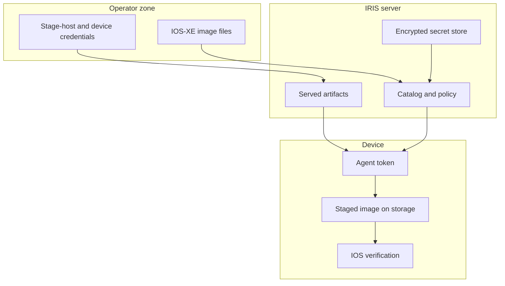

<!--
Copyright 2026 Cisco Systems, Inc. and its affiliates

SPDX-License-Identifier: Apache-2.0
-->

# Security Model

IRIS is designed around least surprise: it moves images, verifies images, and reports status. Installation remains a separate operator decision.

## Guardrails

| Guardrail | Meaning |
| --- | --- |
| No install | IRIS does not run install, activate, or package commit commands. |
| No reload | IRIS does not reload or schedule reloads. |
| No boot mutation | IRIS does not change boot variables or running software state. |
| No inband network mutation | For inband devices, IRIS never creates, changes, or removes the existing VLAN, SVI, gateway, routes, or VRF. |
| Device-side verification | The device verifies the staged copy before reporting success. |
| Private swarm | Torrents use private metadata and authenticated announces. |
| Unprivileged runtime | Every server process runs as a fixed non-root uid with all Linux capabilities dropped. |

Deployment lifecycle state is recorded in durable, non-secret **receipts** under
`IRIS_STATE`, and teardown is driven from a device's active receipt rather than
its editable inventory. Receipts contain no passwords, tokens, certificate keys,
or raw device configuration. Router receipts additionally bind the management IP
and processor-board identity and own only collision-free named globals and
`guest-share` resources. See
[Router preflight and ownership](network-attachment.md#router-preflight-and-ownership).

## Container runtime privileges

The server image creates a system user `iris` with a **fixed uid and gid of
10001** and declares `USER iris`. Every service — tracker (6969), catalog
(8443), artifact server (8000), seeder and `aria2c` (6881), Console (8080), and
telemetry (9101) — runs as that uid. No listener uses a privileged port, no
service needs a raw socket, and nothing chowns anything at runtime, so the
Compose service also sets:

| Setting | Effect |
| --- | --- |
| `user: "10001:10001"` | Restates the image's uid/gid so `docker compose run` and `exec` cannot regress to root. |
| `cap_drop: [ALL]` | Removes every Linux capability. |
| `security_opt: [no-new-privileges:true]` | Blocks regaining privilege through setuid binaries or file capabilities. |

Plaintext secrets live only on the `/run/iris` tmpfs, which is mounted with
`uid=`, `gid=`, and `mode=` mount options so the directory is owned by and
private to the runtime uid. Those options require Docker Engine 23.0 or later.

Because the Dockerfile cannot change ownership of host paths, uid 10001 must be
given access to the age identity file (`IRIS_AGE_KEY_FILE_HOST`, keeping mode
600 or 400) and the artifacts directory (`IRIS_ARTIFACTS_HOST_DIR`) on every
deploy, and a deployment upgraded from a root-runtime release needs a one-time
ownership migration of its existing named volumes. `cap_drop: [ALL]` applies to
`docker compose run` as well, so that migration cannot be done through this
service even as `--user 0`; it needs a throwaway container with default
capabilities. The ownership gap is per volume, so a reset that removes some
volumes and keeps others reopens it for the ones kept. The commands are in
[Upgrading from a root-runtime deployment](server.md#upgrading-from-a-root-runtime-deployment).

The host image tree (`IRIS_IMAGE_ROOT`, mounted read-only at `/opt/images`)
must also be readable and traversable by uid 10001 — see
[Host image tree permissions](server.md#host-image-tree-permissions).

### Kubernetes posture

The Kubernetes manifests match the same identity and enforce it at the
namespace level.

| Control | Value |
| --- | --- |
| Pod `securityContext` | `runAsNonRoot: true`, `runAsUser`/`runAsGroup`/`fsGroup` 10001. |
| Container and init container | `allowPrivilegeEscalation: false`, all capabilities dropped, `seccompProfile: RuntimeDefault`. |
| Namespace pod-security | `pod-security.kubernetes.io/enforce: restricted`. |

`fsGroup` is what keeps the age-key secret readable to a non-root process, and
whether it reaches the persistent volume is the CSI driver's decision — verify
that against your storage class before deploying. See
[Unprivileged runtime](kubernetes.md#unprivileged-runtime).

## Trust boundaries

## Secrets

Server secret material is encrypted at rest with age recipients. Plaintext lives only in `/run/iris` while the container runs. Device enrollment tokens are short-lived and generated per device by the running server.

Do not commit:

- Real `creds/` files.
- `fleet/devices.csv` or `fleet/assignments.csv` with sensitive lab data.
- Private keys, certificates, tokens, or RPC secrets.
- IOS-XE images or generated release artifacts.

## Importing images from disk

The Console can publish an image that is already on disk, across the uploads
volume and the read-only import root. Both routes require an authenticated
session, `POST /api/images/import` additionally requires the CSRF header, and
every attempt writes an `image_import` audit event, rejections included. The
`POST` authorizes on candidate **identity** rather than a path prefix: the
submitted path must be exactly one of the paths the scan currently offers, so a
traversal that merely starts inside a root (`<root>/../outside/secret.bin`) is
refused. Discovery resolves each candidate to its real path and keeps it only if
that still lands inside the root it was found under, so a symlink cannot pull an
outside file into the set. Publishing seeds in place from the file's own
directory: nothing is copied, the read-only root is never written to, and the
`.torrent` goes to the state directory rather than next to the image. A later
catalog delete unlinks nothing outside the uploads volume.

The operator walkthrough is in
[Importing images already on disk](console.md#importing-images-already-on-disk),
and the refusal reasons are in
[Import skip reasons](reference.md#import-skip-reasons).

## TLS and certificates

The catalog and artifact server use HTTPS. The generated device installer installs the catalog certificate into the device trust path so the bootstrap and catalog calls can validate the server identity.

## Device SSH host keys

The agent's IOS control channel supports optional host-key pinning through the
`device_ssh_known_hosts` agent config key, mirroring the verify-if-present
pattern the catalog TLS context already uses. When the key is set **and** the
file exists, SSH and SCP run with `StrictHostKeyChecking=yes` against that
`known_hosts` file. Otherwise they keep `StrictHostKeyChecking=no` with
`UserKnownHostsFile=/dev/null`, which is the default and is tolerable only
because this is SSH-to-self over the app's point-to-point link to the device's
own SVI. Nothing in IRIS writes this key, so pinning is opt-in: set it yourself
in the agent configuration to enable it.

## Third-party tools

IRIS invokes tools such as `aria2c`, `mktorrent`, `openssl`, and documentation-time Mermaid as separate programs or runtime dependencies. See the repository `NOTICE` for license notes.
