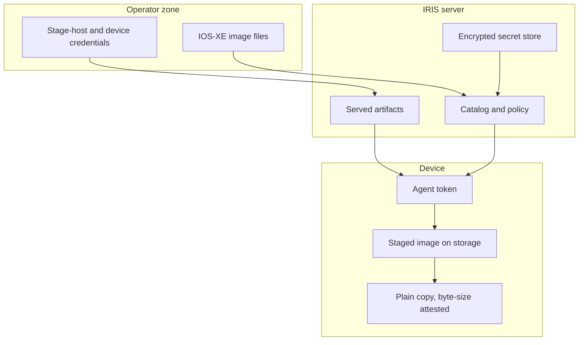

<!--
Copyright 2026 Cisco Systems, Inc. and its affiliates

SPDX-License-Identifier: Apache-2.0
-->

# Security Model

IRIS is designed around least surprise: it moves images, verifies images, and reports status. Installation remains a separate operator decision.

## Guardrails

| Guardrail | Meaning |
| --- | --- |
| No install | IRIS does not run install, activate, or package commit commands. |
| No reload | IRIS does not reload or schedule reloads. |
| No boot mutation | IRIS does not change boot variables or running software state. |
| No inband network mutation | For inband devices, IRIS never creates, changes, or removes the existing VLAN, SVI, gateway, routes, or VRF. |
| Device-side content check | The agent hashes the staged file with sha256 against its catalog entry before placing it, and confirms the placed copy by exact catalog byte size. |
| Private swarm | Torrents use private metadata and authenticated announces. |
| Unprivileged runtime | Every server process runs as a fixed non-root uid with all Linux capabilities dropped. |

Deployment lifecycle state is recorded in durable, non-secret **receipts** under
`IRIS_STATE`, and a normal teardown is driven from a device's recorded receipt
rather than its editable inventory. The one exception is a **forced undeploy**,
for a device stranded with no readable receipt: it is planned from inventory,
removes only what is identifiable by name as IRIS's own, deliberately leaves the
operator's network (VLAN/SVI, VirtualPortGroup, NAT rules) untouched because
nothing proves IRIS created it, and is recorded distinctly in the audit trail as
`undeploy_forced`. Teardown is otherwise never driven from
its editable inventory. Receipts contain no passwords, tokens, certificate keys,
or raw device configuration. Router receipts additionally bind the management IP
and processor-board identity and own only collision-free named globals and
`guest-share` resources. See
[Router preflight and ownership](network-attachment.md#router-preflight-and-ownership).

## Container runtime privileges

The server image creates a system user `iris` with a **fixed uid and gid of
10001** and declares `USER iris`. Every service — tracker (6969), catalog
(8443), artifact server (8000), seeder and `aria2c` (6881), Console (8080), and
telemetry (9101) — runs as that uid. No listener uses a privileged port, no
service needs a raw socket, and nothing chowns anything at runtime. Compose pins
the same identity and drops the remaining privilege surface; the exact settings
are in [Runtime identity](server.md#runtime-identity).

Plaintext secrets live only on the `/run/iris` tmpfs, which is mounted with
`uid=`, `gid=`, and `mode=` mount options so the directory is owned by and
private to the runtime uid. Those options require Docker Engine 23.0 or later.

Because the Dockerfile cannot change ownership of host paths, uid 10001 must be
given access to the age identity file (`IRIS_AGE_KEY_FILE_HOST`, keeping mode
600 or 400) and the artifacts directory (`IRIS_ARTIFACTS_HOST_DIR`) on every
deploy. A deployment upgraded from a root-runtime release additionally needs a
one-time ownership migration of its existing named volumes. `cap_drop: [ALL]` applies to
`docker compose run` as well, so that migration cannot be done through this
service even as `--user 0`; it needs a throwaway container with default
capabilities. The ownership gap is per volume, so a reset that removes some
volumes and keeps others reopens it for the ones kept. The commands are in
[Upgrading from a root-runtime deployment](server.md#upgrading-from-a-root-runtime-deployment).

The host image tree (`IRIS_IMAGE_ROOT`, mounted read-only at `/opt/images`)
must also be readable and traversable by uid 10001 — see
[Host image tree permissions](server.md#host-image-tree-permissions).

### Kubernetes posture

The Kubernetes manifests match the same identity and enforce it at the
namespace level.

| Control | Value |
| --- | --- |
| Pod `securityContext` | `runAsNonRoot: true`, `runAsUser`/`runAsGroup`/`fsGroup` 10001. |
| Container and init container | `allowPrivilegeEscalation: false`, all capabilities dropped, `seccompProfile: RuntimeDefault`. |
| Namespace pod-security | `pod-security.kubernetes.io/enforce: restricted`. |

`fsGroup` is what keeps the age-key secret readable to a non-root process, and
whether it reaches the persistent volume is the CSI driver's decision — verify
that against your storage class before deploying. See
[Unprivileged runtime](kubernetes.md#unprivileged-runtime).

## Trust boundaries

### Swarm data is console-gated

Per-device swarm state (device IDs, IPs, models, progress, live transfer
rates) is reserved for the authenticated console: `:9101/swarm` answers only
loopback peers by default, and the console proxies it over container loopback
behind its session. `IRIS_SWARM_PUBLIC=1` reopens remote access for operators
who scrape it on a trusted segment.

Be honest about what that gate is: a peer-address check scoped to the
container network namespace — defense in depth, not a hard boundary. Under a
rootful container engine (the shipped Compose and Kubernetes postures),
external connections to the published port never arrive as
container-loopback, so the gate holds. Under a rootless engine
(rootless Docker/Podman) published-port connections can be re-originated
inside the namespace as `127.0.0.1`, and under host networking every
host-local process is loopback — in those deployments the gate is void, and
the hard control is `IRIS_METRICS_HOST=127.0.0.1` (bind the listener to
loopback) or not publishing port 9101 at all.

## Typed identity and peer policy

Every tracker and catalog credential resolves to a **typed principal** — a
`(type, id)` pair. `device:<id>` is an onboarded device, `service:seeder` is the
server's own seeder, and `legacy` is a credential that authenticated but cannot
be attributed to either. The two namespaces are distinct, so a device registered
under the name `seeder` and the seeder service are different identities rather
than one colliding key. The device id `seeder` is reserved and refused at
enrollment.

A `legacy` participant is visible, answered, and counted, but it carries no
device identity: it is never written to the durable endpoint map, never joined to
a device row, and cannot be quarantined individually.

**Duplicate credential ownership** fails closed. The announce and catalog
authorization indexes are built strictly: if two records share a credential
value, index construction raises and every request in that lane is refused — a
tracker 403 or a catalog authorization failure — rather than silently resolving
to whichever record loaded last. No error message carries the offending value.

### The announce credential travels over HTTP

The tracker announce is an **HTTP** URL, so the announce credential rides an
unencrypted hop. The address may be any routable IPv4 the operator uses —
fleets are not always on RFC1918 space — and rotation only refuses a base no
peer could dial (loopback, link-local, unspecified, multicast).

That makes the placement of the announce endpoint a deployment decision with a
real consequence: on a routable address the credential crosses that network in
cleartext. Put the tracker on a management network you trust. The catalog
(HTTPS) and the console are the surfaces that do carry transport security.

### Peer policy failure posture

Peer ACLs and per-device assignments live in `peer-policy.json` under
`IRIS_STATE`, with a last-known-good copy at `peer-policy.lkg.json`. Every commit
writes the current authoritative document to the LKG before atomically replacing
the authoritative file, so the last-known-good copy is the revision before the
current one and never a half-written candidate. On a fresh start, when neither
file exists, both are written with the same base revision.

Read precedence decides the posture:

| State on disk | Result |
| --- | --- |
| Neither file present | Open discovery. The validated base document is materialized to both paths; not degraded, not fail-closed. |
| Valid authoritative | Used as-is. |
| Corrupt authoritative, valid LKG | The LKG is used and the policy reports `degraded`. |
| At least one file present, neither valid | `fail_closed`: no announce is offered any candidate peer, and the seeder blocklist switches to the emergency deny list below. |

The first and last rows are easy to confuse and lead to opposite repairs. Both
files *missing* is the open case, not the deny-everything case.

Recovery is to put a valid document back at `peer-policy.json`. Copying
`peer-policy.lkg.json` over it restores service, but that copy is one revision
behind: the most recent policy change is lost and has to be reapplied from the
console. Removing both files re-materializes the base policy, which drops every
device's ACL assignment — including every quarantine assignment — and every
operator-defined ACL; only the reserved `quarantine` ACL is re-created.

A **valid but empty** policy is not the same as a broken one. The tracker applies
an empty blocklist — a full replace, so anything previously blocked is released —
and reports `enforced` once that call succeeds against a live seeder RPC session.

### Emergency deny

Under `fail_closed` the tracker stops consulting policy and derives an emergency
deny list instead: every address it knows that is **not** attributed to a
`service` principal is denied. Durable endpoint rows within the TTL and endpoint
writes still queued for retry supply device addresses; the live announce registry
supplies the rest, including legacy participants.

The address configured as `IRIS_HOST_IP` is the exclusion — it is never added to
the deny list in either mode. The emergency list additionally skips addresses it
knows only through a `service` principal, but that skip is **not** a guarantee:
the emergency list is a set of addresses with no shared-address handling, so an
address the tracker also knows under a device principal is denied even if a
service principal announces from it. Protecting the seeder therefore depends on
`IRIS_HOST_IP` being set to the address it actually announces from.

A fail-closed pass is recorded as `fail_closed`, never as `enforced`:
`fail_closed` is decided before any other state, and the status writer rejects an
`enforced` claim with no current seeder RPC session behind it.

### When no address is known

If the tracker is fail-closed and knows no address to deny, the derived set is
empty — and an empty set produced by the fail-closed path is the one desired set
the tracker computes and **deliberately does not send**. Sending it would be a
full replace that released every existing block. The state stays `fail_closed`
and is never reported as `enforced`.

### Enforcement status is count-only

The tracker is the only process that writes the aria2 peer blocklist, and its
status file `peer-enforcement.json` records the denied set as a **count**, not a
list. That file therefore cannot tell you whether one particular peer is blocked.

One exception is deliberate and narrow: a conflict record names the single
address that two principals disagree about, so `peer-enforcement.json` is
**not address-free**. Treat it accordingly when deciding who may read it or
where it is backed up. The console API is the boundary — it rebuilds the payload field by
field and reduces conflicts to a count and the reason names, so no address
crosses into a browser.

### Announce credentials are not revoked on rotation

Rotating the seeder announce credential keeps the previous credential valid.
Rotation does not revoke it, at most two valid previous records are allowed, and
a rotation that would exceed that is refused. Revoking a previous record is
library-level support in this release: **no shipped command** performs it, and
there is no automated migration. Old and new credentials are both valid, and
retiring one is a separate operator decision.

## First-run admin claim

Before an admin account exists, the console's normal login page accepts the
documented default credential `iris` / `irisisgreat!` and, instead of a
session, mints a one-time, single-use, 10-minute setup grant that leads into
admin creation. That pair authorizes nothing else and stops working the
moment a real admin account exists — afterwards it is an ordinary failed
login, rate-limited and audited like any other. The operator may name the
real admin `iris` too.

This is a deliberate trade: a documented, unauthenticated default credential
means whoever reaches a brand-new console first can claim the admin account.
Complete setup immediately after deploying, and keep the console on a
trusted network until you have.

## Secrets

Server secret material is encrypted at rest with age recipients. Plaintext lives only in `/run/iris` while the container runs. Device enrollment tokens are short-lived and generated per device by the running server.

The age private key is deliberately kept outside the directory holding the
ciphertext it opens. Co-locating them would mean any backup, snapshot, or read
of the config directory yields both halves at once, making the at-rest
encryption theater. Compose enforces the separation structurally: the key is
mounted as a Docker secret at `/run/secrets/iris_age_key` from a host path the
operator controls, never from the encrypted volume.

Do not commit:

- Real `creds/` files.
- `fleet/devices.csv` or `fleet/assignments.csv` with sensitive lab data.
- Private keys, certificates, tokens, or RPC secrets.
- IOS-XE images or generated release artifacts.

## Importing images from disk

The Console can publish an image that is already on disk, across the uploads
volume and the read-only import root. Both routes require an authenticated
session, `POST /api/images/import` additionally requires the CSRF header, and
every attempt writes an `image_import` audit event, rejections included. The
`POST` authorizes on candidate **identity** rather than a path prefix: the
submitted path must be exactly one of the paths the scan currently offers, so a
traversal that merely starts inside a root (`<root>/../outside/secret.bin`) is
refused. Discovery resolves each candidate to its real path and keeps it only if
that still lands inside the root it was found under, so a symlink cannot pull an
outside file into the set. Publishing seeds in place from the file's own
directory: nothing is copied, the read-only root is never written to, and the
`.torrent` goes to the state directory rather than next to the image. A later
catalog delete unlinks nothing outside the uploads volume.

The operator walkthrough is in
[Importing images already on disk](console.md#importing-images-already-on-disk),
and the refusal reasons are in
[Import skip reasons](reference.md#import-skip-reasons).

## TLS and certificates

The catalog and artifact server use HTTPS. The generated device installer installs the catalog certificate into the device trust path so the bootstrap and catalog calls can validate the server identity.

The console's own certificate and key, imported through Settings → TLS &
trust, get the same careful handling: an encrypted private key is decrypted
with `openssl pkey`, its passphrase piped over stdin and never passed as an
argument or written to a log, and the key is stored age-encrypted at rest
either way.

## Device SSH host keys

The agent's IOS control channel supports optional host-key pinning through the
`device_ssh_known_hosts` agent config key, mirroring the verify-if-present
pattern the catalog TLS context already uses. When the key is set **and** the
file exists, SSH and SCP run with `StrictHostKeyChecking=yes` against that
`known_hosts` file. Otherwise they keep `StrictHostKeyChecking=no` with
`UserKnownHostsFile=/dev/null`, which is the default and is tolerable only
because this is SSH-to-self over a link that never leaves the device (the SVI
on switches, the VirtualPortGroup on routers, the operator's SVI inband).
Nothing in IRIS writes this key, so pinning is opt-in: set it yourself
in the agent configuration to enable it.

## Third-party tools

IRIS invokes tools such as `aria2c`, `mktorrent`, `openssl`, and documentation-time Mermaid as separate programs or runtime dependencies. See the repository `NOTICE` for license notes.
