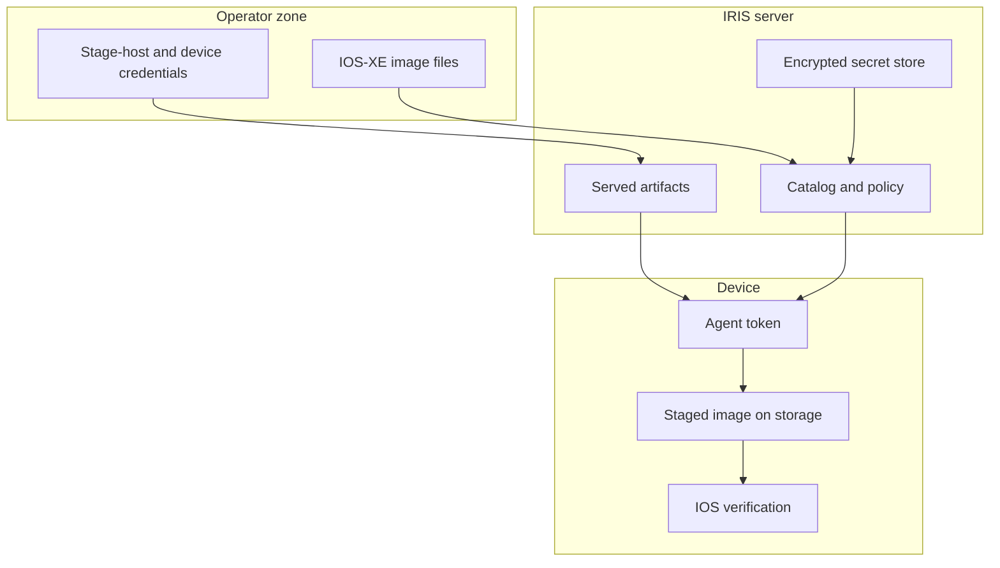

<!--
Copyright 2026 Cisco Systems, Inc. and its affiliates

SPDX-License-Identifier: Apache-2.0
-->

# Security Model

IRIS is designed around least surprise: it moves images, verifies images, and reports status. Installation remains a separate operator decision.

## Guardrails

| Guardrail | Meaning |
| --- | --- |
| No install | IRIS does not run install, activate, or package commit commands. |
| No reload | IRIS does not reload or schedule reloads. |
| No boot mutation | IRIS does not change boot variables or running software state. |
| No inband network mutation | For inband devices, IRIS never creates, changes, or removes the existing VLAN, SVI, gateway, routes, or VRF. |
| Device-side verification | The device verifies the staged copy before reporting success. |
| Private swarm | Torrents use private metadata and authenticated announces. |

Deployment lifecycle state is recorded in durable, non-secret **receipts** under
`IRIS_STATE`, and teardown is driven from a device's active receipt rather than
its editable inventory. Receipts contain no passwords, tokens, certificate keys,
or raw device configuration. See
[Network Attachment and VLAN Ownership](network-attachment.md).

## Trust boundaries

## Secrets

Server secret material is encrypted at rest with age recipients. Plaintext lives only in `/run/iris` while the container runs. Device enrollment tokens are short-lived and generated per device by the running server.

Do not commit:

- Real `creds/` files.
- `fleet/devices.csv` or `fleet/assignments.csv` with sensitive lab data.
- Private keys, certificates, tokens, or RPC secrets.
- IOS-XE images or generated release artifacts.

## TLS and certificates

The catalog and artifact server use HTTPS. The generated device installer installs the catalog certificate into the device trust path so the bootstrap and catalog calls can validate the server identity.

## Third-party tools

IRIS invokes tools such as `aria2c`, `mktorrent`, `openssl`, and documentation-time Mermaid as separate programs or runtime dependencies. See the repository `NOTICE` for license notes.

