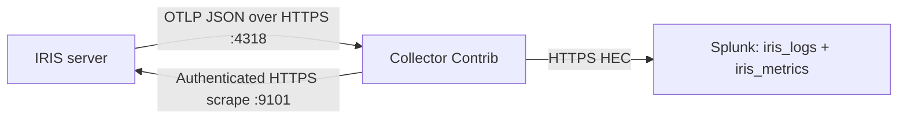

<!--
Copyright 2026 Cisco Systems, Inc. and its affiliates

SPDX-License-Identifier: Apache-2.0
-->

# Splunk Setup

Send IRIS telemetry through an OpenTelemetry Collector to Splunk Enterprise
or Splunk Cloud Platform. This guide configures HTTPS on each connection,
creates the two indexes the shipped dashboard uses, and provides searches to
check the result. All hostnames, addresses, and paths below are examples.



The OTLP push carries log records and aggregate metrics. The scrape supplies
additional aggregate families used by the dashboard, including origin bytes
and peer attribution. **Configure both paths for the shipped Splunk view.**
Telemetry is best-effort: bounded queues and retries can lose data during an
outage, and staging continues independently.

## Prepare Splunk

In **Settings → Indexes**, create these indexes and give dashboard users
permission to search them:

| Index | Data type | Source | Sourcetype |
| --- | --- | --- | --- |
| `iris_logs` | Events | `iris` | `otel:logs` |
| `iris_metrics` | Metrics | `iris` | `otel:metrics` |

On Splunk Enterprise, open **Settings → Data inputs → HTTP Event Collector →
Global Settings**. Enable HEC, select **Enable SSL**, and set its port to
`8088`. Install a certificate whose subject alternative name matches the HEC
hostname. Create an enabled token named `iris-otel`, allow both indexes, and
use `iris_logs` as its default index. The collector sets source and sourcetype
on each export. Leave indexer acknowledgment disabled for this configuration.
See [Splunk's HEC setup instructions](https://help.splunk.com/en/splunk-enterprise/get-data-in/get-started-with-getting-data-in/10.0/get-data-with-http-event-collector/set-up-and-use-http-event-collector-in-splunk-web).

For Splunk Cloud Platform, obtain the HEC hostname and port for your stack.
Use its **HEC ingest endpoint**, including `/services/collector`, in both
exporters below. Managed stacks normally use port `443`; trial stacks can
use `8088`. Use the stack's supported index and token management workflow.

Keep these three credentials separate:

| Credential | Used by | Purpose |
| --- | --- | --- |
| Splunk HEC token | Collector | Write to the two Splunk indexes |
| Collector bearer token | IRIS server | Submit OTLP to the collector |
| IRIS observability token | Collector | Read IRIS `/metrics` |

## Prepare certificates and secrets

On the collector host, create a working directory containing `compose.yaml`,
`otel-collector.yaml`, `secrets/`, and `tls/`. These files belong to your
monitoring deployment, outside the IRIS repository. Keep `.env`, private
keys, and tokens out of version control.

The complete configuration below uses these files:

| File on collector host | Contents |
| --- | --- |
| `tls/collector.crt` | Collector server certificate and any intermediate certificates, valid for `collector.example.com` |
| `tls/collector.key` | Its private key |
| `tls/splunk-ca.pem` | CA certificates that validate `splunk.example.com` |
| `tls/iris-catalog.pem` | IRIS server's public catalog certificate or issuing CA |
| `secrets/collector-token` | Raw bearer token accepted by the collector |
| `secrets/iris-observability-token` | Raw token configured on the IRIS server for `/metrics` |
| `.env` | Collector bind address and HEC token |

Obtain certificates through your certificate authority. The collector verifies
the HEC and IRIS certificates, including hostname matching. For a HEC endpoint
already trusted by the collector's system roots, omit its `tls.ca_file` and
corresponding mount instead of providing a separate CA file.

For the built-in IRIS certificate, copy the public `artifacts/iris-catalog.pem`
from your IRIS deployment over an authenticated channel. Use an IRIS target
name or address present in that certificate. If you connect to an address
while validating a different certificate name, set the scrape's
`tls_config.server_name` to the certificate's valid name.

Create a collector bearer token on the collector host:

```bash
umask 077
mkdir -p secrets tls
openssl rand -hex 32 > secrets/collector-token
```

Use the token and header-file instructions in
[Turning export on](telemetry-export.md#turning-export-on) to configure:

- The IRIS observability token, with the same raw value copied securely to
  `secrets/iris-observability-token` on the collector.
- The IRIS OTLP header file, containing `Authorization=Bearer ` followed by
  the raw value from `secrets/collector-token`.

The example runs the collector as UID/GID `10001`. Make the mounted files
readable by that account, keep secret/key files mode `0600`, and allow it to
traverse their directories. For example, after placing the files:

```bash
sudo chown -R 10001:10001 secrets tls
sudo chmod 0700 secrets tls
sudo chmod 0600 secrets/* tls/collector.key
sudo chmod 0644 tls/*.crt tls/*.pem
```

Save the collector's `.env` with mode `0600`. Replace both values locally:

```dotenv
COLLECTOR_BIND_IP=192.0.2.10
SPLUNK_HEC_TOKEN=replace-with-your-hec-token
```

## Configure the collector

This example pins Collector Contrib `0.160.0` and uses its current filter
syntax. Contrib includes the `splunk_hec` exporter. Its
[exporter reference](https://github.com/open-telemetry/opentelemetry-collector-contrib/blob/v0.160.0/exporter/splunkhecexporter/README.md),
[bearer authentication extension](https://github.com/open-telemetry/opentelemetry-collector-contrib/blob/v0.160.0/extension/bearertokenauthextension/README.md),
and [filter processor](https://github.com/open-telemetry/opentelemetry-collector-contrib/blob/v0.160.0/processor/filterprocessor/README.md)
describe the configuration fields.

Save as `compose.yaml`:

```yaml
services:
  otel-collector:
    image: otel/opentelemetry-collector-contrib:0.160.0
    user: "10001:10001"
    restart: unless-stopped
    command: ["--config=/etc/otelcol/otel-collector.yaml"]
    environment:
      SPLUNK_HEC_TOKEN: "${SPLUNK_HEC_TOKEN:?Set SPLUNK_HEC_TOKEN}"
    volumes:
      - ./otel-collector.yaml:/etc/otelcol/otel-collector.yaml:ro
      - ./secrets:/etc/otelcol/secrets:ro
      - ./tls:/etc/otelcol/tls:ro
    ports:
      - "${COLLECTOR_BIND_IP:?Set COLLECTOR_BIND_IP}:4318:4318"
      - "127.0.0.1:8888:8888"
```

Allow the IRIS server to reach collector port `4318`, the collector to reach
IRIS port `9101`, and the collector to reach your HEC port. Port `8888` is
published only on the collector host's loopback interface for local diagnosis.
IRIS uses OTLP/HTTP JSON; it does not need the gRPC port `4317`.

Save as `otel-collector.yaml`, replacing the example hostnames:

```yaml
extensions:
  bearertokenauth/iris:
    filename: /etc/otelcol/secrets/collector-token

receivers:
  otlp/iris:
    protocols:
      http:
        endpoint: 0.0.0.0:4318
        tls:
          cert_file: /etc/otelcol/tls/collector.crt
          key_file: /etc/otelcol/tls/collector.key
        auth:
          authenticator: bearertokenauth/iris

  prometheus/iris9101:
    config:
      scrape_configs:
        - job_name: iris-9101
          scrape_interval: 15s
          scheme: https
          authorization:
            type: Bearer
            credentials_file: /etc/otelcol/secrets/iris-observability-token
          tls_config:
            ca_file: /etc/otelcol/tls/iris-catalog.pem
          static_configs:
            - targets: ["iris.example.com:9101"]

processors:
  filter/iris_logs:
    error_mode: propagate
    log_conditions:
      - 'resource.attributes["service.name"] != "iris-tracker"'
  filter/iris_metrics:
    error_mode: propagate
    metric_conditions:
      - 'not IsMatch(metric.name, "^iris[._].*")'
  batch:
    send_batch_size: 512
    timeout: 5s

exporters:
  splunk_hec/iris_logs:
    token: "${env:SPLUNK_HEC_TOKEN}"
    endpoint: https://splunk.example.com:8088/services/collector
    index: iris_logs
    source: iris
    sourcetype: otel:logs
    tls:
      ca_file: /etc/otelcol/tls/splunk-ca.pem
    retry_on_failure:
      enabled: true
    sending_queue:
      enabled: true

  splunk_hec/iris_metrics:
    token: "${env:SPLUNK_HEC_TOKEN}"
    endpoint: https://splunk.example.com:8088/services/collector
    index: iris_metrics
    source: iris
    sourcetype: otel:metrics
    tls:
      ca_file: /etc/otelcol/tls/splunk-ca.pem
    retry_on_failure:
      enabled: true
    sending_queue:
      enabled: true

service:
  extensions: [bearertokenauth/iris]
  telemetry:
    metrics:
      level: detailed
      readers:
        - pull:
            exporter:
              prometheus:
                host: 0.0.0.0
                port: 8888
  pipelines:
    logs/iris_splunk:
      receivers: [otlp/iris]
      processors: [filter/iris_logs, batch]
      exporters: [splunk_hec/iris_logs]
    metrics/iris_splunk:
      receivers: [otlp/iris]
      processors: [filter/iris_metrics, batch]
      exporters: [splunk_hec/iris_metrics]
    metrics/iris9101:
      receivers: [prometheus/iris9101]
      processors: [filter/iris_metrics, batch]
      exporters: [splunk_hec/iris_metrics]
```

Filter conditions describe records to **drop**. This keeps IRIS logs and both
metric naming styles: dotted OTLP names and underscored scrape names. Scrape
housekeeping series such as `up` are deliberately excluded from Splunk.

On a shared collector, merge these named components into its existing
configuration and preserve its other pipelines. A receiver can feed several
pipelines. The queues above are held in memory; they do not survive collector
replacement. Use the collector's persistent queue support if you need that
additional protection.

Validate and start the collector from its working directory:

```bash
docker compose run --rm --no-deps otel-collector validate --config=/etc/otelcol/otel-collector.yaml
docker compose up -d otel-collector
docker compose logs --tail 50 otel-collector
```

## Enable IRIS export

On the IRIS host, set these deployment defaults in `server/.env` alongside
the secret-file paths configured above:

```dotenv
IRIS_OBSERVABILITY=1
IRIS_OTLP_ENDPOINT=https://collector.example.com:4318
```

Use the collector **base URL**. IRIS adds `/v1/logs` and `/v1/metrics` itself.
It verifies the collector using system roots and the IRIS trust store. For a
private CA, upload its public certificate under **Settings → TLS & trust →
Trusted CAs**. See [TLS & trust](console.md#tls-trust).

Apply changed deployment variables from the IRIS `server/` directory:

```bash
docker compose up -d iris console
```

**Settings → Telemetry** can override the OTLP endpoint and enabled flag
without a restart. Ensure any saved override matches the intended destination.
The Prometheus endpoint is controlled by `IRIS_OBSERVABILITY` at server
startup, independently of that runtime OTLP setting. Keep the telemetry
listener on port `9101`; the server and Console also use it for health and
swarm state.

## Check delivery

On the collector host, inspect its local counters:

```bash
curl --fail --silent --show-error http://127.0.0.1:8888/metrics \
  | rg 'otelcol_(receiver_accepted|exporter_sent|exporter_send_failed)'
```

Accepted and sent counts should increase while IRIS exports. Failed sends
point to the HEC connection, token, or index configuration. Accepted records
with no sends can also mean the filter excluded them. Inspect collector logs
for scrape, authentication, and TLS errors. An idle fleet can have few log
records while aggregate metrics continue.

In Splunk, start with these searches:

```spl
index=iris_logs source=iris sourcetype=otel:logs earliest=-24h
| stats count BY "otel.log.name", "service.version"
```

```spl
| mcatalog values(metric_name) WHERE index=iris_metrics earliest=-2h
```

Expect `iris.transfer.*` OTLP names and `iris_*` scrape names. For example,
`iris_tracker_up` confirms the IRIS scrape feed. Per-image byte series appear
when their image and ledger data exist. A receiver may trim a counter's
`_total` suffix; the shipped view accepts both spellings.

The HEC exporter supplies record attributes as searchable fields. Dotted
names need single quotes when used as field values in SPL expressions, as
shown below. Integer byte attributes use strings in OTLP JSON; use
`tonumber()` before arithmetic.

### Device staging reports

```spl
index=iris_logs source=iris sourcetype=otel:logs earliest=-24h
  "otel.log.name"="iris.device.transfer.report"
| dedup "event.id"
| eval completed_bytes=tonumber('iris.transfer.completed_content_bytes')
| table _time "device.id" "iris.image.id" "iris.transfer.id"
    "iris.report.event" completed_bytes "iris.transfer.content_sha256.state" "iris.transfer.ios_copy_verify.state"
```

`iris.device.transfer.report` carries the transfer fields. The separate
`iris.device.report` projection contains fewer fields. Do not add both
projections when counting deliveries. Use device, image, and transfer identity
together when comparing repeated assignments or several images on one device.

### Bytes received from each peer

```spl
index=iris_logs source=iris sourcetype=otel:logs earliest=-24h
  "otel.log.name"="iris.device.peer_transfer_record"
| dedup "event.id"
| eval received_bytes=tonumber('iris.transfer.session_bytes_from_peer')
| eval image=coalesce('iris.image.name', 'iris.image.id')
| eval source=coalesce('iris.peer.device_id', "unknown")
| stats max(received_bytes) AS received_bytes
    values("iris.transfer_record.capture_complete") AS capture_complete
    values("network.peer.address") AS peer_address
    BY "device.id", image, "iris.transfer.id", source, "iris.peer.attribution"
```

The query keeps the largest cumulative capture per transfer and sender.
`source` is the sender: `origin` for the seeder, the sending device's id for
a `device` row (`iris.peer.device_id` carries both), and `unknown` for a row
the server could not name. That attribute is absent on unknown rows, and a
`BY` on an absent field silently drops the event, so the `eval` fills it in.
`image` is the catalog filename (`iris.image.name`, looked up when the report
is exported); it falls back to `iris.image.id` for an image that has since
left the catalog. Each row is measured by the receiving device, but a peer
that disconnected before capture can be absent; `capture_complete=false`
marks that incomplete capture. Missing rows do not mean zero bytes. A report
is re-exported under the same `event.id` after a server restart; its sender
classification is pinned on first export, so the copies are identical and
`dedup` collapses them. `iris.swarm.peer_bytes` is the origin-side sampled
view of traffic; summing it with device peer records would count the same
traffic twice.

### Peer-to-peer evidence

These three searches back the *Peer-to-peer evidence* row of the shipped view.
They read the same device-measured record as the search above, split by who
sent the bytes, so a peer-to-peer claim rests on an observation rather than on
a subtraction of two origin-side totals.

```spl
index=iris_logs source=iris sourcetype=otel:logs earliest=-24h
  "otel.log.name"="iris.device.peer_transfer_record"
| dedup "event.id"
| eval source=case('iris.peer.attribution'=="origin","origin",
    'iris.peer.attribution'=="device","peer device",1==1,"unknown")
| eval MiB=tonumber('iris.transfer.session_bytes_from_peer')/1048576
| timechart span=1h sum(MiB) BY source
```

Read the stacked columns as bytes arriving per hour: a visible *peer device*
band is the traffic devices served each other, *origin* is the seeder's share
of the same hour, and *unknown* is a peer the server could not name.

```spl
index=iris_logs source=iris sourcetype=otel:logs earliest=-24h
  "otel.log.name"="iris.device.peer_transfer_record"
| dedup "event.id"
| eval b=tonumber('iris.transfer.session_bytes_from_peer')
| stats sum(eval(if('iris.peer.attribution'=="device",b,null()))) AS peer_bytes,
    sum(b) AS all_bytes
| eval pct=if(isnull(all_bytes) OR all_bytes<=0,null(),
    round(100*coalesce(peer_bytes,0)/all_bytes,1))
| fields pct
```

Read the single number as the share of received bytes that came from a peer
device over the window, measured on the receiving devices; the denominator
carries origin and unknown rows too, so an unnamed peer never inflates it.

```spl
index=iris_logs source=iris sourcetype=otel:logs earliest=-24h
  "otel.log.name"="iris.device.peer_transfer_record" "iris.peer.attribution"="device"
| dedup "event.id"
| eval "MiB from this peer"=round(tonumber('iris.transfer.session_bytes_from_peer')/1048576,1)
| eval Image=coalesce('iris.image.name','iris.image.id')
| rename "iris.peer.device_id" AS Sender, "device.id" AS Receiver,
    "iris.transfer_record.capture_complete" AS "Capture complete"
| table _time, Sender, Receiver, Image, "MiB from this peer", "Capture complete"
| sort - _time
```

Read each row as one device-to-device transfer leg: *Sender* served those bytes
to *Receiver*, `_time` is when the receiver read its counters, and
`Capture complete` false marks a snapshot that missed peers rather than a wrong
byte count.

The caveat from the search above applies to all three: a peer that disconnected
before the completion snapshot leaves no row at all, so a missing row is a
capture gap, not zero traffic, and every total here is a floor. Do not add
`iris.swarm.peer_bytes` to these sums — it is the origin-side sampled view of
the same bytes, and the two together count one transfer twice.

### Assignment to confirmed seeding

```spl
index=iris_logs source=iris sourcetype=otel:logs earliest=-24h
  "otel.log.name"="iris.transfer.lifecycle" event="seeding_started"
| dedup "event.id"
| eval planned=strptime('iris.transfer.planned_at', "%Y-%m-%dT%H:%M:%S.%N%Z")
| eval seeding=strptime('iris.transfer.seeding_started_at', "%Y-%m-%dT%H:%M:%S.%N%Z")
| eval elapsed_seconds=round(seeding-planned,3)
| table "device.id" "iris.image.id" "iris.plan.id" elapsed_seconds
    "iris.transfer.report_received_at" "iris.transfer.tracker_seeder_at"
    "iris.transfer.recovered_promotion"
```

This measures server-observed time from assignment to confirmed seeding. It
includes report-delivery delay and is not a raw download duration. A tracker
seeder alone does not prove device verification or final placement. See
[Transfer lifecycle events](observability.md#transfer-lifecycle-events) for
the confirmation rules and recovery semantics.

## Import the dashboard

Download [splunk-iris-swarm.xml](dashboards/splunk-iris-swarm.xml) and follow
[Importing the Splunk view](dashboards/README.md#importing-the-splunk-view).
Its default searches use `iris_logs` and `iris_metrics`; edit them if you
chose different index names.

Both the OTLP log pipeline and the Prometheus scrape pipeline are required.
The view's peer-share panels use the origin's sampled records, while its
*Peer-to-peer evidence* row uses the device-measured peer transfer records.
The device peer searches above expose those same separate device measurements.
Read [Telemetry Export](telemetry-export.md#known-limits) before interpreting
missing records, untraced bytes, or peer-share estimates.

## Troubleshooting

| Symptom | Check |
| --- | --- |
| Collector rejects `splunk_hec` | Run the Contrib distribution and validate against the image version you deploy. |
| Collector cannot read a file | Check bind-mount paths, directory traversal permissions, and UID `10001` access. |
| IRIS export is off | Enable OTLP and set its base endpoint; check saved Console overrides. |
| IRIS export is degraded | Check collector DNS, port `4318`, its certificate SAN/CA, and the OTLP header file. |
| Collector returns `401` | The OTLP bearer token must match the collector token file, without a duplicated `Bearer` prefix. |
| IRIS scrape returns `401` | Check the separate raw observability token and its IRIS host mount. |
| IRIS scrape returns `404` after authentication | Enable `IRIS_OBSERVABILITY=1` and recreate the server container. |
| TLS validation fails | Install the issuing CA and use a name or address in the certificate. Keep certificate verification enabled. |
| HEC reports an invalid token | Check the HEC token value, enabled state, and destination stack. |
| HEC reports an incorrect index | Both indexes must exist and be allowed by the token; `iris_metrics` must be a Metrics index. |
| Log searches work, metric panels are empty | Check the `/metrics` scrape and `metrics/iris9101` pipeline; OTLP metrics alone do not supply all dashboard families. |
| Metrics work, peer tables are empty | Check OTLP logs and the selected time range; an idle fleet need not emit peer records. |
| Byte totals look wrong | Select one record family, coerce byte values to numbers, and keep device/image/transfer identity in the grouping. |

The anonymous IRIS `https://iris.example.com:9101/healthz` probe reports only
listener health. Check the Console's telemetry export status and collector
logs for export health; the anonymous response does not expose those details.
